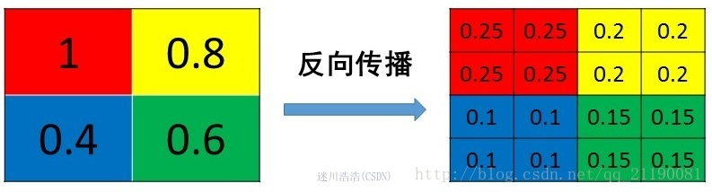

# CNN 学习笔记

CNN 可以应用在场景分类，图像分类，现在还可以应用到自然语言处理(NLP)方面的很多问题，比如句子分类等。

**LeNet** 是最早的CNN结构之一，它是由大神 **Yann LeCun** 所创造的，主要是用在字符分类问题。

下面是一个简单的CNN结构，图来自参考文章[1]。这个网络结构是用于一个四类分类的问题，分别是狗、猫、船和鸟，图中的输入图片是属于船一类。


该结构展示了四种运算，也可以说是由四种不同的层，分别是卷积层，非线性层(也就是使用了ReLU函数)，Pooling层，全连接层，下面将一一介绍这几种网络层。


------

## 卷积层

### 卷积简介

CNN的名字由来就是因为其使用了卷积运算的缘故。卷积的目的主要是为了提取图片的特征。卷积运算可以保持像素之间的空间关系。

每张图片可以当做是一个包含每个像素值的矩阵，像素值的范围是0~255,0表示黑色，255是白色。下面是一个$5 \times 5$大小的矩阵例子，它的值是0或者1。


接下来是另一个$3\times 3$矩阵：


上述两个矩阵通过卷积，可以得到如下图右侧粉色的矩阵结果。


黄色的矩阵在绿色的矩阵上从左到右，从上到下，每次滑动的步进值是1个像素，所以得到一个$3\times 3$的矩阵。

在CNN中，黄色的矩阵被叫做**滤波器(filter)或者核(kernel)或者是特征提取器**，而通过卷积得到的矩阵则是称为**“特征图(Feature Map)”或者“Activation Map”**。

另外，**使用不同的滤波器矩阵是可以得到不同的 Feature Map** ，例子如下图所示，执行的操作分别是：

1. 输出原图
2. 边缘检测
3. 图像锐化
4. 方块模糊
5. 高斯模糊


上图通过滤波器矩阵，实现了不同的操作，比如边缘检测，锐化以及模糊操作等。

在实际应用中，CNN是可以在其训练过程中学习到这些滤波器的值，不过我们需要首先指定好滤波器的大小，数量以及网络的结构。使用越多的滤波器，可以提取到更多的图像特征，网络也就能够有更好的性能。

Feature Map的尺寸是由以下三个参数来决定的：

* **深度(Depth)**： **深度等于滤波器的数量**。
* **步进(Stride)**: 步进值是在使用滤波器在输入矩阵上滑动的时候，每次滑动的距离。步进值越大，得到的Feature Map的尺寸越小。
* **Zero-padding**: 有时候可以在输入矩阵的边界填补0，这样就可以将滤波器应用到边缘的像素点上，一个好的Zero-padding是能让我们可以控制好特征图的尺寸的。使用该方法的卷积称为**wide convolution**，没有使用的则是**narrow convolution**。


### 卷积公式和参数量

上一小节简单介绍了卷积的操作和其实现的效果，接下来将介绍卷积运算的公式，以及CNN中卷积层的参数数量。

卷积是大自然中最常见的运算，一切信号观测、采集、传输和处理都可以用卷积过程实现，其用公式表达如下：
$$
\begin{align}
Y(m,n) & =X(m,n)*H(m,n) \\ 
&= \sum_{i=-\infty}^{+\infty}\sum_{j=-\infty}^{+\infty}X(i,j)H(m-i,n-j) \\ &=\sum_{i=-\infty}^{+\infty}\sum_{j=-\infty}^{+\infty}X(m-i,n-j)H(i,j)
\end{align}
$$
上述公式中$H(m,n)$表示卷积核。

在CNN中的卷积层的计算步骤与上述公式定义的二维卷积有点差异，首先是维度升至三维、四维卷积，跟二维卷积相比多了一个**“通道”(channel)**，每个通道还是按照二维卷积方式计算，而多个通道与多个卷积核分别进行二维卷积，得到多通道输出，需要“合并”为一个通道；**其次是卷积核在卷积计算时没有“翻转”，而是与输入图片做滑动窗口“相关”计算**。用公式重新表达如下：
$$
Y^l(m,n) =X^k(m,n)*H^{kl}(m,n) = \sum_{k=0}^{K-1}\sum_{i=0}^{I-1}\sum_{j=0}^{J-1}X^k(m+i,n+j)H^{kl}(i,j)
$$
这里假定卷积层有$L$个输出通道和$K$个输入通道，于是需要有$KL$个卷积核实现通道数目的转换。其中$X^k$表示第$k$个输入通道的二维特征图，$Y^l$表示第$l$个输出通道的二维特征图，$H^{kl}$表示第$k$行、第$l$列二维卷积核。假定卷积核大小是$I*J$,每个输出通道的特征图大小是$M*N$，则该层每个样本做一次前向传播时卷积层的计算量是$Calculations(MAC)=I*J*M*N*K*L$。

卷积层的学习参数，也就是**卷积核数目乘以卷积核的尺寸--$Params = I*J*K*L$。**

这里定义计算量-参数量之比是**CPR**=$Calculations/Params=M*N$。

因此可以得出结论：**卷积层的输出特征图尺寸越大，CPR越大，参数重复利用率越高。若输入一批大小为B的样本，则CPR值可提高B倍。**

### 优点

卷积神经网络通过**『参数减少』与『权值共享』**大大减少了连接的个数，也即需要训练的参数的个数。

假设我们的图像是`1000*1000`的，则有10^6个隐层神经元，那么它们全连接的话，也就是每个隐层神经元都连接图像的每个像素点，就有10^12个连接，也即10^12个权值参数需要训练，这显然是不值得的。但是对于一个只识别特定feature的卷积核，需要大到覆盖整个图像的所有像素点吗？通常是不需要的，**一个特定feature，尤其是第一层需要提取的feature，通常都相当基础，只占图像很小的一部分。所以我们设置一个较小的局部感受区域，比如`10*10`，也即每个神经元只需要和这`10*10`的局部图像相连接，所以10^6个神经元也就有10^8个连接。这就叫参数减少。**

那什么叫权值共享呢？在上面的局部连接中，`10^6` 个神经元，每个神经元都对应 100 个参数，所以是 `10^8` 个参数，**那如果每个神经元所对应的参数都是相同的，那需要训练的参数就只有100个了。**

这后面隐含的道理在于，**这100个参数就是一个卷积核，而卷积核是提取feature的方式，与其在图像上的位置无关，图像一个局部的统计特征与其他局部的统计特征是一样的，我们用在这个局部抽取feature的卷积核也可以用在图像上的其它任何地方。**

而且这100个参数只是一种卷积核，只能提取一种feature，我们完全可以采用100个卷积核，提取100种feature，而所需要训练的参数也不过10^4，最开始我们训练10^12个参数，还只能提取一种特征。选取100个卷积核，我们就能得到100张FM，每张FM可以看做是一张图像的不同通道。

CNN主要用来识别位移、缩放及其他形式扭曲不变性的二维图形。由于CNN特征检测层通过训练数据进行学习，在使用CNN时，避免了显式的特征抽取，而隐式地从训练数据中进行学习；再者，由于同一FM上的神经元权值相同，所以网络可以并行学习，这也是卷积网络相对于神经元彼此相连网络的一大优势。卷积神经网络以其局部权值共享的特殊结构在语音识别和图像处理方面有着独特的优越性，其布局更接近于实际的生物神经网络，权值共享降低了网络的复杂性，避免了特征提取和分类过程中数据重建的复杂度。

### 缺点

1. CNN 需要大量的数据，数据量过少容易导致过拟合；
2. CNN 对硬件要求高，需要使用 GPU，而且越大的网络模型对 GPU 性能要求也越高，单纯使用 CPU 的训练速度太慢；


### padding

一个基本的卷积操作是 padding，之所以需要使用 padding 操作，也是因为原始的卷积操作存在这样两个缺点：

1. **每次做完卷积操作后，图像会缩小**。因为原始图像是 $n\times n$，滤波器是 $f\times f$，两者卷积后输出的图像的大小就是 $(n-f+1)\times (n-f+1)$，具体来说，一个 $6 \times 6$ 的图片和一个 $3\times 3$ 的滤波器卷积后，输出的图像就是 $4\times 4$ 了，那么假设卷积层有多个，后续的图像就会越来越小；
2. 卷积的时候，图像角落或者边缘的像素点在输出中采用很少，比如边界位置，基本只会被使用一次，**也就是很多图像边缘位置的信息会被丢掉**。

基于以上的问题，所以需要采用 padding操作，也就是沿着图像边缘再填充数量为 p 的像素，至于 p 的取值，一般有两种情况，分别是 **Valid 卷积**和 **Same 卷积**。


#### Valid 卷积

Valid 卷积其实就是不填充，p=0 的情况。也就是原始图像是 $n\times n$，滤波器是 $f\times f$，两者卷积后输出的图像的大小就是 $(n-f+1)\times (n-f+1)$。


#### Same 卷积

**Same 卷积就是保持输入和输出大小一样。**

具体来说，当填充 p 个像素点，输出的边长就是 n+2p-f+1（原来是 n-f+1），那么这里就是需要让 $n = n+2p-f+1$，求解得到的结果就是 $p=\frac{f-1}{2}$，所以如果滤波器是 $3\times 3$，那么应该填充的像素个数就是 p = (3-1)/2 = 1 个像素。

一般来说，f 通常是奇数，这里有两个原因：

1. f 是偶数的话，那根据上述得到的 p 的公式，**只能采用不对称填充**，也就是左边填充多一点，右边填充少一点这种做法了；f 是奇数的时候，Same 卷积才会有自然填充；
2. 采用奇数维度的过滤器，那么它就有一个中心点，在计算机视觉里，如果有一个中心像素点会更加方便，便于支出过滤器的位置。

因此，一般 CNN 里面的滤波器的大小都是奇数的，常见的就是 $3\times 3$，$5 \times 5$ ，$1 \times 1$，甚至 $7\times 7$，当然可能采用偶数的滤波器也会有不错的表现，但这也是计算机视觉的惯例，更推荐采用奇数值的滤波器。


### 卷积步长

卷积的步长，即 strided，是指每次滤波器在图像上移动的距离，假设步长是 s，那么现在输出图像的计算公式就是：
$$
\lfloor \frac{n+2p-f}{s}+1\rfloor \times \lfloor \frac{n+2p-f}{s}+1\rfloor
$$
这里对于不能整除的做法是向下取整。


### 卷积核的分类

参考：

1. [卷积网络CNN中各种常见卷积过程](https://www.jianshu.com/p/2a0f3a4a9d1d)
2. [可分离卷积基本介绍](https://baijiahao.baidu.com/s?id=1634399239921135758&wfr=spider&for=pc)
3. [CNN中卷积操作十大改进方向](https://blog.csdn.net/hongxingabc/article/details/79563525)
4. [关于转置卷积（反卷积）的理解](https://blog.csdn.net/isMarvellous/article/details/80087705)
5. [Dilated/Atrous conv 空洞卷积](https://blog.csdn.net/silence2015/article/details/79748729)


常⻅的卷积主要是**由连续紧密的卷积核对输⼊的图像特征进⾏滑窗式点乘求和操作**，除此

之外还有其他类型的卷积核在不同的任务中会⽤到，具体分类如下图所示：


#### 符号约定

**输入**：$H_{in}*W_{in}*C_{in}$ ，其中 $H_{in}$ 为输入 feature map 的高，$W_{in}$ 为宽，$C_{in}$ 为通道数

**输出**：$H_{out}*W_{out}*C_{out}$ ，其中 $H_{out}$ 为输出 feature map 的高，$W_{out}$ 为宽，$C_{out}$ 为通道数

**卷积核**：$N*K*K*C_k$ ，其中 $N$ 为该卷积层的卷积核个数，$K$ 为卷积核宽与高(默认相等)，$C_k$ 为卷积核通道数

这里我们先不考虑卷积步长 stride 和 padding 等，这些只影响输入 feature map 的大小。且假定你已熟悉普通意义下的卷积操作。


#### 常规卷积

**特点：**

1. 卷积核通道数与输入 feature map 的通道数相等，即 $C_{in} = C_k$
2. 输出 feature map 的通道数等于卷积核的个数，即 $C_{out} = N$

**卷积过程：**

卷积核在输入 feature map 中移动，按位点乘后求和即可。

下面是一个卷积动图，帮助你理解。


#### 1*1 卷积

**特点和作用：**

1. 顾名思义，卷积核大小为 1ｘ1
2. 卷积核通道数与输入 feature map 的通道数相等，即 $C_{in} = C_k$
3. 输出 feature map 的通道数等于卷积核的个数，即 $C_{out} = N$
4. 不改变 feature map 的大小，目的是为了改变 channel 数，即 1ｘ1 卷积的使用场景是：不想改变输入 feature map 的宽高，但想改变它的通道数。即可以用于升维或降维。
5. 相比 3ｘ3 等卷积，计算量及参数量都更小。
6. **加入非线性**。1*1的卷积在不同 channels 上进行线性整合，在前一层的学习表示上添加了非线性激励（ non-linear activation ），提升网络的表达能力；


**示意图：**


(图来自这个[博客](https://www.cnblogs.com/lemonzhang/p/9939187.html))

1x1核的主要目的是应用非线性。在神经网络的每一层之后，我们都可以应用一个激活层。无论是ReLU、PReLU、Sigmoid还是其他，与卷积层不同，激活层是非线性的。非线性层扩展了模型的可能性，这也是通常使“深度”网络优于“宽”网络的原因。为了在不显著增加参数和计算量的情况下增加非线性层的数量，我们可以应用一个1x1内核并在它之后添加一个激活层。这有助于给网络增加一层深度。 


#### 分组卷积

Group convolution 分组卷积，最早在 AlexNet 中出现，由于当时的硬件资源有限，训练 AlexNet 时卷积操作不能全部放在同一个 GPU 处理，因此作者把 feature maps 分给多个GPU分别进行处理，最后把多个 GPU 的结果进行融合。

**卷积过程：**

将输入 feature map 分成 g 组，一个卷积核也相对应地分成 g 组，在对应的组内做卷积。（我们可以理解成分组卷积中使用的 g 组卷积核整体对应于常规卷积中的一个卷积核，只不过是将常规卷积中的一个卷积核分成了 g 组而已）


(图来自这个[博客](https://www.jianshu.com/p/a936b7bc54e3))

**特点、作用：**

1. 输入的 feature map 尺寸：$H_{in}*W_{in}* \frac{C_{in}}{g}$ ，共有 g 组
2. 卷积核的规格：$N*K*K*\frac{C_{k}}{g}$，共有 N * g 组
3. 输出 feature map 规格：$H_{out}*W_{out}*N*g$ ，共生成 N*g 个 feature map
4. 当 $g = 1$ 时就退化成了上面讲过的常规卷积，当 $g = C_{in}$ 时就是我们下面将要讲述的深度分离卷积。
5. 用常规卷积得到一个输出 feature map 的计算量和参数量便可以得到 g 个输出 feature map，所以分组卷积常用在轻量型高效网络中，因为它可以用少量的参数量和计算量生成大量的 feature map。


#### 可分离卷积

可分离卷积又分成两种：**空间可分离卷积** 和 **深度可分离卷积**。

##### 空间可分离卷积

之所以命名为空间可分离卷积，是因为它主要处理的是**卷积核的空间维度：宽度和高度**。

空间可分离卷积简单地将卷积核划分为两个较小的卷积核。 最常见的情况是将3x3的卷积核划分为3x1和1x3的卷积核，如下所示：


**特点：**

1. **局限性**：并不是所有的卷积核都可以“分离”成两个较小的卷积核，能够“分离”的是那些卷积核参数大小的行和列有一定倍数关系的. 这在训练期间变得特别麻烦，因为网络可能采用所有可能的卷积核，它最终只能使用可以分成两个较小卷积核的一小部分。所以实际中用的不多
2. **参数量和计算量更少**：如上图所示，不是用9次乘法进行一次卷积，而是**进行两次卷积**，每次3次乘法（总共6次），以达到相同的效果。 **乘法较少，计算复杂性下降，网络运行速度更快**。


##### 深度可分离卷积

与空间可分离卷积不同，深度可分离卷积与卷积核无法“分解”成两个较小的内核。 因此，它更常用。 这是在`keras.layers.SeparableConv2D`或`tf.layers.separable_conv2d`中看到的可分离卷积的类型。

之所以命名为深度可分离卷积，是因为第一步卷积的时候是通道独立的（后面会看到这种卷积方式分成两步），你可以将每个通道想象成对该图像特定的解释说明（interpret）; 例如RGB图像中，“R”通道解释每个像素的“红色”，“B”通道解释每个像素的“蓝色”，“G”通道解释每个像素的“绿色”。 有多少个通道就有多少种解释。

**卷积过程：**

深度可分离卷积的过程分为两部分：**深度卷积**(depthwise convolution) 和 **逐点卷积**(pointwise convolution)

(1) 深度卷积

深度卷积意在保持输入 feature map 的通道数，即对 feature map 中的每个通道使用一个规格为 $K*K*1$ 的卷积核进行卷积，于是输入 feature map 有多少个通道就有多少个这样的卷积核，深度卷积结束后得到的输出的通道数与输入的相等。

这一步其实就相当于常规卷积中的一个卷积核，只不过不同通道的卷积结果不相加而已，自己体会体会。


(2) 逐点卷积

在上一步的基础上，运用 1ｘ1 卷积进行逐点卷积。

使用一个  1ｘ1 卷积核就可以得到输出 feature map 一维的结果。


如果你要输出 feature map 有 256 维，那么就使用 256 个  1ｘ1 卷积核即可。


**特点：**

1. 可以理解成常规的卷积分成了两步执行，但是分成两步后**参数量和计算量大大减少，网络运行更快**


#### 转置卷积

转置卷积常常用于 **CNN 中对特征图进行上采样**，比如语义分割和超分辨率任务中。之所以叫转置卷积是因为，它其实是把我们平时所用普通卷积操作中的卷积核做一个转置，然后把普通卷积的输出作为转置卷积的输入，而转置卷积的输出，就是普通卷积的输入。

这样说可能有点绕，我们可以参照CNN中的反向传播过程来理解，转置卷积形式上就和一个卷积层的反向梯度计算相同。既然是输入输出对调，那么就有两个很重要的特性：

1. 转置的卷积核变为了普通卷积核的转置
2. 如果把由输入特征图到输出特征图的计算过程画成一个计算图，那么输入输出元素的连接关系是不变的.也就是说，在普通卷积中，若元素a和元素1有连接（元素1由a计算得到），那么在相应的转置卷积中，元素1和元素a依然是有连接的（元素a由元素1计算得到）。

下面通过对比常规卷积和转置卷积的计算过程帮助理解：

**常规卷积：**


这是一个卷积核大小为3x3，步长为2，padding为1的普通卷积。卷积核在红框位置时输出元素1，在绿色位置时输出元素2。我们可以发现，输入元素a仅和一个输出元素有运算关系，也就是元素1，而输入元素b和输出元素1, 2均有关系。同理c只和一个元素2有关，而d和1,2,3,4四个元素都有关。那么在进行转置卷积时，依然应该保持这个连接关系不变。


**转置卷积：**

根据前面的分析，我们需要将上图中绿色的特征图作为输入，蓝色的特征图作为输出，并且保证连接关系不变。也就是说，a只和1有关，b和1,2两个元素有关，其它类推。怎么才能达到这个效果呢？我们可以先用0给绿色特征图做插值，**插值的个数就是使相邻两个绿色元素的间隔为卷积的步长**，同时边缘也需要进行与插值数量相等的补0。如下图：


注意，这时候卷积核的滑动步长就不是2了，而是1，步长体现在了插值补0的过程中。


**输出特征图的尺寸计算：**

假设我们做转置卷积的输入特征图大小为 $n*n$，卷积核大小为 $k*k$，后面为了表示方便，我们直接使用边长来表示大小。步长stride为 s（注意这个步长是前面做卷积的时候的步长，设计网络结构的时候对应过来即可），那么转置卷积需要在四周每个边缘补0的数量为 s-1，边缘和内部插空补0后输入特征图大小变为：
$$
0插值后的输入特征图大小：s*n+s-1
$$
使用大小为 k 的卷积核进行卷积（滑动步长为1），得到的输出特征图大小为：
$$
\frac{s*n+s-1-k}{1}+1 = s*n+(s-k)
$$
当然这个公式只是转置卷积的一种理解方法，在实际的实现中，还有不同的padding, stride和dilation配置，输出图像大小也会随之改变。

**可能疑惑的地方：**

1. 为什么人们很喜欢叫转置卷积为反卷积或逆卷积。首先举一个例子，将一个4x4的输入通过3x3的卷积核在进行普通卷积（无padding, stride=1），将得到一个2x2的输出。而转置卷积将一个2x2的输入通过同样3x3大小的卷积核将得到一个4x4的输出，看起来似乎是普通卷积的逆过程。就好像是加法的逆过程是减法，乘法的逆过程是除法一样，人们自然而然的认为这两个操作似乎是一个可逆的过程。但事实上两者并没有什么关系，操作的过程也不是可逆的。具体对转置卷积名称的理解可参考这篇[博客](https://blog.csdn.net/tsyccnh/article/details/87357447)。


#### 空洞卷积  (Dilated / Atrous Convolutions)

空洞卷积诞生在图像分割领域，在一般的卷积结构中因为存在 pooling 操作，目的是增大感受野也增加非线性等，但是 pooling 之后特征图的大小减半，而图像分割是 pixelwise 的，因此后续需要 upsamplng 将变小的特征图恢复到原始大小，这里的 upsampling 主要是通过转置卷积完成，但是经过这么多的操作之后会将很多细节丢失，**那么空洞卷积就是来解决这个的，既扩大了感受野，又不用 pooling** 。

Dilated/Atrous Convolution 或者是 Convolution with holes 从字面上就很好理解，是在标准的 convolution map 里注入空洞，以此来增加感受野。相比原来的正常卷积，**空洞多了一个 超参数，称之为 dilation rate**， 指的是kernel的间隔数量(e.g. 正常的卷积是 dilatation rate 1)。

在VGG网络中就证明了使用小卷积核叠加来取代大卷积核可以起到减少参数同时达到大卷积核同样大小感受野的功效。但是通过叠加小卷积核来扩大感受野只能线性增长，公式为$(kernelSize - 1)*layers+1$,，也就是线性增长，而空洞卷积可以以指数级增长感受野。

先来感受下空洞卷积和常规卷积的不同之处：Dilated Convolution with a 3 x 3 kernel and dilation rate 2


要理解空洞概念和如何操作可以从两个角度去看。

1. 从原图角度，所谓空洞就是在原图上做采样。采样的频率是根据rate参数来设置的，当rate为1时候，就是原图不丢失任何信息采样，此时卷积操作就是标准的卷积操作，当rate>1，比如2的时候，就是在原图上每隔一（rate-1）个像素采样，如图b，可以把红色的点想象成在原图上的采样点，然后将采样后的图像与kernel做卷积，这样做其实变相增大了感受野。
2. 从kernel角度去看空洞的话就是扩大kernel的尺寸，在kernel中，相邻点之间插入rate-1个零，然后将扩大的kernel和原图做卷积 ，这样还是增大了感受野。

在语义分割任务中，当它与双线性插值一起使用时，可以替代转置卷积。


### 感受野

参考：

- [如何计算感受野(Receptive Field)——原理](https://zhuanlan.zhihu.com/p/31004121)
- [Calculate Receptive Field for VGG16](http://zike.io/posts/calculate-receptive-field-for-vgg-16/)
- [a-guide-to-receptive-field-arithmetic-for-convolutional-neural-networks](https://medium.com/mlreview/a-guide-to-receptive-field-arithmetic-for-convolutional-neural-networks-e0f514068807)

- [特征图尺寸和感受野计算详解](https://zhuanlan.zhihu.com/p/56940729)


#### 概念

卷积神经网络中每一层输出的特征图(feature map)中的每一个像素映射到原始输入图像的区域大小，相当于高层的特征图中的像素点受原图多大区域的影响，对于视觉任务来说，这是很关键的，设计神经网络的时候需要充分考虑感受野的问题，模型才会更加精细和鲁棒。


#### 卷积输入输出的大小关系

根据感受野的概念，大家可以体会到感受野的计算应该与卷积的计算是相反的过程，所以先回顾下卷积输入输出的大小关系公式：（以高度为例）
$$
Height_{out} = \frac{Height_{in} - F+2*P}{S} + 1
$$
其中`F`为滤波器的边长，`P`为padding的大小，`S`为步长。

如果是空洞卷积 dilation convolution，其计算方式就是：
$$
Height_{out} = \frac{Height_{in} - dilation\times(F-1)+2*P-1}{S} + 1
$$


#### 感受野的计算

上面说了**感受野的计算是与卷积计算相反的过程**，卷积是从低层慢慢一层层卷积到高层的，所以感受野的计算采用的是`Top-Down`方式，即从最高层向低层迭代计算。具体步骤为：

  1. 设要计算感受野的这层为第N层
  2. 第`N`层到第`N-1`层的感受野就是对第`N-1`层进行卷积时使用的滤波器大小，这里我们设为$RF_{N-1}$。
  3. 接着计算第`N`层到第`N-2`层的感受野大小，公式是：
     $RF_{N-2} = (RF_{N-1} -1)*stride + kernel\_size$ **（需要注意的是这里的`stride`和`kernel_size`是第`N-2`层的）**
  4. 一直迭代第３步直至输入层，即可算出第N层的感受野

这里大家注意下第３步中的公式，体会下是不是刚好与上面卷积输入输出的关系刚好反过来，$RF_{N-2}$对应$Height_{in}$，$RF_{N-1}$对应$Height_{out}$。

**唯一的区别是不需要管padding，这也说明了感受野其实是包括padding在内的，所以你会发现算出来的感受野大小可能会比原始图像的大小还要大**。

如上一段所说，**其实这样的计算方法是有一点问题的，没有考虑padding和pooling部分，要做修改。但这种方法还是可以应对面试时候的感受野计算问题的**，若是研究过程中要计算非常准确的感受野大小的话，还是得再深入研究下，大家可以看看下面的两个参考资料。

如果是空洞卷积：
$$
F(i,j-1)=(F(i,j)-1)*stride+dilation*(kernelsize-1)+1
$$


#### 代码实现

```python
def inFromOut(net, layernum):
    RF = 1
    for layer in reversed(range(layernum)):
        fsize, stride, pad = net[layer]
        RF = ((RF -1)* stride) + fsize
    return RF
```

采用空洞卷积的代码实现：

```python
def outFromIn(isz, net, layernum):
    totstride = 1
    insize = isz
    for layer in range(layernum):
        fsize, stride, pad, dilation = net[layer]
        outsize = (insize + 2 * pad - dilation * (fsize - 1) - 1) / stride + 1
        insize = outsize
        totstride = totstride * stride
    return outsize, totstride
```


------

## 非线性层(ReLU)
  非线性修正函数**ReLU(Rectified Linear Unit)**如下图所示：

  


这是一个对每个像素点实现点乘运算，并用0来替换负值像素点。其目的是在CNN中加入非线性，**因为使用CNN来解决的现实世界的问题都是非线性的，而卷积运算是线性运算，所以必须使用一个如ReLU的非线性函数来加入非线性的性质。**

其他非线性函数还包括**tanh**和**Sigmoid**，但是**ReLU**函数已经被证明在大部分情况下性能最好。


## 池化(Pooling)层

参考：

1. [深度学习笔记（3）——CNN中一些特殊环节的反向传播](https://blog.csdn.net/qq_21190081/article/details/72871704)
2. [CNN网络的pooling层有什么用？](https://www.zhihu.com/question/36686900/answer/130890492)
3. [深度学习---之pooling层的作用与缺陷](https://blog.csdn.net/zxyhhjs2017/article/details/78607469)
4. [池化方法总结](https://blog.csdn.net/danieljianfeng/article/details/42433475)


**空间合并（Spatial Pooling)**也可以叫做子采样或者下采样，可以在保持最重要的信息的同时降低特征图的维度。它有不同的类型，如最大化，平均，求和等等。

对于**Max Pooling**操作，首先定义一个空间上的邻居，比如一个$2\times 2$的窗口，对该窗口内的经过ReLU的特征图提取最大的元素。除了提取最大的元素，还可以使用窗口内元素的平均值或者是求和的值。不过，**Max Pooling**的性能是最好的。例子可以如下图所示：


上图中使用的步进值是2。

根据相关理论，特征提取的误差主要来自两个方面：

1. **邻域大小受限造成的估计值方差增大**；

2. **卷积层参数误差造成估计均值的偏移**。


**一般来说，mean-pooling能减小第一种误差，更多的保留图像的背景信息，max-pooling能减小第二种误差，更多的保留纹理信息。**

**通常最大池化比平均池化更加常用**，不过在深度很深的网络中，可以用平均池化来分解规模为 $7*7*1000$ 的网络的表示层，在整个空间内求平均值，得到 $1*1*1000$。不过整体上还是最大池化使用频率更高。

池化的超级参数主要是过滤器大小 f 和步幅 s，常用的数值是 f=2,s=2，应用频率很高，其效果就是相当于高度和宽度缩减一半。

另外，最大池化很少用到 padding，一般设置 p=0。

需要注意的一点是，**池化过程中没有需要学习的参数**。执行反向传播时，反向传播没有参数适用于最大池化.

池化类型如下图所示：


SPPNet 就引⼊了空间池化的组合，对**不同输出尺度采⽤不同的滑窗⼤⼩和步⻓以确保输出尺度相同**($win_{size}=\lceil \frac{in}{out} \rceil, stride=\lfloor \frac{in}{out} \rfloor$) ，同时⽤如⾦字塔式叠加的多种池化尺度组合，以提取更加丰富的图像特征。常⽤于多尺度训练和⽬标检测中的区域提议⽹络(Region Proposal Network)的兴趣区域(Region of Interest)提取。


### Pooling池化操作的反向梯度传播

参考：

- [池化层（pooling）的反向传播是怎么实现的](https://blog.csdn.net/Jason_yyz/article/details/80003271)

CNN网络中另外一个不可导的环节就是Pooling池化操作，因为Pooling操作使得 feature map的尺寸变化，假如做2×2的池化，假设那么第 l+1层的feature map有16个梯度，那么第 l 层就会有64个梯度，这使得梯度无法对位的进行传播下去。其实解决这个问题的思想也很简单，就是把1个像素的梯度传递给4个像素，但是 **需要保证传递的loss（或者梯度）总和不变** 。根据这条原则，mean pooling和max pooling的反向传播也是不同的。


#### 1. Mean pooling

mean pooling的前向传播就是**把一个patch中的值求取平均来做pooling**，那么**反向传播的过程也就是把某个元素的梯度等分为n份分配给前一层，这样就保证池化前后的梯度（残差）之和保持不变**，还是比较理解的，图示如下 ：



mean pooling 比较容易让人理解错的地方就是**会简单的认为直接把梯度复制N遍之后直接反向传播回去**，但是这样会**造成loss之和变为原来的N倍，网络是会产生梯度爆炸的**。


#### 2. Max pooling

max pooling也要满足梯度之和不变的原则 ，max pooling的**前向传播是把patch中最大的值传递给后一层**，而其他像素的值直接被舍弃掉。那么反向传播也就是**把梯度直接传给前一层某一个像素，而其他像素不接受梯度，也就是为0** 。所以 max pooling操作和mean pooling操作**不同点在于需要记录下池化操作时到底哪个像素的值是最大，也就是max id ，这个变量就是记录最大值所在位置的，因为在反向传播中要用到**，那么假设前向传播和反向传播的过程就如下图所示 ：


### 优点

池化层的优点有：

* **不变性**，更关注是否存在某些特征而不是特征具体的位置。可以看作加了一个很强的先验，让学到的特征要能容忍一些的变化。
* 减小下一层输入大小，**减小计算量和参数个数**，从而缩减模型的大小，提高计算速度。
* **获得定长输出**。（文本分类的时候输入是不定长的，可以通过池化获得定长输出）
* **提高所提取特征的鲁棒性，防止过拟合或有可能会带来欠拟合**


#### translation invariance（平移不变性）

例如下面一个数字识别的例子，左边下图（大小为16×16）中的数字 1 比上图中的向右偏了一个单位，但是经过max pooling层之后，都变成了8×8的feature map。**平移不变性体现在，max pooling之后，原图中的a(或b)最终都会映射到相同的位置**（这句话的应该可以理解为原来feature map中的特征保持不变？比如a和b的位置不会错开，而是保持了相对位置从而保持了原来的主要特征）。

此外，图像主要的特征捕获到了，同时又将问题的规模从16×16降到了8×8（降维）。


#### rotation invariance（旋转不变性）

下图表示汉字“一”的识别，第一张相对于x轴有倾斜角，第二张是平行于x轴，两张图片相当于做了旋转，经过多次max pooling后具有相同的特征。


#### scale invariance（尺度不变性）


下图表示数字“0”的识别，第一张的“0”比较大，第二张的“0”进行了较小，相当于作了缩放，同样地，经过多次 max pooling 后具有相同的特征。


**对③scale invariance（尺度不变性）的补充理解：**（来自另一位大佬，作为参考）

**增大了感受野**！！！  怎么理解？比如上图中16×16的“0”，经过max pooling之后，可以用4×4的图表示了。

另外我们知道，CNN中利用卷积核进行卷积操作后，图像的的感受野会增大，那是不是一开始就用和图像大小一样的卷积核，获得的感受野更大，这样就更好呢？不是。因为卷积层越深模型的表征能力越强，如果直接用图像大小的卷积核就会得到1×1的feature map，一下子降维这么多，会导致很多重要信息丢失。

那如果多次卷积到最后也是要降维到1×1大小，信息不是一样丢失了吗？跟直接一次降维到1×1有什么区别吗？**有区别的。因为如果每次只降维一些，逐渐降维虽然信息每次都会丢失一些，但每次卷积后表征的能力就会更强一些，到最后降到1×1的时候相比于直接降到1×1还是会强一些的**。


### 缺点

pooling能够增大感受野，让卷积能看到更多的信息，但是在降维的过程中也会丢失一部分信息（只留下了它认为重要的信息）。比如对segmentation要求的精度location会有一定的影响。


### 其他的pooling方法

#### overlapping pooling（重叠池化）

重叠池化，就是相邻池化窗口之间会有重叠，即窗口大小大于步长sizeX>stride。

#### Spatial Pyramid Pooling（空间金字塔池化）

空间金字塔池化的思想来源于SPPNet，用大小不同的池化窗口来作用于feature map，得到1×1、2×2和4×4的池化结果，如下图所见，假设卷积层有256个filter，那么可以得到1个256维的特征、4个256维的特征、16个256维的特征。

注意：这里的1×1、2×2和4×4不是池化窗口本身的大小，而是池化后将feature map分别划分为1×1、2×2和4×4个相同大小的子区域，而要得到这样的结果，就**需要根据图像的大小动态地计算出池化窗口的大小和步长**。
$$
计算方法：假设conv层输出为a*a，要得到n*n的池化结果，则有：\\ \\sizeX=\frac{a}{n},\ \ stride=\frac{a}{n}
$$

> 若 $\frac{a}{n}$ 刚好取得整数，自然没有问题，例如假设a=13，要得到1×1pooling结果，只需令sizeX=13，stride=13即可。
>
> 但是当 $\frac{a}{n}$ 不能取整时，例如要得到2×2pooling结果，论文中给的sizeX=7，stride=6。（应该是对窗口大小sizeX稍作调整吧，然后采用重叠池化overlapping pooling的方法进行操作）

**作用：CNN中加入SPP层之后，可以让CNN处理任意大小的输入，因而模型可以变得更加灵活。**


------

## 全连接层

全连接层就是一个传统的多层感知器，它在输出层使用一个**softmax**激活函数。其主要作用就是将前面卷积层提取到的特征结合在一起然后进行分类。**Softmax**函数可以将输入是一个任意实数分数的向量变成一个值的范围是0~1的向量，但所有值的总和是1。

在CNN出现之前，最早的深度学习网络计算类型都是全连接形式的。

全连接层的主要计算类型是**矩阵-向量乘（GEMV)。**假设输入节点组成的向量是$x$，维度是$D$,输出节点组成的向量是$y$,维度是$V$,则全连接层计算可以表示为 $y=Wx$。

其中$W$是$V*D$的权值矩阵。

全连接层的参数量为$Params=V*D$,其单个样本前向传播的计算量也是$Calculations(MAC)=V*D$，也就是$CPR=Calculations/Params=1$。也就是其权值利用率很低。

可以将一批大小为$B$的样本$x_i$逐列拼接成矩阵$X$，一次性通过全连接层，得到一批输出向量构成的矩阵$Y$，相应地前面的矩阵-向量乘运算升为**矩阵-矩阵乘计算（GEMM)：$Y=WX$**。

这样全连接层前向计算量提高了$B$倍，CPR相应提高了$B$倍，权重矩阵在多个样本之间实现了共享，可提高计算速度。

比较卷积层和全连接层，卷积层在输出特征图维度实现了**权值共享**，这是降低参数量的重要举措，同时，卷积层**局部连接**特性（相比全连接）也大幅减少了参数量。

**因此卷积层参数量占比小，但计算量占比大，而全连接层是参数量占比大，计算量占比小。所以在进行计算加速优化时，重点放在卷积层；在进行参数优化、权值剪裁时，重点放在全连接层。**


------

##  激活函数

激活函数是给网络提供非线性的特性，在每个网络层中对输入数据进行非线性变换的作用，这有两个好处。

* **对数据实现归一化操作**

激活函数都有各自的取值范围，比如Sigmoid函数取值范围是[0,1]，Tanh函数取值范围是[-1,1]，这种好处对网络的正反向训练都有好处：

（1）正向计算网络的时候，由于输入数值的大小没有限制，其数值差距会非常大，第一个坏处是大数值会更被重视，而小数值的重要性会被忽视，其次，随着层数加深，这种大数值会不断累积到后面的网络层，最终可能导致数值爆炸溢出的情况；

（2）反向计算网络的时候，每层数值大小范围不同，有的在[0,1]，有的在[0,10000]，这在模型优化时会对设定反向求导的优化步长增加难度，设置过大会让梯度较大的维度因为过量更新而造成无法预期的结果；设置过小，梯度较小的维度会得不到充分的更新，就无法有所提升。

* **打破之前的线性映射关系。**

如果网络只有线性部分，那么叠加多个网络层是没有意义的，因为多层神经网络可以退化为一层神经网络。


------

## 反向传播Backpropagation

CNN的整个训练过程如下所示：

1. 首先是随机初始化所有滤波器以及其他参数和权重值；
2. 输入图片，进行前向传播，也就是经过卷积层，ReLU和pooling运算，最后到达全连接层进行分类，得到一个分类的结果，也就是输出一个包含每个类预测的概率值的向量；
3. 计算误差，也就是代价函数，这里代价函数可以有多种计算方法，比较常用的有平方和函数，即$Error = \frac{1}{2}\sum(实际值-预测值)^2$；
4. 使用反向传播来计算网络中对应各个权重的误差的梯度，一般是使用梯度下降法来更新各个滤波器的权重值，目的是为了让输出的误差，也就是代价函数的值尽可能小。
5. 重复上述第二到第四步，直到训练次数达到设定好的值。


当了，全连接层、卷积层的反向传播还是有些不相同的，这里分别介绍一下；

### 全连接层

对于全连接层的理论推导如下：


在数据表示上，将全连接神经网络的每一层神经元都表示为一个列向量。每一层的神经元，会将上一层神经元的输出作为输入，通过乘上权重矩阵以及加上列向量形式的偏置项。得到激活前的输出值，最后通过激活函数得到该层最终激活后的输出：
$$
z^l=W^l*a^{l-1}+b^l \\
a^l=\sigma(z^l)
$$

$z^l$ 表示第 l 层 (l = 1, 2, 3, ... , L) 经过激活函数之前的输出，而 $a^l$ 表示第 l 层经过激活函数的输出，$\sigma$ 表示激活函数。注意，每层的输入以及输出都是一个一维的列向量，我们假设上一层的输出是m×1的列向量，而当前层的输出是n×1的列向量，那么权重矩阵的维度应该是多少呢？应该为 n×m。而当前层偏置项的维度为n×1。

如此一来，在我们有一个输入列向量x时，通过一层层的计算，就可以得到我们最终神经网络的输出y。这样神经网络的前向传播就完成了。

而前向传播完成之后，需要更新网络的参数以使得网络实际的输出与正确的输出的差异越来越小，也就是反向传播，我们首先需要定义一个误差函数，这里使用简单直观的**均方误差损失函数**：
$$
C=\frac{1}{2}||a^L - y||_2^2
$$
其中的 $a^L$ 经过 L 层全连接后的输出，$y$ 为训练数据中对应输入 $x$ 实际的输出值。求得损失 $C$ 之后，下一步就是利用求得的误差对神经网络中的参数进行更新，即对各层的权重矩阵 $W^l$ 和偏置列向量 $b^l$ 进行更新，使得神经网路的误差减小，达到训练的目的。

神经网络里更新参数的方法主要是梯度下降，通过求出误差对各个参数的梯度大小，令各参数向导数减小的方向变化即可。所以，我们现在的任务是求出误差函数对每个参数的导数。

为了方便进一步的计算推导，以及避免重复计算，我们引入一个中间量 $\delta^l$ ，我们称它为**第 $l$ 层的 delta 误差**，表示误差函数对于神经网络第 $l$ 层激活前输出值的偏导数，即 $\delta^l = \frac{\partial C}{\partial z^l}$。

首先，根据神经网络误差函数的定义式，我们可以很容易地求出输出层的delta误差 $\delta^L$：

$$
\delta^L = \frac{\partial C}{\partial z^L} = \frac{\partial C}{\partial a^L} \frac{\partial a^L}{\partial z^L} = (a^L-y) \odot \delta'(z^L)
$$
公式中的 $\odot$ 表示 Hardmard 积，即对应逐元素相乘。注意输出层的 delta 误差 $\delta^L$ 与损失函数的定义相关，不同的损失函数得到不同的计算结果，在本文中损失函数以均方误差为例讲解。

求得了输出层的delta误差，误差函数C对于输出层参数的导数，即对权重矩阵以及偏置项的导数可通过输出层的delta误差求得如下，这里使用了求导的链式法则
$$
\frac{\partial C}{\partial W^L} = \frac{\partial C}{\partial z^L} \frac{\partial z^L}{\partial W^L} = \delta^L(a^{L-1})^T \\
\frac{\partial C}{\partial b^L} = \frac{\partial C}{\partial z^L} \frac{\partial z^L}{\partial b^L} = \delta^L*1
$$
**在这里注意矩阵乘法的求导即乘上系数矩阵对应的转置，左乘还是右乘需要与求导前保持一致，我们通过分析计算公式中各项的矩阵维度可以验证我们公式在维度上是正确的。**

得到了最后一层的delta误差，我们接下来需要将delta误差逆向传播，即不断地根据后一层的delta误差求得前一层的delta误差，最终求得每一层的delta误差。其实在这里我们主要利用的是求导的链式法则。假设我们已经求得第l+1层的delta误差，我们可以将第l层的delta误差表示如下
$$
\delta^l = \frac{\partial C}{\partial z^l} = \frac{\partial C}{\partial z^{l+1}} \frac{\partial z^{l+1}}{\partial z^l} = \delta^{l+1}*\frac{\partial z^{l+1}}{\partial z^l}
$$
又：
$$
z^{l+1} = W^{l+1}a^l+b^{l+1} = W^{l+1}\sigma(z^l)+b^{l+1}
$$
因此：
$$
\delta^l = (W^{l+1})^T\delta^{l+1}\odot \sigma'(z^l)
$$
由于我们之前计算出了最后一层的 delta 误差 $\delta^L$ ，通过上式，我们依次可以求得 $\delta ^{L-1}$ ，$\delta ^{L-2}$ 一直到第二层的 delta 误差 $\delta^2$ 。需要注意的是：第一层为我们的输入，并不存在第一层的 delta 误差，因此我们计算到第二层截止。

在求得每一层的 delta 误差后，我们可以很容易地求出误差函数 C 对于每一层参数的梯度：
$$
\frac{∂C}{∂W^l }=\frac{∂C}{∂z^l } \frac {∂z^l}{∂W^l }=δ^l (a^{l-1} )^T\\
\frac{∂C}{∂b^l }=\frac{∂C}{∂z^l }  \frac{∂z^l}{∂b^l} =δ^l 1=δ^l
$$
最后可以通过梯度下降法对每一层的参数进行更新:
$$
W^l=W^l-η \frac{∂C}{∂W^l }\\
b^l=b^l-η \frac{∂C}{∂b^l }\\
$$
其中 η 表示学习率。

在上述的分析中，我们只根据一组训练数据更新数据，而在一般的情况下，我们往往采用随机梯度下降法（SGD），即一次性训练一批数据，先求得这一批数据中每一个数据对应的误差梯度，最后再根据它们的平均值来对参数进行更新，即：
$$
W^l=W^l-\frac{η}{batch\_size} \sum\frac{∂C}{∂W^l }\\
b^l=b^l-\frac{η}{batch\_size} \sum \frac{∂C}{∂b^l }
$$

理论部分推导完了，让我们回顾一下，如何完成一个多层感知机的训练:

1. 对神经网络各层参数即各层的权重矩阵和偏置项进行初始化，设置好训练的最大迭代次数，每个训练batch的大小，学习率 η

2. 从训练数据中取出一个batch的数据

3. 从该batch数据中取出一个数据，包括输入数据 x 以及对应的正确标注 y

4. 将输入x送入神经网络的输入端，得到神经网络各层输出参数 $z^l$ 和 $a^l$

5. 根据神经网络的输出和标注值y计算神经网络的损失函数 C

6. 计算损失函数对输出层的delta误差 $\delta^L$

7. 利用相邻层之间delta误差的递推公式 $δ^l=(W^{l+1} )^T δ^{l+1}⊙σ' (z^l)$ ，求得每一层的delta误差

8. 利用每一层的delta误差求出损失函数对该层参数的导数
   $$
   \frac{∂C}{∂W^l }=\frac{∂C}{∂z^l } \frac {∂z^l}{∂W^l }=δ^l (a^{l-1} )^T\\
   \frac{∂C}{∂b^l }=\frac{∂C}{∂z^l }  \frac{∂z^l}{∂b^l} =δ^l 1=δ^l
   $$

9. 将求得的导数加到该batch数据求得的导数之和上(初始化为0)，跳转到步骤3，直到该batch数据都训练完毕

10. 利用一个batch数据求得的导数之和，根据梯度下降法对参数进行更新
    $$
    W^l=W^l-\frac{η}{batch\_size} \sum\frac{∂C}{∂W^l }\\
    b^l=b^l-\frac{η}{batch\_size} \sum \frac{∂C}{∂b^l }
    $$
    
11. 跳转到步骤2，直到达到指定的迭代次数


总结一下：

>  分析 delta 误差反向传播过程的简单方法，如果神经网络l+1层某个结点的delta误差要传到l层，我们就去找前向传播时 l+1层的这个结点和第l层的哪些结点有关系，权重是多少，那么反向传播时，delta误差就会乘上相同的权重传播回来。

> 假设第 l 层有一个结点 a，l+1 层有一个结点 b。两个结点间的连接权重为 w。如果前向传播时，结点 a 对结点 b 的影响是 $wa$ 。而反向传播时，结点 b 的 delta 误差 $\delta_b$ 对结点 a 的 delta 误差 $\delta_a$ 的影响是 $w\delta_a$ 。它们的系数都为两结点之间的连接权重。


### 卷积层

虽然卷积神经网络的卷积运算是一个三维张量的图片和一个四维张量的卷积核进行卷积运算，但最核心的计算只涉及二维卷积，因此我们先从二维的卷积运算来进行分析：


如上图所示，我们求原图A处的delta误差，就先分析，它在前向传播中影响了下一层的哪些结点。显然，它只对结点 C 有一个权重为 B 的影响，对卷积结果中的其它结点没有任何影响。因此 A 的delta误差应该等于C点的delta误差乘上权重B。


我们现在将原图A点位置移动一下，再看看变换位置后A点的delta误差是多少，同样先分析它前向传播影响了卷积结果的哪些结点。经过分析，A点以权重C影响了卷积结果的D点，以权重B影响了卷积结果的E点。那它的delta误差就等于D点delta误差乘上C加上E点的delta误差乘上B。

大家可以尝试用相同的方法去分析原图中其它结点的delta误差，结果会发现，原图的delta误差，等于卷积结果的delta误差**经过零填充**后，与**卷积核旋转180度**后的卷积。(这一点比较难以理解，具体可以参考参 [Convolutional Neural Networks backpropagation: from intuition to derivation](https://grzegorzgwardys.wordpress.com/2016/04/22/8/))


在标准 MLP 中，我们定义第 l 层的第 j 个神经元的 delta 误差为：
$$
\delta_j^l = \frac{\partial C}{\partial z_j^l}
$$
其中 $z_j^l = \sum_k W^l_{jk}a^{l-1}_k + b_j^l$，     $a_j^l=\sigma(z_j^l)$

但在卷积操作中，MLP中矩阵的乘法被卷积所替代，所以我们这里得用 $z^l_{x,y}$ 来替代 $z^l_j$。

$$
z^{l+1}_{x,y} = W^{l+1}*\sigma(z^l_{x,y})+b^{l+1}_{x,y}=\sum_a \sum_b w^{l+1}_{a,b} \sigma(z^l_{x-a,y-b})+b^{l+1}_{x,y}
$$

接下来，我们将回答这样的一个问题：**为什么在计算CNN的梯度的时候，需要将卷积核旋转180度？**

卷积层中第 l 层的位置为 (x, y) 处的 delta 误差如下：

$$
\delta_{x,y}^l = \frac{\partial C}{\partial z_{x,y}^l} =\sum \limits_{x'} \sum \limits_{y'}\frac{\partial C}{\partial z_{x',y'}^{l+1}}\frac{\partial z_{x',y'}^{l+1}}{\partial z_{x,y}^l}
$$

在这里，坐标(x',y')是第l+1层中在前向传播中受第l层坐标(x,y)影响到的点，它们不止一个，我们需要将它们加起来。再利用前向传播的关系式可得：

$$
\frac{\partial C}{\partial z_{x,y}^l} =\sum \limits_{x'} \sum \limits_{y'}\frac{\partial C}{\partial z_{x',y'}^{l+1}}\frac{\partial z_{x',y'}^{l+1}}{\partial z_{x,y}^l} = \sum \limits_{x'} \sum \limits_{y'} \delta_{x',y'}^{l+1} \frac{\partial(\sum \limits_a\sum \limits_bw_{a,b}^{l+1}\sigma(z^l_{x'-a,y'-b})+b^{l+1}_{x',y'})}{\partial z_{x,y}^l}
$$


以上第一项是根据 delta 误差的概念简化的，而第二项虽然像个怪物，但只要与 $\part z^l_{x,y}$ 无关的求导之后都为０，因此上式简化后的结果是：

$$
\sum \limits_{x'} \sum \limits_{y'} \delta_{x',y'}^{l+1} \frac{\partial(\sum \limits_a\sum\limits_bw_{a,b}^{l+1}\sigma(z^l_{x'-a,y'-b})+b^{l+1}_{x',y'})}{\partial z_{x,y}^l} = \sum \limits_{x'} \sum \limits_{y'} \delta_{x',y'}^{l+1} w_{a,b}^{l+1} \sigma'(z_{x,y}^l)
$$

上式中的 $x=x'-a$，$y=y'-b$。调换一下位置也就是 $a = x'-x$，$b = y'-y$。因此：
$$
\sum \limits_{x'} \sum \limits_{y'} \delta_{x',y'}^{l+1} w_{a,b}^{l+1} \sigma'(z^l_{x,y}) =\sum \limits_{x'}\sum \limits_{y'} \delta_{x',y'}^{l+1} w_{x'-x,y'-y}^{l+1} \sigma'(z_{x,y}^l)
$$
简化一下书写方式，即：
$$
\sum \limits_{x'}\sum \limits_{y'} \delta_{x',y'}^{l+1} w_{x'-x,y'-y}^{l+1} \sigma'(z^l_{x,y})= \delta^{l+1} * w_{-x,-y}^{l+1} \sigma'(z_{x,y}^l)
$$
其中 $w^{l+1}_{-x,-y}$ 就是 $w_{x,y}^{l+1}$ 旋转 180 度后的结果：
$$
ROT180(w_{x,y}^{l+1})=w_{-x, -y}^{l+1}
$$

所以上面问的问题：

**为什么在计算CNN的梯度的时候，需要将卷积核旋转180度？**的答案很简单，就是根据在二维卷积中对delta误差传播的推导算出来的结果。

最后可以得到根据损失函数对二维卷积中的参数更新的梯度计算方法如下：
$$
\frac{\partial C}{\partial w_{a,b}^l} = \sum \limits_{x} \sum\limits_{y} \frac{\partial C}{\partial z_{x,y}^l}\frac{\partial z_{x,y}^l}{\partial w_{a,b}^l} = \sum \limits_{x}\sum \limits_{y}\delta_{x,y}^l  \frac{\partial(\sum \limits_{a'}\sum\limits_{b'} w_{a',b'}^{l}\sigma(z^l_{x-a',y-b'})+b^{l}_{x,y}))}{\partial w_{a,b}^l} =\sum \limits_{x}\sum \limits_{y} \delta_{x,y}^l \sigma(z_{x-a,y-b}^{l-1}) = \delta_{a,b}^l * \sigma(z_{-a,-b}^{l-1})\\ =\delta_{a,b}^l * \sigma(ROT180(z_{a,b}^{l-1}))
$$


------

## FLOPS 和参数量的计算

参考文章：

- [CNN 模型所需的计算力（flops）和参数（parameters）数量是怎么计算的？](https://www.zhihu.com/question/65305385)


### FLOPs

首先是给出两个定义：

- **FLOPS**：全大写，是floating point operations per second的缩写，**意指每秒浮点运算次数，理解为计算速度。是一个衡量硬件性能的指标**。
- **FLOPs**：注意 s 小写，是floating point operations的缩写（s表复数），**意指浮点运算数，理解为计算量。可以用来衡量算法/模型的复杂度。**

这里说的自然是第二种 FLOPs，计算量，也就是模型的复杂度。


#### 卷积层的 FLOPs

不考虑激活函数，对于单个输入特征图的计算公式为（没有考虑 batch ）:
$$
(2\times C_i \times K^2-1)\times H \times W\times C_o
$$
这里每个参数的含义：$C_i$ 是输入通道数量， K 表示卷积核的大小，H 和 W 是输出特征图(feature map)的大小，$C_o$ 是输出通道。

因为是乘法和加法，所以括号内是 2 ，表示两次运算操作。另外，不考虑 bias 的时候，有 -1，而考虑 bias 的时候是没有 -1。

对于括号内的理解是这样的：
$$
(2\times C_i \times K^2-1)=(C_i\times K^2)+(C_i\times K^2-1)
$$


第一项是乘法的运算数量，第二项是加法运算数量，因为 n 个数相加，是执行 n-1 次的加法次数，如果考虑 bias，就刚好是 n 次，也就是变成 $(2\times C_i \times K^2)$


对于整个公式来说就是分两步计算：

1. 括号内是计算得到输出特征图的一个像素的数值；
2. 括号外则是乘以整个输出特征图的大小，拓展到整个特征图。

举个例子，如下图所示是一个输出特征图的计算，其中输入特征图是 $5*5 $，卷积核是 $3*3$，输出的特征图大小也是 $3*3$，所以这里对应公式中的参数，就是 K=3, H=W=3, 假设输入和输出通道数量都是 1，那么下图得到右边的特征图的一个像素的数值的计算量就是 $(3*3)次乘法+（3  *3-1）次加法 = 17$，然后得到整个输出特征图的计算量就是 $17*  9 = 153$.


#### 深度可分离卷积的FLOPs

深度可分离卷积分成两部分，一部分是分通道卷积，另一部分是1*1卷积。（如果不知道深度可分离卷积的朋友可以先看下[这个博客](https://baijiahao.baidu.com/s?id=1634399239921135758&wfr=spider&for=pc)，这是一种可大大减少计算量的卷积方法）

这里的讨论以考虑bias为准：
第一部分：$(2*k^2 )*H*W*C_{int}$
第二部分：$2*C_{int}*H*W*C_{out}$

最终的结果就是两部分相加。


#### 全连接层的 FLOPs

计算公式为：
$$
(2\times I-1)\times O
$$
每个参数的含义：I 是输入数量，O 是输出数量。

同样 2 也是表示乘法和加法，然后不考虑 bias 是 -1，考虑的时候没有 -1。

对于这个公式也是和卷积层的一样，括号内考虑一个输出神经元的计算量，然后扩展到所有的输出神经元.

#### 池化层的FLOPS

这里又分为全局池化和一般池化两种情况：

##### 全局池化

针对输入所有值进行一次池化操作，不论是max、sum还是avg，都可以简单地看做是只需要对每个值算一次。

所以结果为：$H_{int}*W_{int}*C_{int}$

##### 一般池化

答案是：$k^2*H_{out}*W_{out}*C_{out}$

注意池化层的：$C_{out} = C_{int}$

#### 激活层的FLOPs

##### ReLU

ReLU一般都是跟在卷积层的后面，这里假设卷积层的输出为$H*W*C$，因为ReLU函数的计算只涉及到一个判断，因此计算量就是$H*W*C$

##### sigmoid

根据sigmoid的公式可以知道，每个输入都需要经历4次运算，因此计算量是$H*W*C*4$（参数含义同ReLU）


#### 相关实现代码库

GitHub 上有几个实现计算模型的 FLOPs 的库：

- https://github.com/Lyken17/pytorch-OpCounter
- https://github.com/sagartesla/flops-cnn
- https://github.com/sovrasov/flops-counter.pytorch

非常简单的代码实现例子，来自 https://github.com/sagartesla/flops-cnn/blob/master/flops_calculation.py

```python
input_shape = (3 ,300 ,300) # Format:(channels, rows,cols)
conv_filter = (64 ,3 ,3 ,3)  # Format: (num_filters, channels, rows, cols)
stride = 1
padding = 1
activation = 'relu'

if conv_filter[1] == 0:
    n = conv_filter[2] * conv_filter[3] # vector_length
else:
    n = conv_filter[1] * conv_filter[2] * conv_filter[3]  # vector_length

flops_per_instance = n + ( n -1)    # general defination for number of flops (n: multiplications and n-1: additions)

num_instances_per_filter = (( input_shape[1] - conv_filter[2] + 2 * padding) / stride) + 1  # for rows
num_instances_per_filter *= ((input_shape[1] - conv_filter[2] + 2 * padding) / stride) + 1  # multiplying with cols

flops_per_filter = num_instances_per_filter * flops_per_instance
total_flops_per_layer = flops_per_filter * conv_filter[0]  # multiply with number of filters

if activation == 'relu':
    # Here one can add number of flops required
    # Relu takes 1 comparison and 1 multiplication
    # Assuming for Relu: number of flops equal to length of input vector
    total_flops_per_layer += conv_filter[0] * input_shape[1] * input_shape[2]


if total_flops_per_layer / 1e9 > 1:   # for Giga Flops
    print(total_flops_per_layer/ 1e9 ,'{}'.format('GFlops'))
else:
    print(total_flops_per_layer / 1e6 ,'{}'.format('MFlops'))
```


### 参数量

#### 卷积层的参数量

卷积层的参数量与输入特征图大小无关

考虑bias：$(k^2*C_{int}+1)*C_{out}$
不考虑bias：$(k^2*C_{int})*C_{out}$

#### 深度可分离卷积的参数量

不考虑bias：
第一部分：$k^2*C_{int}$
第二部分：$(1*1*C_{int})*C_{out}$
最终结果为两者相加。

#### 池化层的参数量

池化层没有需要学习的参数，所以参数量为0。

#### 全连接层的参数量

考虑bias：$I*O+1$


------

## 网络结构
这里简单介绍比较有名的网络结构。

### 1. LeNet（1990s）
在开头介绍了，这是最早使用的CNN网络结构之一，主要是用于字符分类；

特点如下：

- 卷积神经网络使用3层架构：卷积、下采样、非线性激活函数
- 使用卷积提取图像空间特征
   - 下采样使用了图像平均稀疏性
   - 激活函数采用了tanh或者sigmoid函数
   - 多层神经网络（MLP）作为最后的分类器
   - 层之间使用稀疏连接矩阵，以避免大的计算成本


### 2. AlexNet（2012）

这是在2012年的ImageNet视觉挑战比赛上获得第一名所使用的网络结构，这也是使得许多视觉问题取得重大突破，让CNN变得非常热门的原因。总结下其改进地方：

- 使用ReLU函数作为激活函数，降低了Sigmoid类函数的计算量
- 利用dropout技术在训练期间选择性地剪掉某些神经元，避免模型过度拟合
- 引入max-pooling技术
- 利用双GPU NVIDIA GTX 580显著减少训练时间


### 3. ZF Net（2013）

这是2013年ImageNet比赛的胜者，对AlexNet的结构超参数做出了调整。


### 4. GoogleNet（2014）

2014年ImageNet比赛的胜者，其主要贡献是使用了一个**Inception Module**，可以大幅度减少网络的参数数量，其参数数量是4M，而 AlexNet 的则有60M。


### 5. VGGNet（2014）

这是一个更深的网络，使用了16层的结构。**它是对原始图像进行3×3卷积，然后再进行3×3卷积，连续使用小的卷积核对图像进行多次卷积。**VGG一开始提出的时候刚好与LeNet的设计原则相违背，**因为LeNet相信大的卷积核能够捕获图像当中相似的特征（权值共享）。**AlexNet在浅层网络开始的时候也是使用9×9、11×11卷积核，并且尽量在浅层网络的时候避免使用1×1的卷积核。但是VGG的神奇之处就是在于使用多个3×3卷积核可以模仿较大卷积核那样对图像进行局部感知。后来多个小的卷积核串联这一思想被GoogleNet和ResNet等吸收。

**VGG相信如果使用大的卷积核将会造成很大的时间浪费，减少的卷积核能够减少参数，节省运算开销。虽然训练的时间变长了，但是总体来说预测的时间和参数都是减少的了。**


### 6. ResNets（2015）

随着网络的加深，出现了**训练集准确率下降**的现象，我们可以确定**这不是由于Overfit过拟合造成的(过拟合的情况训练集应该准确率很高)**；所以作者针对这个问题提出了一种全新的网络，叫**深度残差网络**，它允许网络尽可能的加深，其中引入了全新的结构如下图；


在 ResNet 中使用了跳跃连接（Skip connection）的操作，也就是上图中将输入 x 连接到输出的操作，实现 F(x) + x 。


### 7. Inception 网络

基本思想是**Inception**网络不需要人为决定使用哪个过滤器或者是否需要池化，而是由网络自行确定这些参数，你可以给网络添加这些参数的所有可能值，然后把这些输出连接起来，让网络自己学习它需要什么样的参数，采用哪些过滤器组合。


事实证明，只要合理构建瓶颈层(bottleneck layer)，你既可以显著缩小表示层规模，又不会降低网络性能，从而节省了计算


------

# 参考

1. [An Intuitive Explanation of Convolutional Neural Networks](https://ujjwalkarn.me/2016/08/11/intuitive-explanation-convnets/)

2. [对CNN中pooling的理解](http://blog.csdn.net/jiejinquanil/article/details/50042791)

3. 《深度学习轻松学：核心算法与视觉实践》

4. [ResNet解析](https://blog.csdn.net/lanran2/article/details/79057994)

5. 深度学习 500 问：第五章-卷积神经网络

6. [Convolutional Neural Networks backpropagation: from intuition to derivation](https://grzegorzgwardys.wordpress.com/2016/04/22/8/)

7. [全连接神经网络中反向传播算法数学推导](https://zhuanlan.zhihu.com/p/61863634)
8. [How the backpropagation algorithm works](http://neuralnetworksanddeeplearning.com/chap2.html)
9. [卷积神经网络(CNN)反向传播算法推导](https://zhuanlan.zhihu.com/p/61898234)

   


