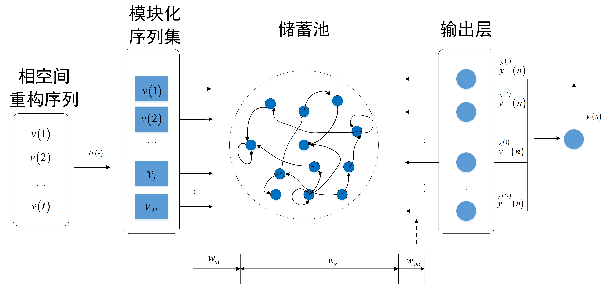
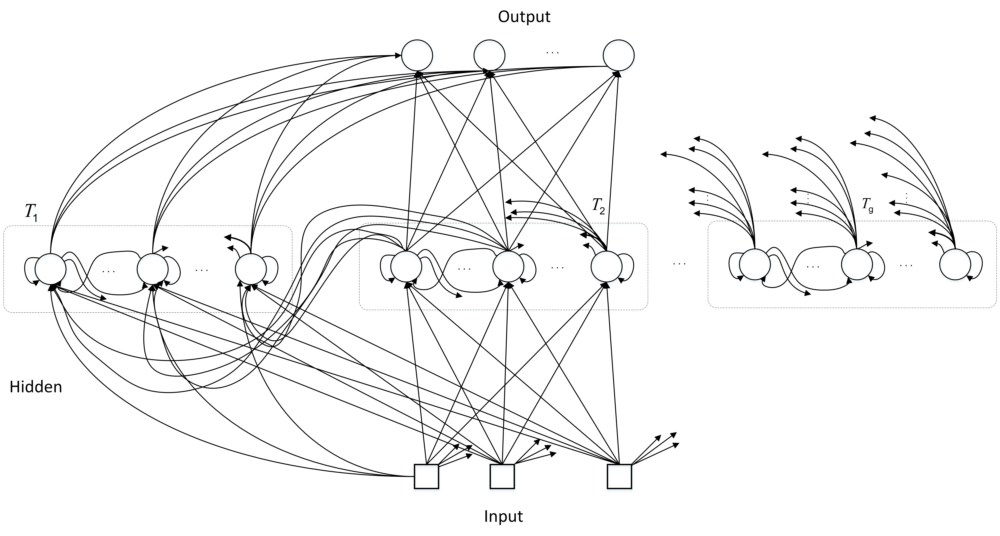

# RNN &amp; LSTM 学习笔记


## RNN

### 简介

时间序列数据是指在不同时间点上收集到的数据，这类数据反映了某⼀事物、现象等随时间的变化状态或程度。

一般的神经网络对于单个输入的处理，是和前后输入没有关系的，但是实际应用中，每个输入可能和其上一个输入或者下一个输入是有关联的，比如NLP 中要理解一句话的意思的时候，单独理解这句话的每个单词不足以理解整体意思，通常是需要处理这些词连接起来的整个序列；或者处理视频的时候，单独处理每一帧是不足够的，还需要分析这些帧连接起来的整个序列；因此，也就有了 RNN 的诞生。


一般来说 RNN 有两种：

1. Recurrent Neural Networks，即**循环神经网络**
2. Recursive Neural Networks，即**递归神经网络**。

最先提出来的是第一种，循环神经网络，也就是我们实际常说的 RNN 网络，它是一种**时间线上进行线性递归**的神经网络。

而递归神经网络被视为循环神经网络（recurrent neural network）的推广，这是一种在**结构上进行递归**的神经网络，常用于自然语言处理中的序列学习，它的输入数据本质不一定是时序的，但结构却往往更加复杂。接下来介绍的主要是**循环神经网络**。

一个循环神经网络的结构如下所示：


其中做左图是一个基本结构，而右图就是在时间上进行展开的示意图，$x_t$ 表示时刻 t 的输入，$h_t, o_t$ 分别表示隐藏层和输出层的输出。

从图中可以看出，RNN 的输入包括两个，**一个是当前时刻输入$x_t$ ，用于实时更新状态，另一个是上一时刻隐藏层的状态$h_{t-1}$ ,用于记忆状态，而不同时刻的网络共用的是同一套参数**。

RNN 常用的激活函数是 tanh，所以用公式表示每个隐藏层的状态 $h_t$ 和输出$y_t$如下所示:
$$
h_t = tanh(U \cdot x_t + W\cdot h_{t-1}+b)\\
y_t = \sigma(W^h h_t+b)
$$
用伪代码表示如下：

```python
class RNN: 
   def step(self, x): 
      self.h = np.tanh(np.dot(self.W_hh, self.h) + np.dot(self.W_xh, x)) #更新隐藏层
      y = np.dot(self.W_hy, self.h) #得到输出

   return y
```


### 常见的 RNN 结构

对于时间序列的问题，因为输入和输出可以是不同的形式，比如是单独的值或是一个序列，那么就有不同的结构，常见的结构包括了：

1. vector to sequence
2. sequence to vector
3. sequence to sequence


#### vector to sequence 结构

有时候需要处理的问题，输入是单独的值，输出是一个序列，比如常见的应用场景有：

1. 图文生成，即输入图像或者图像的特征，输出是一段文字；
2. 根据图像生成语音或者音乐，输入图像特征，输出一段语音或者是音乐。


这时候有两种建模方式：

方法 1，可以只在某一个序列进行计算，比如序列第一个进行输入计算，结构如下所示：


方法 2：把输⼊信息X作为每个阶段的输⼊，结构如下所示：


#### sequence to vector

有时我们要处理的问题输⼊是⼀个序列，输出是⼀个单独的值，此时通常在最后的⼀个序列上进⾏输出变换，其结构如下所示：


常见的应用场景有：

1. 输入一段文字，判断其所属的类别
2. 输入一个句子，判断其情感倾向
3. 输入一段视频，判断其所属类别


#### Encoder-Decoder

原始的 sequence-to-sequence 结构 的 NN 要求序列等长，然而我们遇到的大部分问题序列都是不等长的，如机器翻译中，源语言和目标语言的句子往往并没有相同的长度。

所以这种时候一般采用 Encoder-Decoder 的结构，其方法流程如下：

1. 将输入数据编码成一个上下文向量 $c$ ，这部分称为Encoder，得到 $c$ 有多种方式，最简单的方法就是把 Encoder的最后一个隐状态赋值给$c$，还可以对最后的隐状态做一个变换得到$c$，也可以对所有的隐状态做变换。其示意如下所示：


2. ⽤另⼀个RNN⽹络（我们将其称为Decoder）对其进⾏编码，这里有两种编码方法，

   ⽅法⼀是将步骤⼀中的 $c$ 作为初始状态输⼊到Decoder，示意图如下所示：


方法 2 则是将 $c$ 作为 Decoder 的每一步输入，如下所示：


常见的应用场景：

1. 机器翻译，输入一种语言的文本序列，输出另一种语言的文本序列；
2. 文本摘要，输入文本序列，输出这段文本序列的摘要；
3. 阅读理解，输入文章，输出问题答案
4. 语音识别，输入语音序列，输出文字序列


#### RNN 中的 attention 机制

在上述的 Encoder-Decoder 中，存在一个问题，**$c$ 的长度会成为限制模型性能的瓶颈**，原因是因为 Encoder 中将所有输入序列都编码成一个统一的语义特征 $c$ ，然后再进行 Decoder，那么 $c$ 就必须包含所有输入的信息，但遇到原始输入序列太长的情况，$c$ 就可能无法装下所有信息，导致模型性能精度不好。

一个解决办法就是采用 attention 机制，它通过在每个时间输入不同的 $c$ 来解决这个问题，对于引入 attention 机制的 Decoder，如下所示：


### 标准 RNN 前向输出流程

以 $x$ 表示输入，$ h$是隐层单元，$o$ 是输出，$L$ 为损失函数，$y$ 为训练集标签。$t$ 表示 $t$ 时刻的状态，$V,U,W$ 是权值，同一类型的连接权值相同。以下图为例进行说明标准 RNN 的前向传播算法：


对于 t 时刻有：
$$
h^{(t)}=\phi(Ux^{(t)}+Wh^{(t-1)}+b)
$$
其中 $\phi()$ 为激活函数，一般会选择 tanh 函数，$b$ 为偏置。

$t$ 时刻的输出为：
$$
o^{(t)}=Vh^{(t)}+c
$$
模型的预测输出为：
$$
\widehat{y}^{(t)}=\sigma(o^{(t)})
$$
其中 $\sigma$ 为激活函数，通常 RNN 用于分类，故这里一般用 softmax 函数。


### RNN 的反向传播

RNN的优化也是通过反向传播，但是带时序的版本，即 **BPFT（backpropagation through time）**，它与BP的原理是完全一样的，只不过计算过程与时间有关。沿着需要优化的参数的负梯度方向不断寻找更优的点直至收敛。

与普通的反向传播算法一样，它重复地使用链式法则，**区别在于损失函数不仅依赖于当前时刻的输出层，也依赖于下一时刻**。所以参数W在更新梯度时，必须考虑当前时刻的梯度和下一时刻的梯度，传播示意图如下；


需要寻优的参数有三个，分别是 U、V、W。与BP算法不同的是，**其中 W 和 U 两个参数的寻优过程需要追溯之前的历史数据，参数 V 相对简单只需关注目前**，那么我们就来先求解参数 V 的偏导数。
$$
\frac{\partial L^{(t)}}{\partial V}=\frac{\partial L^{(t)}}{\partial o^{(t)}}\cdot \frac{\partial o^{(t)}}{\partial V}
$$
RNN 的**损失也是会随着时间累加**的，所以不能只求 t 时刻的偏导。
$$
L=\sum_{t=1}^{n}L^{(t)}
$$

$$
\frac{\partial L}{\partial V}=\sum_{t=1}^{n}\frac{\partial L^{(t)}}{\partial o^{(t)}}\cdot \frac{\partial o^{(t)}}{\partial V}
$$

W和U的偏导的求解由于需要涉及到历史数据，其偏导求起来相对复杂。为了简化推导过程，我们假设只有三个时刻，那么在第三个时刻 L 对 W，L 对 U 的偏导数分别为：
$$
\frac{\partial L^{(3)}}{\partial W}=\frac{\partial L^{(3)}}{\partial o^{(3)}}\frac{\partial o^{(3)}}{\partial h^{(3)}}\frac{\partial h^{(3)}}{\partial W}+\frac{\partial L^{(3)}}{\partial o^{(3)}}\frac{\partial o^{(3)}}{\partial h^{(3)}}\frac{\partial h^{(3)}}{\partial h^{(2)}}\frac{\partial h^{(2)}}{\partial W}+\frac{\partial L^{(3)}}{\partial o^{(3)}}\frac{\partial o^{(3)}}{\partial h^{(3)}}\frac{\partial h^{(3)}}{\partial h^{(2)}}\frac{\partial h^{(2)}}{\partial h^{(1)}}\frac{\partial h^{(1)}}{\partial W}
$$

$$
\frac{\partial L^{(3)}}{\partial U}=\frac{\partial L^{(3)}}{\partial o^{(3)}}\frac{\partial o^{(3)}}{\partial h^{(3)}}\frac{\partial h^{(3)}}{\partial U}+\frac{\partial L^{(3)}}{\partial o^{(3)}}\frac{\partial o^{(3)}}{\partial h^{(3)}}\frac{\partial h^{(3)}}{\partial h^{(2)}}\frac{\partial h^{(2)}}{\partial U}+\frac{\partial L^{(3)}}{\partial o^{(3)}}\frac{\partial o^{(3)}}{\partial h^{(3)}}\frac{\partial h^{(3)}}{\partial h^{(2)}}\frac{\partial h^{(2)}}{\partial h^{(1)}}\frac{\partial h^{(1)}}{\partial U}
$$

可以观察到，在某个时刻的对 W 或是 U 的偏导数，需要追溯这个时刻之前所有时刻的信息。根据上面两个式子得出 L 在 t 时刻对 W 和 U 偏导数的通式： 
$$
\frac{\partial L^{(t)}}{\partial W}=\sum_{k=0}^{t}\frac{\partial L^{(t)}}{\partial o^{(t)}}\frac{\partial o^{(t)}}{\partial h^{(t)}}(\prod_{j=k+1}^{t}\frac{\partial h^{(j)}}{\partial h^{(j-1)}})\frac{\partial h^{(k)}}{\partial W}
$$

$$
\frac{\partial L^{(t)}}{\partial U}=\sum_{k=0}^{t}\frac{\partial L^{(t)}}{\partial o^{(t)}}\frac{\partial o^{(t)}}{\partial h^{(t)}}(\prod_{j=k+1}^{t}\frac{\partial h^{(j)}}{\partial h^{(j-1)}})\frac{\partial h^{(k)}}{\partial U}
$$

整体的偏导公式就是将其按时刻再一一加起来。


连乘一直带来了两个问题：**梯度爆炸和消失**。而且，在前向过程中，**开始时刻的输入对后面时刻的影响越来越小，这就是长距离依赖问题**。这样一来，就失去了**“记忆”**的能力，要知道生物的神经元拥有对过去时序状态很强的记忆能力。


### RNNs 的特点

1. **RNNs主要用于处理序列数据**。对于传统神经网络模型，从输入层到隐含层再到输出层，层与层之间一般为全连接，每层之间神经元是无连接的。但是传统神经网络无法处理数据间的前后关联问题。例如，为了预测句子的下一个单词，一般需要该词之前的语义信息。这是因为一个句子中前后单词是存在语义联系的。
2. **RNNs 中当前单元的输出与之前步骤输出也有关，因此称之为循环神经网络**。具体的表现形式为当前单元会对之前步骤信息进行储存并应用于当前输出的计算中。隐藏层之间的节点连接起来，隐藏层当前输出由当前时刻输入向量和之前时刻隐藏层状态共同决定。
3. 标准的RNNs结构图，图中每个箭头代表做一次变换，也就是说箭头连接带有权值。
4. 在标准的RNN结构中，隐层的神经元之间也是带有权值的，且权值共享。
5. 理论上，RNNs能够对任何长度序列数据进行处理。但是在实践中，为了降低复杂度往往假设当前的状态只与之前某几个时刻状态相关，**下图便是一个典型的RNNs**：


输入单元(Input units)：输入集$\bigr\{x_0,x_1,...,x_t,x_{t+1},...\bigr\}$，

输出单元(Output units)：输出集$\bigr\{y_0,y_1,...,y_t,y_{y+1},...\bigr\}$，

隐藏单元(Hidden units)：输出集$\bigr\{s_0,s_1,...,s_t,s_{t+1},...\bigr\}$。

**图中信息传递特点：**

1. 一条单向流动的信息流是从输入单元到隐藏单元。
2. 一条单向流动的信息流从隐藏单元到输出单元。
3. 在某些情况下，RNNs会打破后者的限制，引导信息从输出单元返回隐藏单元，这些被称为“Back Projections”。
4. 在某些情况下，隐藏层的输入还包括上一时刻隐藏层的状态，即隐藏层内的节点可以自连也可以互连。 
5. 当前单元（cell）输出是由当前时刻输入和上一时刻隐藏层状态共同决定。


### RNN 的问题

在原始RNN隐层中的神经元，它只有一个状态，记为 *h*，它对短期输入非常敏感。之前介绍过，RNN可利用历史信息（或说上下文信息），把过去的输出，再次循环作为输入，从而可达到更好的预测效果。比如说，“天空中飞来一只__”，这个句子比较短，对于RNN来说，构建的网络层数比较浅，因此我们可以充分利用历史信息，能以较大概率来预测空白区可能是“鸟”或“蜻蜓”之类的飞行动物。

但是，如果我们再接着预测如下句子的空白处，句子为“我在中国北京长大，我兄弟5人，我哥叫牛A，我还有三个弟弟分别叫牛C、牛D和牛F，我排名老二，因此大家都叫我牛B，我们都能说一口流利的__”。距离空白处最近的信息提示我们，该处可能要预测一个语言名称。

但世界上的语言上百种，如果我们想缩小语言名称的范围，自然需要利用这个词的上下文信息，但我们很快就会发现，关键词“中国北京”距离“说一口流利的__”这个词汇之间，距离太过遥远。的确，我们也可把RNN的结构做深一点，但限于前文提到的缺点，如梯度弥散等问题，前面网络层的信息如 ![[公式]](https://www.zhihu.com/equation?tex=x_0) 、 ![[公式]](https://www.zhihu.com/equation?tex=x_1) ，等“流淌”到当前层，有用的信息已所剩无几。或者说，过去的信息已经被抛弃（“遗忘”）了。有时，**这样有用但又为抛弃的神经单元，也称为泄漏单元（leaky unit）**。


### 常见的 RNNs 拓展和改进模型

#### 1. Simple RNNs（SRNs）

1. SRNs是一个三层网络，其在隐藏层增加了上下文单元。下图中的 y 是隐藏层，u 是上下文单元。上下文单元节点与隐藏层中节点的连接是固定的，并且权值也是固定的。上下文节点与隐藏层节点一一对应，并且值是确定的。
2. 在每一步中，使用标准的前向反馈进行传播，然后使用学习算法进行学习。上下文每一个节点保存其连接隐藏层节点上一步输出，即保存上文，并作用于当前步对应的隐藏层节点状态，即隐藏层的输入由输入层的输出与上一步的自身状态所决定。**因此SRNs能够解决标准多层感知机(MLP)无法解决的对序列数据进行预测的问题**。 
   SRNs网络结构如下图所示：


#### 2.  Bidirectional RNNs

Bidirectional RNNs(双向⽹络)将两层RNNs叠加在⼀起，**当前时刻输出(第t步的输出)不仅仅与之前序列有关，还与之后序列有关**。例如：为了预测⼀个语句中的缺失词语，就需要该词汇的上下⽂信息。Bidirectional RNNs是⼀个相对较简单的RNNs，是由两个RNNs上下叠加在⼀起组成的。输出由前向RNNs和后向RNNs共同决定。如下图所示：


#### 3. **Deep RNNs**

Deep RNNs与Bidirectional RNNs相似，其也是⼜多层RNNs叠加，因此每⼀步的输⼊有了多层⽹络。该⽹络具有更强⼤的表达与学习能⼒，但是复杂性也随之提⾼，同时需要更多的训练数据。Deep RNNs的结构如下图所示：


#### 4. **Echo State Networks**（**ESNs**）

**ESNs特点**：

1. 它的核心结构为一个**随机生成、且保持不变的储备池(Reservoir)**。储备池是大规模随机生成稀疏连接(SD通常保持1%～5%，SD表示储备池中互相连接的神经元占总神经元个数N的比例)的循环结构；
2. 从储备池到输出层的权值矩阵是唯一需要调整的部分；
3. 简单的线性回归便能够完成网络训练；


**ESNs基本思想**：

使用大规模随机连接的循环网络取代经典神经网络中的中间层，从而简化网络的训练过程。网络中的参数包括：
（1）W - 储备池中节点间连接权值矩阵；
（2）Win - 输入层到储备池之间连接权值矩阵，表明储备池中的神经元之间是相互连接；
（3）Wback - 输出层到储备池之间的反馈连接权值矩阵，表明储备池会有输出层来的反馈；
（4）Wout - 输入层、储备池、输出层到输出层的连接权值矩阵，表明输出层不仅与储备池连接，还与输入层和自己连接。
（5）Woutbias - 输出层的偏置项。 


ESNs的结构如下图所示：




#### 5.Gated Recurrent Unit Recurrent Neural Networks

GRUs是一般的RNNs的变型版本，其主要是从以下两个方面进行改进。

1. 以语句为例，序列中不同单词处的数据对当前隐藏层状态的影响不同，越前面的影响越小，**即每个之前状态对当前的影响进行了距离加权，距离越远，权值越小**。

2. 在产生误差 error 时，其可能是由之前某一个或者几个单词共同造成，所以应当对对应的单词 weight 进行更新。GRUs的结构如下图所示。


GRUs 首先根据当前输入单词向量 word vector 以及前一个隐藏层状态 hidden state 计算出 update gate 和 reset gate。再根据reset gate、当前word vector以及前一个hidden state计算新的记忆单元内容(new memory content)。当reset gate为1的时候，new memory content忽略之前所有memory content，最终的memory是由之前的hidden state与new memory content一起决定。


#### 6. Bidirectional LSTMs

1. 与 bidirectional RNNs 类似，bidirectional LSTMs 有两层 LSTMs。一层处理过去的训练信息，另一层处理将来的训练信息。
2. 在 bidirectional LSTMs 中，通过前向LSTMs获得前向隐藏状态，后向LSTMs获得后向隐藏状态，当前隐藏状态是前向隐藏状态与后向隐藏状态的组合。


#### 7. Stacked LSTMs

1. 与deep rnns 类似，stacked LSTMs 通过**将多层LSTMs叠加起来**得到一个更加复杂的模型。
2. 不同于 bidirectional LSTMs，stacked LSTMs只利用之前步骤的训练信息。 


#### 8. Clockwork RNNs(CW-RNNs)

CW-RNNs是RNNs的改良版本，其使用时钟频率来驱动。它将隐藏层分为几个块(组，Group/Module)，每一组按照自己规定的时钟频率对输入进行处理。为了降低RNNs的复杂度，CW-RNNs减少了参数数量，并且提高了网络性能，加速网络训练。CW-RNNs通过不同隐藏层模块在不同时钟频率下工作来解决长时依赖问题。将时钟时间进行离散化，不同的隐藏层组将在不同时刻进行工作。因此，所有的隐藏层组在每一步不会全部同时工作，这样便会加快网络的训练。并且，时钟周期小组的神经元不会连接到时钟周期大组的神经元，只允许周期大的神经元连接到周期小的(组与组之间的连接以及信息传递是有向的)。周期大的速度慢，周期小的速度快，因此是速度慢的神经元连速度快的神经元，反之则不成立。

CW-RNNs与SRNs网络结构类似，也包括输入层(Input)、隐藏层(Hidden)、输出层(Output)，它们之间存在前向连接，输入层到隐藏层连接，隐藏层到输出层连接。但是与SRN不同的是，隐藏层中的神经元会被划分为若干个组，设为$g$，每一组中的神经元个数相同，设为$k$，并为每一个组分配一个时钟周期$T_i\epsilon\{T_1,T_2,...,T_g\}$，每一组中的所有神经元都是全连接，但是组$j$到组$i$的循环连接则需要满足$T_j$大于$T_i$。如下图所示，将这些组按照时钟周期递增从左到右进行排序，即$T_1<T_2<...<T_g$，那么连接便是从右到左。例如：隐藏层共有256个节点，分为四组，周期分别是[1,2,4,8]，那么每个隐藏层组256/4=64个节点，第一组隐藏层与隐藏层的连接矩阵为$64\times64$的矩阵，第二层的矩阵则为 $64\times 128$ 矩阵，第三组为$64\times (3 \times 64)=64 \times  192$ 矩阵，第四组为 $64\times (4\times 64)=64 \times 256$ 矩阵。这就解释了上一段中速度慢的组连接到速度快的组，反之则不成立。

**CW-RNNs的网络结构如下图所示**：




#### 9. CNN-LSTMs

为了同时利用CNN以及LSTMs的优点，CNN-LSTMs 被提出。在该模型中，CNN用于提取对象特征，LSTMs用于预测。

CNN 由于卷积特性，其能够快速而且准确地捕捉对象特征。LSTMs的优点在于能够捕捉数据间的长时依赖性。


------

## LSTM

### LSTM 产生的原因

RNN在**处理⻓期依赖（时间序列上距离较远的节点）时会遇到巨⼤的困难**，因为计算距离较远的节点之间的联系时会涉及雅可⽐矩阵的**多次相乘**，**会造成梯度消失或者梯度膨胀的现象**。

为了解决该问题，研究⼈员提出了许多解决办法，例如 ESN（Echo State Network），增加有漏单元（Leaky Units）等等。其中**最成功应⽤最⼴泛的就是⻔限RNN（Gated RNN）**，⽽ LSTM 就是⻔限 RNN 中最著名的⼀种。有漏单元通过设计连接间的权重系数，从⽽允许 RNN 累积距离较远节点间的⻓期联系；⽽⻔限 RNN 则泛化了这样的思想，**允许在不同时刻改变该系数，且允许⽹络忘记当前已经累积的信息**。

LSTM 和 RNN 的主要输入输出区别如下：


即 LSTM 结构相比于普通的 RNN 多了一个传输状态 $c^t$ (cell state)， $h^t$ 为 hidden state。RNN中的 $h^t$ 对应于 LSTM 中的 $c^t$，传递过程中改变较慢。

$c^t$ 也就是cell  state中的内容，可以理解为主线，主要是用来保存节点传递下来的数据的，每次传递会对某些维度进行“忘记”并且会加入当前节点所包含的内容，**总的来说还是用来保存节点的信息，改变相对较小**。 它之所以变化慢，**主要是对前期记忆和当前输入的线性变换**，对前期记忆的更新和变化（可以视为理解或者领悟出来的内容），是线性变换，所以变动不大，

$h^t$ 则主要是为了和当前输入组合来获得门控信号，对于不同的当前输入，传递给下一个状态的$h^t$区别也会较大。它做的非线性变化，根据输入节点内容和非线性变化函数的不同，变动固然很大

上面说到LSTM中的 $c^t$主要是用来保存先前节点的数据的，那么RNN只有 $h^t$，那么这个 $h^t$ 肯定主要是保存了先前节点的信息的，所以我们说RNN中的 $h^t$ 实际上对应的是LSTM中的 $c^t$。


### 简介

RNN 存在梯度爆炸和消失的问题，而长短期记忆（Long short-term memory, LSTM）的提出就是要解决这两个问题，相比 RNN，**LSTM 增加了一个细胞状态 cell state**。

这个 cell state **承载着之前所有状态的信息**，每到新的时刻，就有相应的操作来决定舍弃什么旧的信息以及添加什么新的信息。这个状态与隐藏层状态 h 不同，在更新过程中，**它的更新是缓慢的**，而**隐藏层状态 h 的更新是迅速的**。

LSTM的网络结构如图所示


LSTM 拥有 3 个门，分别是遗忘门、输入门和输出门，门是一种让信息选择式通过的方法。

另外需要强调的是：LSTM 搞得这么复杂，**除了在结构上天然地克服了梯度消失的问题**，也是通过更多参数来控制模型：**通过 4 倍于 RNN 的参数量，可以更加精细地预测时间序列变量**。


#### 遗忘门与遗忘阶段

**遗忘门的作用是决定从上一个状态中舍弃什么信息**，其输入是上一个状态的输出 $h_{t-1}$，当前状态输入信息$x_t$，然后输入到 Sigmoid 函数中，输出是一个 0到 1 的数值 $f_t$ ，然后乘以上一个时刻的状态 $c_{t-1}$ 来决定舍弃或者保留多少信息，其中 0 表示完全舍弃，1 表示完全保留，这个阶段完成了对上一个节点 cell state 进行选择性忘记，其公式如下，其中  $\sigma$ 表示 Sigmoid 函数
$$
f_t = \sigma(w_f x_t + u_f h_{t-1}+b_{f})\\
遗忘门的输出： f_t * c_{t-1}
$$


#### 输入门与选择记忆阶段

**选择记忆阶段就是对输入有选择性地记忆**，即重要的记录下来，不重要的少记录一些，它决定了要往当前状态中保留什么新的信息。

输入是上一个状态的输出 $h_{t-1}$，当前状态输入信息$x_t$，同样也是输入到 Sigmoid 函数中，输出 0 到 1 的数值$i_t$，根据数值判断保留多少新的信息。

而**候选新信息是通过上一状态的输出、当前状态输入信息和 tanh 激活函数生成**。

公式如下所示，其中 $\hat C_t$ 表示单元状态更新值
$$
i_t=\sigma(w_i x_t + u_i h_{t-1})，输入门\\
\hat C_t = tanh(w_C x_t + u_C h_{t-1})，候选新信息
$$
有了输入门和遗忘门，就可以得到完整的下一个状态$C_t$，它将用于下一个状态的隐藏层 $h_t$，即当前单元的输出。公式如下所示：
$$
C_t = f_t \cdot C_{t-1}+ \hat C_t \cdot i_t
$$


#### 输出门与输出阶段

输出门决定了要从 cell state 输出什么信息，与之前两个门类似，也是会用一个 Sigmoid 函数产生一个介于 0 到 1 的数值 $O_t$ ，确定要输出什么信息，然后会继续经过一个 tanh 激活函数，得到这个单元的最终输出信息 $h_t$，公式如下：
$$
O_t = \sigma(w^ox_t+u^Oh_{t-1}) \\
h_t = O_t \cdot tanh(C_t)
$$


### LSTM 训练

LSTM 的参数训练也是采用反向传播算法，其流程如下所示：

1. **前向计算每个神经元的输出值**。对于 LSTM，就是分别计算前面说的几个门，即 $f_t, i_t, c_t, o_t, h_t$ ；

2. **确定优化的目标函数**。在训练早期，输出值和预期值会不一致，于是可计算每个神经元的误差项值，借此构造出损失函数。

3. **根据损失函数的梯度指引，更新网络权值参数**。与传统 RNN 类似，LSTM 误差项的反向传播包括两个层面：一个是空间上层面的，将误差项向网络的上一层传播。另一个是时间层面上的，沿时间反向传播，即从当前*t*时刻开始，计算每个时刻的误差。


然后跳转第（1）步，重新做（1）、（2）和（3）步，直至网络误差小于给定值。


### LSTM 流行的变体

#### 增加 peephole 连接

在正常的LSTM结构中，Gers F A 等人提出增加peephole 连接，**可以门层接受细胞状态的输入**。示意图如下所示：


#### 对忘记门和输入门进行同时确定

不同于之前是分开确定什么忘记和需要添加什么新的信息，这⾥是⼀同做出决定。示意图如下所示：


#### Gated Recurrent Unit

由Kyunghyun Cho等⼈提出的 Gated Recurrent Unit (GRU)，其将**忘记⻔和输⼊⻔合成了⼀个单⼀的更新⻔，同样还混合了细胞状态和隐藏状态**，和其他⼀些改动。其示意图如下：


### LSTM 和 GRU的区别

LSTMs与GRUs的区别如图所示：


从上图可以看出，二者结构十分相似，**不同在于**：

1. new memory 都是根据之前 state 及 input 进行计算，但是GRUs中有一个 reset gate 控制之前state的进入量，而在LSTMs里没有类似gate；
2. **产生新的state的方式不同**，LSTMs有两个不同的gate，分别是forget gate (f gate)和input gate(i gate)，而GRUs只有一种update gate(z gate)；
3. LSTMs对新产生的state可以通过 output gate(o gate) 进行调节，而GRUs对输出无任何调节。


------

## 参考

- [【模型解读】浅析RNN到LSTM](https://mp.weixin.qq.com/s?__biz=MzA3NDIyMjM1NA==&mid=2649031355&idx=2&sn=90755895232f413d1594fc43a43c4830&chksm=8712bcc6b06535d0d7e0ad1d9625deb2c729cb7d5f4d4164a5ce1f1ffb7bfcad652a7b2a4bbf&scene=21#wechat_redirect)
- Deeplearning.ai 第五门课程--序列模型
- [LSTM入门总结](https://zhuanlan.zhihu.com/p/38063427)
- [人人都能看懂的LSTM](https://zhuanlan.zhihu.com/p/32085405)
- [Understanding LSTM Networks](http://colah.github.io/posts/2015-08-Understanding-LSTMs/)
- [完全图解RNN、RNN变体、Seq2Seq、Attention机制](https://www.leiphone.com/news/201709/8tDpwklrKubaecTa.html)
- [【深度学习之美28】LSTM该如何通俗理解？](https://zhuanlan.zhihu.com/p/49834993)


