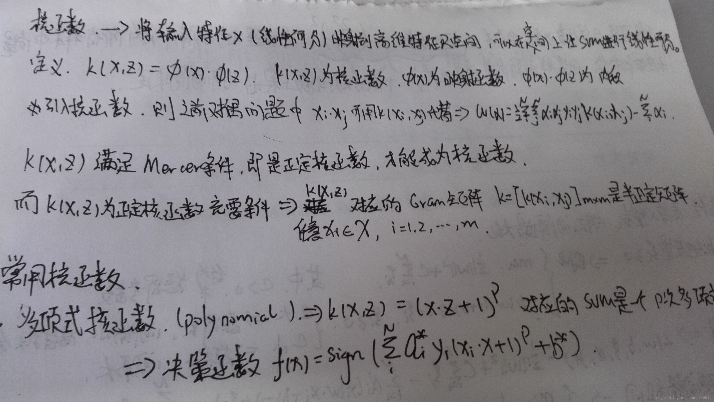

# SVM

参考：

* 《统计学习方法》
* [SVM详解(包含它的参数C为什么影响着分类器行为)-scikit-learn拟合线性和非线性的SVM](http://blog.csdn.net/xlinsist/article/details/51311755)
* [机器学习常见算法个人总结（面试用）](http://kubicode.me/2015/08/16/Machine%20Learning/Algorithm-Summary-for-Interview/)
* [SVM-支持向量机算法概述](http://blog.csdn.net/passball/article/details/7661887)
* [机器学习算法与Python实践之（二）支持向量机（SVM）初级](http://blog.csdn.net/zouxy09/article/details/17291543)
* [机器学习算法与Python实践之（三）支持向量机（SVM）进阶](http://blog.csdn.net/zouxy09/article/details/17291805)
* [机器学习算法与Python实践之（四）支持向量机（SVM）实现](http://blog.csdn.net/zouxy09/article/details/17292011)


------

## 简介

> SVM是一种二类分类模型，其基本模型定义为特征空间上的间隔最大的线性分类器，即支持向量机的学习策略便是**间隔最大化**，最终可转化为一个凸二次规划问题的求解。或者简单的可以理解为就是在高维空间中寻找一个合理的超平面将数据点分隔开来，其中涉及到非线性数据到高维的映射以达到数据线性可分的目的。

训练数据线性可分时，通过**硬间隔最大化**，学习一个线性分类器，即**线性可分支持向量机**，又称为硬间隔支持向量机；训练数据近似线性可分时，通过**软间隔最大化**，也学习一个线性分类器，即**线性支持向量机**，也称为软间隔支持向量机；训练数据线性不可分时，通过**使用核技巧和软间隔最大化**，学习**非线性支持向量机**。


## 线性可分支持向量机和硬间隔最大化

接下来主要是手写的笔记


关于凸函数，**凸集是指有这么一个点的集合，其中任取两个点连一条直线，这条线上的点仍然在这个集合内部，因此说“凸”是很形象的**。例如下图，对于凸函数（在数学表示上，满足约束条件是仿射函数，也就是线性的Ax+b的形式）来说，局部最优就是全局最优，但对非凸函数来说就不是了。


> **支持向量**是训练数据集的样本点中与分离超平面距离最近的样本点的实例。

如下图所示：


图中对类1，即Class 1的支持向量就在超平面$H_2: wx+b=-1$上，而对于类2，即Class 2正类的支持向量就在超平面$H_1: wx+b=1$上。而在这两个超平面中间的距离，即图中标着`m`的距离称为**间隔**，它依赖于分离超平面的法向量$w$，等于$\frac{2}{|| w ||}$，而两个超平面$H_1 和H_2$称为**间隔平面**。

在决定分离超平面时只有支持向量其作用，其他实例点并不起作用。如果移动支持向量将改变所求的解。**正是因为支持向量在确定分离超平面中起着决定性作用 ，所以将这种分类模型称为支持向量机。**支持向量的个数一般很少，所以支持向量机由很少的“重要的”训练样本确定。

## 线性支持向量机和软间隔最大化


## 核函数




采用不同的核函数就相当于采用不同的相似度的衡量方法。从计算的角度，不管$Φ(x)$变换的空间维度有多高，甚至是无限维（函数就是无限维的），**这个空间的线性支持向量机的求解都可以在原空间通过核函数进行**，这样就可以避免了高维空间里的计算，而**计算核函数的复杂度和计算原始样本内积的复杂度没有实质性的增加**。

> 一般情况下RBF效果是不会差于Linear
> 但是时间上RBF会耗费更多
> 下面是吴恩达的见解：
>
> 1. 如果Feature的数量很大，跟样本数量差不多，这时候选用LR或者是Linear Kernel的SVM
> 2. 如果Feature的数量比较小，样本数量一般，不算大也不算小，选用SVM+Gaussian Kernel
> 3. 如果Feature的数量比较小，而样本数量很多，需要手工添加一些feature变成第一种情况

更多有关核函数可以参考[【模式识别】SVM核函数](http://blog.csdn.net/xiaowei_cqu/article/details/35993729)和[SVM的核函数如何选取?--知乎](https://www.zhihu.com/question/21883548)。

这里总结一下：支持向量机的基本思想可以概括为，**首先通过非线性变换将输入空间变换到一个高维的空间，然后在这个新的空间求最优分类面即最大间隔分类面，而这种非线性变换是通过定义适当的内积核函数来实现的。**SVM实际上是根据统计学习理论依照**结构风险最小化**的原则提出的，要求实现两个目的：**1）两类问题能够分开（经验风险最小）2）margin最大化（风险上界最小），既是在保证风险最小的子集中选择经验风险最小的函数。**


## 优缺点

### 优点

1. 使用核函数可以向高维空间进行映射
2. 使用核函数可以解决非线性的分类
3. 分类思想很简单，就是将样本与决策面的间隔最大化
4. 分类效果较好

### 缺点

1. 对大规模数据训练比较困难
2. 无法直接支持多分类，但是可以使用间接的方法来做
3. 噪声也会影响SVM的性能，因为SVM主要是由少量的支持向量决定的。


## 多类分类

### 直接法

直接在目标函数上进行修改，将多个分类面的参数求解合并到一个最优化问题中，通过求解该优化就可以实现多分类。但是计算复杂度很高，实现起来较为困难。

### 间接法

> **1 一对多方法**就是每次训练的时候设置其中某个类为一类，其余所有类为另一个类。比如有A,B,C,D四个类，第一次A是一个类，{B,C,D}是一个类，训练一个分类器，第二次B是一个类，然后A,C,D是一个类，训练一个分类器，依次类推。因此，如果总共有$n$个类，最终将训练$n$个分类器。测试的时候，将测试样本都分别送入所有分类器中，取得到最大值的类别作为其分类结果。这是因为到分类面距离越大，分类越可信。

这种方法的优点是**每个优化问题的规模比较小，而且分类速度很快**，因为分类器数目和类别数目相同；但是，有时会出现这样两种情况：对一个测试样本，每个分类器都得到它属于分类器所在类别；或者都不属于任意一个分类器的类别。**前者称为分类重叠现象，后者叫不可分类现象**。前者可以任意选择一个结果或者就按照其到每个超平面的距离来分，哪个远选哪个类别；而后者只能分给新的第$n+1$个类别了。最大的缺点还是由于将$n-1$个类别作为一个类别，其数目会数倍于只有1个类的类别，这样会人为造成**数据集偏斜**的问题。

> **2 一对一方法**是任意两个类都训练一个分类器，那么$n$个类就需要$\frac{n(n-1)}{2}$个分类器。预测的时候通过投票选择最终结果。

这个方法同样会有分类重叠的现象，但不会有不可分类现象，因为不可能所有类别的票数都是0。**这种方法会比较高效，每次训练使用的样本其实就只有两类数据，而且预测会比较稳定，但是缺点是预测时间会很久。**

> **3 层次支持向量机（H-SVMs）。**层次分类法首先将所有类别分成两个子类，再将子类进一步划分成两个次级子类，如此循环，直到得到一个单独的类别为止。

> **4 DAG-SVMS**是由Platt提出的决策导向的循环图DDAG导出的,是针对“一对一”SVMS存在误分、拒分现象提出的。


## 序列最小最优化算法(SMO)

SMO是用于快速求解SVM的，是一种启发式算法。

基本思路如下：如果所有变量的解都满足此最优化问题的**KKT**条件，那么这个最优化问题的解就得到了。**因为KKT条件是该最优化问题的充分必要条件**。否则它选择**凸二次规划的两个变量**，其他的变量保持不变，然后根据这两个变量构建一个二次规划问题，这个二次规划关于这两个变量解会更加的接近原始二次规划的解，通过这样的子问题划分可以大大增加整个算法的计算速度，关于这两个变量：

1. 其中一个是**严重违反KKT条件**的一个变量
2. 另一个变量由约束条件自动确定。

整个SMO算法分为两部分：求解两个变量二次规划的解析方法和选择变量的启发式方法。


> **SMO称选择第一个变量的过程为外层循环**。外层循环在训练样本中选取违反KKT条件最严重的样本点，并将其对应的变量作为第一个变量。具体的，检验训练样本($x_i, y_i$)是否满足KKT条件，也就是：


该检验是在$ε$范围内进行的。在检验过程中，外层循环**首先遍历所有满足条件$0<α_j<C$的样本点，即在间隔边界上的支持向量点，**检验他们是否满足KKT条件，然后选择违反KKT条件最严重的$α_i$。如果这些样本点都满足KKT条件，那么遍历整个训练集，检验他们是否满足KKT条件，然后选择违反KKT条件最严重的$α_i$。

 **优先选择遍历非边界数据样本，因为非边界数据样本更有可能需要调整，边界数据样本常常不能得到进一步调整而留在边界上**。由于大部分数据样本都很明显不可能是支持向量，因此对应的$α$乘子一旦取得零值就无需再调整。遍历非边界数据样本并选出他们当中违反KKT 条件为止。**当某一次遍历发现没有非边界数据样本得到调整时，遍历所有数据样本，以检验是否整个集合都满足KKT条件**。如果整个集合的检验中又有数据样本被进一步进化，则有必要再遍历非边界数据样本。这样，**不停地在遍历所有数据样本和遍历非边界数据样本之间切换，直到整个样本集合都满足KKT条件为止**。**以上用KKT条件对数据样本所做的检验都以达到一定精度ε就可以停止为条件。如果要求十分精确的输出算法，则往往不能很快收敛。**

对整个数据集的遍历扫描相当容易，而实现对非边界$α_i$的扫描时，首先需要将所有非边界样本的$α_i$值（也就是满足$0<α_i<C$）保存到新的一个列表中，然后再对其进行遍历。同时，该步骤跳过那些已知的不会改变的$α_i$值。

> SMO称选择第2个变量的过程为内层循环。第2个变量选择的标准是希望能使$\alpha_2$有足够大的变化。

记$g(x) = \sum_{i=1}^N \alpha_i y_iK(x_i, x) + b$, 令$E_i = g(x_i) - y_i= (\sum_{i=1}^N \alpha_i y_iK(x_i, x) + b) - y_i,\qquad i = 1, 2$。

当$i = 1, 2$时，$E_i$是函数$g(x_i)$对输入$x_i$的预测值与真实输出$y_i$之差。

对于第2个变量$\alpha_2$的选择，一个简单的做法是选择让$|E_1 - E_2|$最大的变化。为了节省计算时间，将所有$E_i$值保存在一个列表中。

如果上述方法选择的变量不能使目标函数有足够的下降，那么采用以下启发式规则继续选择第2个变量。遍历在**间隔边界上**的支持向量点，依次将其对应的向量作为$\alpha_2$试用，直到目标函数有足够的下降。若找不到合适的，则遍历训练数据集；若仍找不到合适的$\alpha_2$，则放弃第一个变量$\alpha_1$，再通过外层循环寻求另外的$\alpha_1$。

选择这两个拉格朗日乘子后，我们需要先计算这些参数的约束值。然后再求解这个约束最大化问题,下面用$\alpha_i, \alpha_j$表示选择的第1个和第2个变量。

首先，我们需要给$α_j$找到边界$L\le α_j \le H$，以保证$α_j$满足$0\le α_j\le C$的约束。这意味着$α_j$必须落入这个盒子中。由于只有两个变量($α_i, α_j$)，约束可以用二维空间中的图形来表示，如下图：


不等式约束使得($α_i, α_j$)在盒子[0, C]x[0, C]内，等式约束使得($α_i, α_j$)在平行于盒子[0, C]x[0, C]的对角线的直线上。**因此要求的是目标函数在一条平行于对角线的线段上的最优值**。这使得两个变量的最优化问题成为实质的单变量的最优化问题。由图可以得到，$α_j$的上下界可以通过下面的方法得到：


我们优化的时候，$α_j $必须要满足上面这个约束。也就是说上面是$α_j$的可行域。然后我们开始寻找$α_j$，使得目标函数最大化。通过推导得到 $α_j $ 的更新公式如下：


这里 $E_k$ 可以看做对第 $k$ 个样本，SVM 的输出与期待输出，也就是样本标签的误差。


而$η$实际上是度量两个样本$i和j$的相似性的。在计算$η$的时候，我们需要使用核函数，那么就可以用核函数来取代上面的内积。

得到新的$α_j$后，我们需要保证它处于边界内。换句话说，如果这个优化后的值跑出了边界L和H，我们就需要简单的裁剪，将$α_j$收回这个范围：


最后，得到优化的$α_j$后，我们需要用它来计算$α_i$：


到这里，$α_i和α_j$的优化就完成了。

最后就是更新阈值$b$了，使得两个样本$i和j$都满足KKT条件。如果优化后$α_i$不在边界上（也就是满足$0<α_i<C$，这时候根据KKT条件，可以得到$y_ig_i(x_i)=1$，这样我们才可以计算$b$），那下面的阈值$b_1$是有效的，因为当输入$x_i$时它迫使SVM输出$y_i$。


同样，如果$0 < \alpha_j < C$,那么下面的$b_2$也是有效的：


 如果$0 < \alpha_i < C$和$0 < \alpha_j < C$都满足，那么$b_1和b_2$都有效，而且他们是相等的。如果他们两个都处于边界上（也就是$α_i=0$或者$α_i=C$，同时$α_j=0$或者$α_j=C$），那么在$b_1$和$b_2$之间的阈值都满足KKT条件，一般我们取他们的平均值$b=\frac{b1+b2}{2}$。所以，总的来说对$b$的更新如下：


每次完成两个变量的优化后，还必须更新对应的$E_i$值，并将它们保存在列表中。


## KKT条件分析

KKT条件具体可以查看[深入理解拉格朗日乘子法（Lagrange Multiplier) 和KKT条件](http://blog.csdn.net/xianlingmao/article/details/7919597)。

SVM的KKT条件应该是


即满足:

* L对各个x求导为零； 
* $h(x)=0$; 
* $∑α_ig_i(x)=0，α_i≥0$

拉格朗日乘子法(Lagrange Multiplier)和KKT(Karush-Kuhn-Tucker)条件是**求解约束优化问题**的重要方法，**在有等式约束时使用拉格朗日乘子法，在有不等约束时使用KKT条件**。前提是：只有当**目标函数为凸函数**时，使用这两种方法才保证求得的是**最优解**。

假设我们优化得到的最优解是：$α_i,β_i, ξ_i, w和b$。我们的最优解需要满足KKT条件：


同时$β_i, ξ_i$都需要大于等于0，而$α_i$需要在0和C之间。那可以分三种情况讨论：


因此，KKT条件变成了：


第一个式子表明**如果$α_i=0$，那么该样本落在两条间隔线外**。第二个式子表明**如果$α_i=C$，那么该样本有可能落在两条间隔线内部，也有可能落在两条间隔线上面，主要看对应的松弛变量的取值是等于0还是大于0**，第三个式子表明**如果$0<α_i<C$，那么该样本一定落在分隔线上**（这点很重要，$b$就是拿这些落在分隔线上的点来求的，因为在分割线上$w^Tx+b=1$或者$w^Tx+b=-1$嘛，才是等式，在其他地方，都是不等式，求解不了$b$）。具体形象化的表示如下：


通过KKT条件可知，$α_i$不等于0的都是支持向量，它有可能落在分隔线上，也有可能落在两条分隔线内部。KKT条件是非常重要的，在SMO也就是SVM的其中一个实现算法中，我们可以看到它的重要应用。


## 代码实现

下面是线性SVM的代码实现：

```python
from sklearn import datasets
import numpy as np
from sklearn.cross_validation import train_test_split

iris = datasets.load_iris() # 由于Iris是很有名的数据集，scikit-learn已经原生自带了。
X = iris.data[:, [2, 3]]
y = iris.target # 标签已经转换成0，1，2了
X_train, X_test, y_train, y_test = train_test_split(X, y, test_size=0.3, random_state=0) # 为了看模型在没有见过数据集上的表现，随机拿出数据集中30%的部分做测试

# 为了追求机器学习和最优化算法的最佳性能，我们将特征缩放
from sklearn.preprocessing import StandardScaler
sc = StandardScaler()
sc.fit(X_train) # 估算每个特征的平均值和标准差
sc.mean_ # 查看特征的平均值，由于Iris我们只用了两个特征，所以结果是array([ 3.82857143,  1.22666667])
sc.scale_ # 查看特征的标准差，这个结果是array([ 1.79595918,  0.77769705])
X_train_std = sc.transform(X_train)
# 注意：这里我们要用同样的参数来标准化测试集，使得测试集和训练集之间有可比性
X_test_std = sc.transform(X_test)
X_combined_std = np.vstack((X_train_std, X_test_std))
y_combined = np.hstack((y_train, y_test))

# 导入SVC
from sklearn.svm import SVC
svm = SVC(kernel='linear', C=1.0, random_state=0) # 用线性核，你也可以通过kernel参数指定其它的核。
svm.fit(X_train_std, y_train)
# 打印决策边界，这个函数是我自己写的，如果你想要的话，我发给你
plot_decision_regions(X_combined_std, y_combined, classifier=svm, test_idx=range(105,150))
plt.xlabel('petal length [standardized]')
plt.ylabel('petal width [standardized]')
plt.legend(loc='upper left')
plt.show()
```

接下来是使用非线性SVM的代码：

```python
svm = SVC(kernel='rbf', random_state=0, gamma=x, C=1.0) # 令gamma参数中的x分别等于0.2和100.0
svm.fit(X_train_std, y_train) # 这两个参数和上面代码中的训练集一样
plot_decision_regions(X_combined_std, y_combined, classifier=svm, test_idx=range(105,150))
plt.xlabel('petal length [standardized]')
plt.ylabel('petal width [standardized]')
plt.legend(loc='upper left')
plt.show()
```


