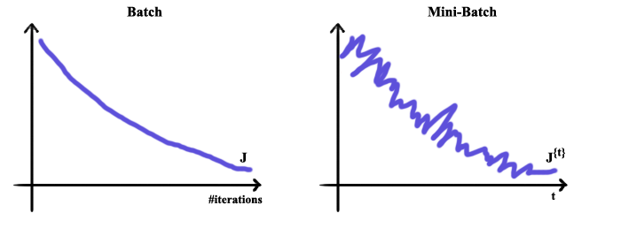

# 优化算法

参考：

- [CV_Interview 10_理清深度学习优化函数发展脉络](https://github.com/GYee/CV_interviews_Q-A/blob/master/%E8%AE%A1%E7%AE%97%E6%9C%BA%E8%A7%86%E8%A7%89/10_%E7%90%86%E6%B8%85%E6%B7%B1%E5%BA%A6%E5%AD%A6%E4%B9%A0%E4%BC%98%E5%8C%96%E5%87%BD%E6%95%B0%E5%8F%91%E5%B1%95%E8%84%89%E7%BB%9C.md)
- 吴恩达老师的 deeplearning.ai 课程
- [deeplearning.ai 学习笔记](http://www.ai-start.com/dl2017/)
- [深度学习中的优化算法串讲](https://mp.weixin.qq.com/s?__biz=MzI5MDUyMDIxNA==&mid=2247493857&idx=3&sn=34e8a373adee73f6bbe6dff740b7ede5&chksm=ec1c0518db6b8c0ef85381973446ab9ab215ccc07e4c7787a7b4e5dcb873ba5d81eec3ba164c&scene=0&xtrack=1#rd)
- [以上资料的视频讲解](https://www.bilibili.com/video/av94067702/)
- [简单认识Adam优化器](https://zhuanlan.zhihu.com/p/32698042)
- [Adam那么棒，为什么还对SGD念念不忘](http://wulc.me/2019/03/18/Adam%E9%82%A3%E4%B9%88%E6%A3%92%EF%BC%8C%E4%B8%BA%E4%BB%80%E4%B9%88%E8%BF%98%E5%AF%B9SGD%E5%BF%B5%E5%BF%B5%E4%B8%8D%E5%BF%98/)
- [干货|全面理解SGD，Momentum，AdaGrad，RMSProp，Adam优化算法](https://mp.weixin.qq.com/s/_NzI9pEY5eut3s3EvM5SxQ)
- [深度学习三十问！一位算法工程师经历30+场CV面试后总结的常见问题合集（含答案](https://mp.weixin.qq.com/s?__biz=MzI5MDUyMDIxNA==&mid=2247557731&idx=1&sn=6beb382062c90405fff55d57405503b0&chksm=ec1d0f9adb6a868ceb0603d1114e920139e59f840801fe725e0ef21d2c2fb741cef82a8dfd69&scene=21#wechat_redirect)


简单总结目前的优化算法：

**一阶方法**：

随机梯度下降（SGD）、动量（Momentum）、牛顿动量法（Nesterov动量）、AdaGrad（自适应梯度）、RMSProp（均方差传播）、Adam、Nadam。

**二阶方法**：

牛顿法、拟牛顿法、共轭梯度法（CG）、BFGS、L-BFGS。

**自适应优化算法有哪些**？

Adagrad（累积梯度平方）、RMSProp（累积梯度平方的滑动平均）、Adam（带动量的RMSProp，即同时使用梯度的一、二阶矩）

**梯度下降陷入局部最优有什么解决办法？**

 可以用BGD、SGD、MBGD、momentum，RMSprop，Adam等方法来避免陷入局部最优。


---

## 1. 优化算法基本框架

假设当前时刻待优化的参数为 $\theta_t$ ，损失函数为 $J(\theta)$ ，学习率为 $\eta$ ，参数更新的框架为：

1. 计算损失函数关于当前参数的梯度：$g_t = \nabla J(\theta_t)$

2. 根据历史梯度计算一阶动量和二阶动量：
   $$
   m_t = \phi(g_1, g_2, ...,g_t)\\
   V_t = \psi(g_1,g_2,...,g_t)
   $$
   即一阶动量为包含当前梯度在内的历史梯度的一次函数，而二阶动量是历史梯度的二次函数。

3. 计算当前时刻的下降梯度：
   $$
   \Delta \theta_t = -\eta*\frac{m_t}{\sqrt{V_t}}
   $$

4. 根据下降梯度更新参数：$\theta_{t+1} = \theta_t + \Delta \theta_t$


## 2. 指数加权移动平均值

SGD 只计算当前梯度更新参数，完全没有考虑历史梯度，但这样有一个问题是假如当前参数处在损失函数的局部最低点处，即梯度为0，因为梯度为0，所以参数不再更新，也就是说不管你之前历史梯度多大，下降地多快，只要你当前梯度为0，那就只能停在这里，也就意味着冲不出这个局部最低点。

要解决这个问题就需要将历史梯度考虑进来，但是这里又有一个问题：历史梯度那么多，全部都考虑吗，还是只考虑一部分？其实我们只要考虑最近的一段历史梯度即可，这段历史梯度怎么截就用到了**指数加权移动平均值**的概念。

假设 $\upsilon_{t-1}$ 是 $t-1$ 时刻的指数加权移动平均值，$\theta_t$ 是当前 $t$ 时刻的观测值，那么 $t$ 时刻的指数加权移动平均值为：
$$
\upsilon_t = \beta \upsilon_{t-1} + ( 1- \beta)\theta_t \\
\quad= ( 1- \beta)\theta_t + ( 1- \beta)\beta\theta_{t-1}+ \beta^2\upsilon_{t-2}\\
\quad= ( 1- \beta)\theta_t + ( 1- \beta)\beta\theta_{t-1}+ ( 1- \beta)\beta^2\theta_{t-2}+ \beta^3\upsilon_{t-3} \\
...(递推)\\
 = (1-\beta)\theta_t + \sum_{i=1}^{t-1}(1-\beta)\beta^i \theta_{t-i}
$$
其中 $0 \leq \beta \le 1$ ，从指数加权移动平均值的最终形式可以看出，$i$  表示的是距离当前时刻的时间长短，$i$ 越大代表着距离当前时刻越久远，且由于其系数中指数部分的影响，其系数越小，也就是说距离当前时刻越远的历史梯度对当前时刻的指数加权移动平均值的贡献越少，这时候若我们设置一个阈值来对贡献量进行筛选，便使得当前时刻的指数加权移动平均值只考虑距离当前时刻较近的那些历史梯度，这就对应了名字中的“移动”这个概念。

除了第 $t$ 时刻的观测值权重为 $1-\beta$ 外，其他时刻的观测值权重为 $(1-\beta)\beta^i$ 。由于通常对于那些权重小于 $\frac{1}{e}$ 的观测值可以忽略不计，所以忽略掉那些权重小于这个阈值的观测值之后，上式就可以看做是在求指数加权**移动**平均值。

下面我们计算一下什么时候权重 $(1-\beta)\beta^i$ 等于$\frac{1}{e}$ 的。

高数中有一个重要极限公式：
$$
\qquad \qquad\qquad\qquad\qquad\qquad\lim_{n \rightarrow \infty}(1+\frac{1}{n})^n= e \\
其实这个极限无论是对于+\infty还是-\infty都是成立的，因此我们令 t=-n，得:\\
lim_{t \rightarrow -\infty} (1-\frac{1}{t})^{-t} = e\quad \rightarrow \quad lim_{n \rightarrow \infty} (1-\frac{1}{n})^{n} = \frac{1}{e} \approx 0.3679 \\
令 n=\frac{1}{1-\beta}，则: \\
lim_{n \rightarrow \infty} (1-\frac{1}{n})^{n} = lim_{\beta \rightarrow 1}(\beta)^{\frac{1}{1-\beta}} = \frac{1}{e}
$$
所以当 $\beta \rightarrow1$ 时，那些 $i \ge \frac{1}{1-\beta}$ 的 $\theta_{t-i}$ 的权重 $(1-\beta)\beta^i$ 的权重肯定小于 $\frac{1}{e}$ 。**$\beta$ 通常取0.9，也就是说 $i \ge 10$ 的那些观测值都会被忽略，也就相当于只考虑包括当前时刻在内的最近10个时刻的指数加权移动平均值。**

但是还有一个问题是：当 t 比较小时，指数加权移动平均值的偏差较大，例如：设 $\theta_1=40,\beta=0.9$ ，那么 $v_1 = \beta v_0 + (1-\beta)\theta_1 = 0.9*0+0.1*40 = 4$ ，显然 $v_1$ 和 $\theta_1$ 相差太大，所以通常会加上一个修正因子 $1-\beta^t$ ，加上修正因子后的公式为：
$$
\upsilon_t = \frac{\beta \upsilon_{t-1} + ( 1- \beta)\theta_t}{1-\beta^t} \\
$$
显然，当 t 较小时，修正因子  $1-\beta^t$ 会起作用，当 t 足够大后，$\beta^t \rightarrow 0, (1-\beta^t) \rightarrow 1$ ，修正因子自动退场。**加修正因子的这个做法只有在 Adam 和 Nadam 中使用到，其他算法并没有考虑。**


## 3. SGD(Stochastic Gradient Descent)

SGD不考虑历史梯度，所以当前时刻的一阶动量即为当前时刻的梯度 $m_t = g_t$ ，且二阶动量 $V_t = E$ ，所以SGD的参数更新公式为：
$$
\Delta \theta_t = -\eta*\frac{g_t}{\sqrt{E}} = -\eta*g_t \\
\theta_{t+1}= \theta_t + \Delta\theta_t = \theta_t-\eta*g_t
$$
**缺点**：容易陷入局部最优。由于SGD只考虑当前时刻的梯度，在局部最优点的当前时刻梯度为 0 ，根据上面计算公式可知，此时参数不再进行更新，故陷入局部最优的状态。

但是虽然SGD有陷入局部最优的缺陷，但还是很常用：以上分析是针对一个参数 $\theta_i$ 来说的，即使其中一个参数陷入局部最优，但其他参数还是会继续更新，所以大概率会将陷入局部最优的那个参数拖离局部最优点，于是该参数可以继续更新。 所以整体来说并不会像单个参数那样陷入局部最优就出不来，所以还是可以work的。

### 改进策略及算法

1. **引入历史梯度的一阶动量**，代表算法：Momentum、NAG
2. **引入历史梯度的二阶动量**，代表算法：AdaGrad、RMSProp、AdaDelta
3. **同时引入历史梯度的一阶动量及二阶动量**，代表算法：Adam、Nadam


### Mini-batch 梯度下降

当我们有一个数据量很大的数据集，如果全部一起训练的话，那么完整训练一个 epoch 就会需要很长的时间。但我们可以将数据集划分成多个子集，然后依次训练每个子集，计算每个子集的损失和梯度，更新权重。

这样的每个子集，就叫做 **mini-batch**，如下所示，展示一个训练集被划分成多个 **mini-batch**，其中 m 表示训练集的数量：
$$
[X^{(1)},\ldots,X^{(1000)}],[X^{(1001),\ldots,X^{(2000)}}],\ldots,[\ldots,X^{(m)}]
$$

对于 **mini-batch** 的梯度下降实现过程如下所示：


```python
for t=(1, ..., Batches):
  对第 t 个 batch 的样本进行前向传播；
  计算该样本的 loss；
  进行反向传播，计算第 t 个 batch 的梯度并更新网络的权重
```


这个训练过程中，loss 的下降趋势会更加平滑，对比直接用整个训练集来计算梯度和 loss 的过程，如下图所示：



对于 **mini-batch**，很重要的选择就是 **batch** 的大小：


- 如果设置 **batch=m**，m 是训练集的数量，那么这就是**批量梯度下降(Batch Gradient Descent)**，也就是直接用所有训练集数据计算梯度；
- 如果设置 **batch=1**，那么就是**随机梯度下降(Stochastic Gradient Descent)**。


实际应用中，选择的 **batch** 都是在 1 和 m 之间，根据 m 的大小，有这么几种选择：


- 如果 m 小于 2000，这个数据集就是一个比较小的数据集，可以直接用批量梯度下降法；
- 如果 m 大于 2000，那么应该用的就是 **mini-batch** 梯度下降，而经典的 **batch** 大小设置一般是 64，128，256 等，也就是通常是 2 的 n 次方，这样主要是考虑内存设置和使用方式；


对于上述三种梯度下降法，其下降趋势如下图所示：


对于这三种梯度下降法，各有各的优缺点：


1. **批量梯度下降法**：
   - 优点：
     - cost fuction若为凸函数，能够保证收敛到全局最优值；若为非凸函数，能够收敛到局部最优值。
     - 一次迭代是对所有样本进行计算，此时利用矩阵进行操作，实现了并行。
   - 缺点：
     - 由于每轮迭代都需要在整个数据集上计算一次，所以批量梯度下降可能非常慢
     - 训练数较多时，需要较大内存
     - 批量梯度下降不允许在线更新模型，例如新增实例
2. **随机梯度下降**：
   - 优点：
     - 算法收敛速度快(在Batch Gradient Descent算法中, 每轮会计算很多相似样本的梯度, 这部分是冗余的)
     - 可以在线更新
     - 有几率跳出一个比较差的局部最优而收敛到一个更好的局部最优甚至是全局最优
   - 缺点：
     - 每次只处理一个样本，效率过低；
     - 容易收敛到局部最优，并且容易被困在鞍点

3. **小批量梯度下降算法（mini-batch GD）**

- 优点：
  - 通过矩阵运算，每次在一个batch上优化神经网络参数并不会比单个数据慢太多
  - 每次使用一个batch可以大大减小收敛所需要的迭代次数，同时可以使收敛到的结果更加接近梯度下降的效果
  - 可实现并行化
- 缺点：
  - 不过 Mini-batch gradient descent 不能保证很好的收敛性，learning rate 如果选择的太小，收敛速度会很慢，如果太大，loss function 就会在极小值处不停地震荡甚至偏离。（有一种措施是先设定大一点的学习率，当两次迭代之间的变化低于某个阈值后，就减小 learning rate，不过这个阈值的设定需要提前写好，这样的话就不能够适应数据集的特点。）对于非凸函数，还要避免陷于局部极小值处，或者鞍点处，因为鞍点周围的error是一样的，所有维度的梯度都接近于0，SGD 很容易被困在这里。（会在鞍点或者局部最小点震荡跳动，因为在此点处，如果是训练集全集带入即BGD，则优化会停止不动，如果是mini-batch或者SGD，每次找到的梯度都是不同的，就会发生震荡，来回跳动。）
  - SGD对所有参数更新时应用同样的 learning rate，如果我们的数据是稀疏的，我们更希望对出现频率低的特征进行大一点的更新。LR会随着更新的次数逐渐变小。


上述三种方法都面临以下的问题：

1. **选择择适当的学习率α较为困难**。太小的学习率会导致收敛缓慢，而学习速度太块会造成较大波动，妨碍收敛。
2. 目前可采用的方法是**在训练过程中调整学习率大小**，例如模拟退火算法：预先定义一个迭代次数m，每执行完m次训练便减小学习率，或者当cost function的值低于一个阈值时减小学习率。**然而迭代次数和阈值必须事先定义，因此无法适应数据集的特点**。
3. 上述方法中, **每个参数的 learning rate 都是相同的，这种做法是不合理的**：如果训练数据是稀疏的，并且不同特征的出现频率差异较大，那么比较合理的做法是对于出现频率低的特征设置较大的学习速率，对于出现频率较大的特征数据设置较小的学习速率。
4. 近期的的研究表明，深层神经网络之所以比较难训练，并不是因为容易进入 local minimum。相反，由于网络结构非常复杂，在绝大多数情况下即使是 local minimum 也可以得到非常好的结果。**而之所以难训练是因为学习过程容易陷入到马鞍面中**，即在坡面上，一部分点是上升的，一部分点是下降的。而这种情况比较容易出现在平坦区域，在这种区域中，**所有方向的梯度值都几乎是 0**。


## 3. 动量梯度下降(Gradient descent with Momentum)


动量梯度下降法的运行速度**几乎总是快于标准的梯度下降法**，**其基本思想就是计算梯度的指数加权平均数，并利用该梯度更新你的权重。**


动量梯度下降法的实现步骤是这样的，在每次迭代 t 中：


1. 计算每个 mini-batch 里的权重和偏置值的微分： dW，db；
1. 参数的更新公式如下所示：


dW%20%5C%5C%0AV_%7Bdb%7D%20%3D%20%5Cbeta%20V_%7Bdb%7D%2B(1-%5Cbeta)db%20%5C%5C%0AW%3A%3DW-%5Calpha%20V_%7BdW%7D%20%5C%5C%0Ab%3A%3Db-%5Calpha%20V_%7Bdb%7D%0A#card=math&code=V_%7BdW%7D%20%3D%20%5Cbeta%20V_%7BdW%7D%20%2B%20%281-%5Cbeta%29dW%20%5C%5C%0AV_%7Bdb%7D%20%3D%20%5Cbeta%20V_%7Bdb%7D%2B%281-%5Cbeta%29db%20%5C%5C%0AW%3A%3DW-%5Calpha%20V_%7BdW%7D%20%5C%5C%0Ab%3A%3Db-%5Calpha%20V_%7Bdb%7D%0A)


这里两个超参数，分别是学习率 ，以及控制指数加权平均数的参数 ，最常用的  数值是 0.9。


而  表示的是权重过去梯度历史的信息，如果设置 $\beta=0.9$，它将是平均前面十次迭代的梯度，也就是会考虑前面10次迭代的梯度来更新本次迭代的权重。如果这个参数设置为 0.999，那么考虑的就是前面 1000 次迭代了。


## 4. NAG (Nesterov Accelerated Gradient)

除了利用惯性（一阶动量）跳出局部沟壑外，我们还可以尝试往前看一步，即：**在Momentum考虑历史梯度的基础上，把当前梯度转换为未来梯度**。

想象一下你走到一个盆地，四周都是略高的小山，你觉得没有下坡的方向，那就只能待在这里了。可是如果你爬上高地，就会发现外面的世界还很广阔。因此，我们不能停留在当前位置去观察未来的方向，而要向前多看一步。

我们知道Momentum在时刻 $t$ 的主要下降方向是由历史梯度（惯性）决定的，当前时刻的梯度权重较小，那不如不用管当前梯度，而是先看看如果跟着惯性走了一步，那个时候外面的世界是怎样的。也即在Momentum的基础上将当前时刻的梯度换成下一时刻的梯度。由于此时仍然没有用到二阶动量，所以 $V_t=E$ ，所以NAG的参数更新公式为：
$$
Momentum中原本下一个时刻的梯度计算公式为:\theta_{t+1} = \theta_t -(\beta m_{t-1}+\eta g_t) \\
不考虑当前梯度即令;g_t = 0 \\ 
所以下一个时刻的梯度的计算公式为：　\theta_{t+1} = \theta_t -\beta m_{t-1} \\
所以将当前时刻的梯度换成下一时刻的梯度即:g_t = \Delta J(\theta_t -\beta m_{t-1})\\
上式代入到Momentum的参数更新公式中：\theta_{t+1} = \theta_t -(\beta m_{t-1}+\eta \Delta J(\theta_t -\beta m_{t-1}))
$$


> 以上的两个概念只引入了一阶动量。而二阶动量的出现，才意味着**“自适应学习率”**优化算法时代的到来。在SGD及其引入一阶动量的改进算法中，均以相同的学习率去更新参数。但是，以相同的学习率进行变化经常是不合理的。
>
> 在神经网络中，**参数需要用不同的学习率进行更新**。对于经常更新的参数，我们已经积累了大量关于它的知识，不希望被单个样本影响太大，希望学习速率慢一些；对于那些偶尔更新的参数，我们了解的信息太少，希望能从每个偶然出现的样本身上多学一些，即学习速率大一些。
>
> 以神经网络中的 W 及 b 为例，如下图为损失函数等高线图，W 为横轴，b 为纵轴。发现每次b 变化很大，而 W 每次仅更新一小步。但是，纵观整个损失函数我们发现，W 其实可以迈开步子往前走，而 b 则不用那么活跃。
>
> 

于是，出现了以下针对不同维度的参数采用不同学习率的二阶动量改进算法。


## 5. AdaGrad

从数学的角度来看，更新幅度很大的参数，通常其历史累计梯度的平方和会很大；相反，更新幅度很小的参数，通常其累计历史梯度的平方和会很小。因此，**我们可以考虑让学习率除以历史梯度的平方和**，这样之前更新幅度大的参数的学习率分母也大，之前更新幅度小的参数的学习率分母也小，**从而起到调节学习率的效果**。

我们上面讨论的 $\theta_t$ 指的是网络中的参数，但是参数有很多个，所以其实 $\theta_t$ 是一个向量，我们假设网络中有 d 个参数，那么 $\theta_t = [\theta_{t,1}, \theta_{t,2},..\theta_{t,d}]^T$ 。那么针对其中的第 i 维度的参数梯度更新公式为：
$$
\upsilon_{t,i} = \sum_{t=1}^{t}g_{t,i}^2 \\
\Delta \theta_{t,i} = -\frac{\eta}{\sqrt{\upsilon_{t,i}+\varepsilon}}*g_{t,i} \\ \theta_{t+1, i}=\theta_{t,i}-\frac{\eta}{\sqrt{\upsilon_{t,i}+\varepsilon}}*g_{t,i}
$$
其中 $g_{t,i}$ 表示第 t 时刻第 i 维度参数的梯度值，$\varepsilon$ 是防止分母等于 0 的平滑项（常取一个很小的值例如 1e-8） 。显然，此时上式中的 $-\frac{\eta}{\sqrt{\upsilon_{t,i}+\varepsilon}}$ 这个整体可以看作是学习率，分母中的历史累计梯度值 $v_{t,i}$ 越大的参数学习率越小。

上式仅仅是第 t 时刻第 i 维度参数的更新公式，对于第 t 时刻所有维度的参数的更新公式如下：
$$
V_t = diag(\upsilon_{t,1}, \upsilon_{t,2},...,v_{t,d}) \in R^{d*d} \\
\Delta \theta_{t} = -\frac{\eta}{\sqrt{V_t+\varepsilon}}*g_{t} \\
\theta_{t+1}=\theta_{t}-\frac{\eta}{\sqrt{V_t+\varepsilon}}*g_{t}
$$
也就是构造成矩阵相乘的形式：　$V_t$ 是对角矩阵（除了对角线有非零值外其他地方都是 0 ） 所以上式中的 $\varepsilon$ 只用来平滑 $V_t$ 对角线上的元素。

**缺点**：随着时间步的拉长，历史累计梯度平方和 $v_{t,i}$ 会越来越大，**这样会使得所有维度参数的学习率都不断减小**（单调递减），无论更新幅度如何。


## 6. RMSprop

由于 AdaGrad 单调递减的学习率变化过于激进，我们考虑一个改变二阶动量计算方法的策略：不累计全部历史梯度，而只关注过去一段时间窗口的下降梯度，采用 Momentum 中的指数加权移动平均值的思路。

首先看最简单直接版的 **RMAProp** ，RMSProp 就是在 AdaGrad 的基础上将普通的历史累计梯度平方和换成**历史累计梯度平方和的指数加权移动平均值**，所以只需将 AdaGrad 中的 $v_{t,i}$ 的公式改成指数加权移动平均值的形式即可：
$$
v_{t,i} = \beta v_{t-1,i} + (1-\beta)g_{t,i}^2 \\
V_t = diag(\upsilon_{t,1}, \upsilon_{t,2},...,v_{t,d}) \in R^{d*d} \\
\Delta \theta_{t} = -\frac{\eta}{\sqrt{V_t+\varepsilon}}*g_{t} \\
\theta_{t+1}=\theta_{t}-\frac{\eta}{\sqrt{V_t+\varepsilon}}*g_{t}
$$


参数中 $\epsilon$ 是为了数值稳定，一般这个参数会设置为非常小的数值，比如 $10^{-8}$。

**RMSprop **跟 **Momentum** 有很相似的一点，可以**消除梯度下降中的摆动**，包括 **mini-batch** 梯度下降，并允许你使用一个更大的学习率，从而加快你的算法学习速度。


## 7. AdaDelta

**AdaDelta** 又在 RMSProp 的基础上进行改进：它除了对二阶动量计算指数加权移动平均值之外，还对学习率动了手脚，**即要达到的目标是不需要我们人为设定固定的学习率，而是让模型根据历史经验将学习率给换掉**。

所以另外它会对当前时刻的下降梯度 $\Delta \theta_t$ 的平方也计算一个指数加权移动平均，具体的：
$$
E[\Delta \theta^2]_{t,i} = \gamma E[\Delta \theta^2]_{t-1,i} + (1-\gamma)\Delta \theta_{t,i}^2
$$
由于 $\Delta \theta_{t,i}^2$ 目前是未知的，所以只能用 t-1 时刻的指数加权移动平均值来近似替换，也即：
$$
E[\Delta \theta^2]_{t-1,i} = \gamma E[\Delta \theta^2]_{t-2,i} + (1-\gamma)\Delta \theta_{t-1,i}^2
$$
接着 AdaDelta 将此值替换我们预先设置的学习率 $\eta$ 。

因此，AdaDelta 的参数更新公式如下：
$$
v_{t,i} = \beta v_{t-1,i} + (1-\beta)g_{t,i}^2 \\
V_t = diag(\upsilon_{t,1}, \upsilon_{t,2},...,v_{t,d}) \in R^{d*d} \\
E[\Delta \theta^2]_{t-1,i} = \gamma E[\Delta \theta^2]_{t-2,i} + (1-\gamma)\Delta \theta_{t-1,i}^2 \\
\Theta_t = diag(E[\Delta \theta^2]_{t-1,1}, E[\Delta \theta^2]_{t-1,2}, ...,E[\Delta \theta^2]_{t-1,d}) \in R^{d*d}\\
\Delta \theta_{t} = -\frac{\sqrt{\Theta_t + \varepsilon}}{\sqrt{V_t+\varepsilon}}*g_{t} \\
\theta_{t+1}=\theta_{t}-\frac{\sqrt{\Theta_t + \varepsilon}}{\sqrt{V_t+\varepsilon}}*g_{t}
$$
显然，对于 AdaDelta 算法来说，已经不需要我们自己预设学习率了，只需要预设 $\beta$ 和 $\gamma$ 这两个指数加权移动平均值的衰减率即可。


## 8. Adam(Adaptive Moment Estimation)

结合了 AdaGrad 和 RMSProp 两种优化算法的优点，对梯度的一阶矩估计（即梯度的均值）和二阶矩估计（即梯度的未中心化的方差）进行综合考虑，计算出更新步长。

具体如下：首先计算一阶动量：（注意这个公式中 $g_t$ 前面的系数与Momentum是不同的）
$$
m_t = \beta_1 m_{t-1}+(1-\beta_1)g_t
$$
然后类似 RMSProp 和 AdaDelta 计算二阶动量：
$$
v_{t,i} = \beta_2 v_{t-1,i} + (1-\beta_2)g_{t,i}^2 \\
V_t = diag(\upsilon_{t,1}, \upsilon_{t,2},...,v_{t,d}) \in R^{d*d} \\
$$
**但是这里要加上修正因子**，即：（如果忘了这个回到前面去再看看指数加权移动平均值概念的最后部分）
$$
\hat{m}_t = \frac{m_t}{1-\beta_1^t} \\
\hat{v}_{t,i} = \frac{v_{t,i}}{1-\beta_2^t} \\
\hat{V}_t = diag(\hat{v}_{t,1}, \hat{v}_{t,2},...,\hat{v}_{t,d}) \in R^{d*d} \\
$$
所以，Adam的参数更新公式为：
$$
\Delta \theta_{t} = -\frac{\eta}{\sqrt{\hat{V}_t+\varepsilon}}*\hat{m}_{t} \\
\theta_{t+1}=\theta_{t}-\frac{\eta}{\sqrt{\hat{V}_t+\varepsilon}}*\hat{m}_{t}
$$

Adam 具有以下这些优点：

1. 实现简单，计算高效，对内存需求少
2. 参数的更新不受梯度的伸缩变换影响
3. 超参数具有很好的解释性，且通常无需调整或仅需很少的微调
4. 更新的步长能够被限制在大致的范围内（初始学习率）
5. 能自然地实现步长退火过程（自动调整学习率）
6. 很适合应用于大规模的数据及参数的场景
7. 适用于不稳定目标函数
8. 适用于梯度稀疏或梯度存在很大噪声的问题


代码实现：

```python
class Adam:
    def __init__(self, loss, weights, lr=0.001, beta1=0.9, beta2=0.999, epislon=1e-8):
        self.loss = loss
        self.theta = weights
        self.lr = lr
        self.beta1 = beta1
        self.beta2 = beta2
        self.epislon = epislon
        self.get_gradient = grad(loss)
        self.m = 0
        self.v = 0
        self.t = 0

    def minimize_raw(self):
        self.t += 1
        g = self.get_gradient(self.theta)
        self.m = self.beta1 * self.m + (1 - self.beta1) * g
        self.v = self.beta2 * self.v + (1 - self.beta2) * (g * g)
        self.m_hat = self.m / (1 - self.beta1 ** self.t)
        self.v_hat = self.v / (1 - self.beta2 ** self.t)
        self.theta -= self.lr * self.m_hat / (self.v_hat ** 0.5 + self.epislon)

    def minimize(self):
        self.t += 1
        g = self.get_gradient(self.theta)
        lr = self.lr * (1 - self.beta2 ** self.t) ** 0.5 / (1 - self.beta1 ** self.t)
        self.m = self.beta1 * self.m + (1 - self.beta1) * g
        self.v = self.beta2 * self.v + (1 - self.beta2) * (g * g)
        self.theta -= lr * self.m / (self.v ** 0.5 + self.epislon)
```


### Adam 的改进

adam 存在以下两个问题：

1. 可能不收敛
2. 错过全局最优解


#### 1. 可能不收敛

在 ICLR 2018 最佳论文 [On the Convergence of Adam and Beyond 中探讨了Adam算法的收敛性，通过反例证明了Adam在某些情况下可能会不收敛。

各大优化算法的学习率：
$$
η_t=α/\sqrt{V_t}
$$
其中:

- SGD 没有用到二阶动量，因此学习率是恒定的（实际使用过程中会采用学习率衰减策略，因此学习率递减）。
- AdaGrad 的二阶动量不断累积，单调递增，因此学习率是单调递减的。

因此，这两类算法会使得学习率不断递减，最终收敛到0，模型也得以收敛。

但 AdaDelta 和 Adam 则不然。二阶动量是固定时间窗口内的累积，随着时间窗口的变化，遇到的数据可能发生巨变，使得 VtVt 可能会时大时小，不是单调变化。这就**可能在训练后期引起学习率的震荡，导致模型无法收敛。**

这篇文章也给出了一个修正的方法。由于Adam中的学习率主要是由二阶动量控制的，为了保证算法的收敛，可以**对二阶动量的变化进行控制，避免上下波动。**

$$
V_t = max(\beta_2 \times V_{t-1}+(1-\beta_2)g_t^2, V_{t-1})
$$
通过这种修改，可以保证$||V_t||\ge||V_{t-1}||$，从而使得学习率单调递减。


#### 2. 错过全局最优解

深度神经网络往往包含大量的参数，在这样一个维度极高的空间内，非凸的目标函数往往起起伏伏，拥有无数个高地和洼地。有的是高峰，通过引入动量可能很容易越过；但有些是高原，可能探索很多次都出不来，于是停止了训练。

Arxiv上有两篇文章谈到这个问题。

第一篇就是吐槽 Adam 最狠的 The Marginal Value of Adaptive Gradient Methods in Machine Learning 。文中说到，同样的一个优化问题，不同的优化算法可能会找到不同的答案，但自适应学习率的算法往往找到非常差的答案。他们通过一个特定的数据例子说明，**自适应学习率算法可能会对前期出现的特征过拟合，后期才出现的特征很难纠正前期的拟合效果。**

另外一篇是 [Improving Generalization Performance by Switching from Adam to SGD](https://arxiv.org/abs/1712.07628)，进行了实验验证。他们 CIFAR-10 数据集上进行测试，**Adam 的收敛速度比 SGD 要快，但最终收敛的结果并没有SGD好。他们进一步实验发现，主要是后期 Adam 的学习率太低，影响了有效的收敛。他们试着对Adam的学习率的下界进行控制，发现效果好了很多。**

于是他们提出了一个用来改进Adam的方法：**前期用Adam，享受Adam快速收敛的优势；后期切换到SGD，慢慢寻找最优解。**这一方法以前也被研究者们用到，不过主要是根据经验来选择切换的时机和切换后的学习率。这篇文章把这一切换过程傻瓜化，给出了切换SGD的时机选择方法，以及学习率的计算方法，效果看起来也不错。


## 9. Nadam

从这名字也能看出，Nadam = Nestrov + Adam ，具体思想如下：由于 Nesterov 的核心在于，计算当前时刻的梯度 $g_t$ 时使用了 "未来梯度" $\Delta J(\theta_t - \beta m_{t-1})$ ，Nadam 基于此提出了一种公式变形的思路，大意可以这样理解：只要能在梯度计算中考虑到 "未来梯度" ，就算达到了 Nestrov 的效果。既然如此，我们不一定非要在计算 $g_t$ 时使用 "未来梯度" ，可以考虑在其他地方使用未来梯度。

具体的，首先在 Adam 的基础上将 $\hat{m_t}$ 展开：
$$
\theta_{t+1}=\theta_{t}-\frac{\eta}{\sqrt{\hat{V}_t+\varepsilon}}*\hat{m}_{t}\\
=\theta_{t}-\frac{\eta}{\sqrt{\hat{V}_t+\varepsilon}}*(\frac{\beta m_{t-1}}{1-\beta_1^t}+\frac{(1-\beta_1)g_t}{1-\beta_1^t})
$$
此时，如果我们将第 t-1 时刻的动量 $m_{t-1}$ 用第 t 时刻的动量 $m_t$ 近似代替的话，那么我们就引入了 "未来因素" ，所以便可以得到 Nadam 的表达式为：
$$
\theta_{t+1}=\theta_{t}-\frac{\eta}{\sqrt{\hat{V}_t+\varepsilon}}*(\frac{\beta m_{t}}{1-\beta_1^t}+\frac{(1-\beta_1)g_t}{1-\beta_1^t})
$$


## 10. 学习率衰减策略


为了加快训练速度，可以考虑随时间慢慢减小学习率，这称为学习率衰减策略。


假设训练时候如果采用的是固定的学习率，那么其 loss 的下降过程如下图所示，波动会非常大，并且迭代过程中会有噪音，而且并不会精确地收敛，算法最后会在最小值附近摆动。主要也是因为用的是一个固定的学习率，而不同的 **mini-batch** 中会有噪音。


因此需要一种学习率衰减策略，并且学习率衰减策略的本质应该是在学习初期可以承受较大的下降，但开始收敛的时候，较小的学习率可以让下降速度减慢，即开始学习率可以下降较多，让 loss 尽快下降到最小值附近，然后通过较小的学习率来逐渐逼近最小值，并达到最小值。

**最直接的学习率衰减策略就是根据训练迭代次数的下降**，也就是 epoch （或者是总的训练迭代次数也可以），其下降公式如下所示：
$$
\alpha=\frac{1}{1+DecayRate * EpochNumbers}\alpha_0
$$


其中 DecayRate 是衰减率，$\alpha_0$  是初始学习率，而 EpochNumber 是训练 epoch 次数。这里衰减率就是需要我们调整的一个超参数。


举个例子，初始学习率 $\alpha_0=0.2$ ，然后衰减率 DecayRate 是 1.0，那么每个 epoch 的学习率如下所示：

| Epoch |  |
| :---: | :----------------------------------------------------------: |
|   1   |                             0.1                              |
|   2   |                            0.067                             |
|   3   |                             0.05                             |
|   4   |                             0.04                             |
|   5   |                             ...                              |


当然还有其他的学习率衰减策略：


1. **指数衰减**：$\alpha=0.95^{EpochNumber}\alpha_0$
1. **基于 epoch 的衰减**：$\alpha=\frac{k}{EpochNumber}\alpha_0$
1. **基于 mini-batch 的衰减**：$\alpha=\frac{k}{t}\alpha_0$，t 就是 batch 的大小
1. **离散下降（discrete stair cease）**：如下图所示：

、


5. **手动衰减**：也就是先用一个学习率训练模型，观察训练速度，如果训练速度变慢了，可以将学习率减小一些；这种方法也是有效的，但是前提是模型数量很小的时候。


## 11. 牛顿法

利用二阶导数，收敛速度快；但对目标函数有严格要求，必须有连续的一、二阶偏导数，计算量大。利用牛顿法求解目标函数的最小值其实是转化成求使目标函数的一阶导为0的参数值。这一转换的理论依据是，函数的极值点处的一阶导数为0.其迭代过程是在当前位置x0求该函数的切线，该切线和x轴的交点x1，作为新的x0,重复这个过程，直到交点和函数的零点重合。此时的参数值就是使得目标函数取得极值的参数值。

**简述梯度下降法和牛顿法的优缺点？梯度下降法和牛顿法区别**

1.牛顿法：是通过求解目标函数的一阶导数为0时的参数，进而求出目标函数最小值时的参数。①收敛速度很快。②海森矩阵的逆在迭代过程中不断减小，可以起到逐步减小步长的效果。③缺点：海森矩阵的逆计算复杂，代价比较大，因此有了拟牛顿法。

2.梯度下降法：是通过梯度方向和步长，直接求解目标函数的最小值时的参数。越接近最优值时，步长应该不断减小，否则会在最优值附近来回震荡。

