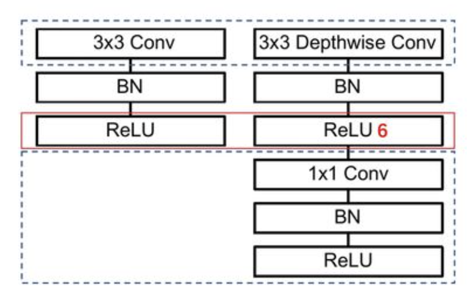
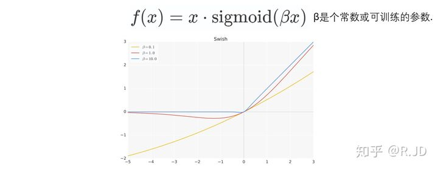
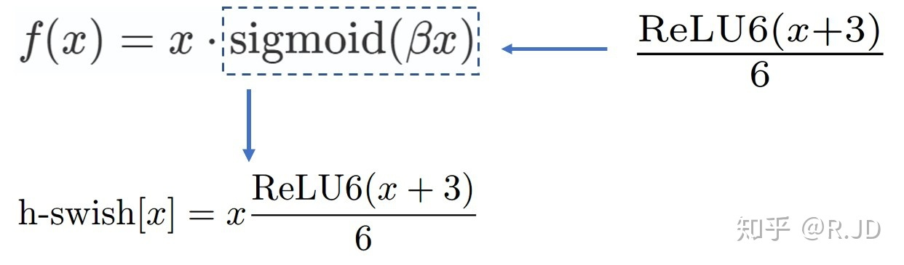

# 轻量级网络

参考文章：

- 深度学习 500 问
- [计算机视觉深度学习面试题总结](https://blog.csdn.net/sazass/article/details/112146957)
- [轻量级神经网络“巡礼”（二）—— MobileNet，从V1到V3](https://zhuanlan.zhihu.com/p/70703846)
- [Xception算法详解](https://blog.csdn.net/u014380165/article/details/75142710)

## 常用的轻量级网络有哪些？

### 1. SequeezeNet

SqueenzeNet出自F. N. Iandola, S.Han等人发表的论文《SqueezeNet: AlexNet-level accuracy with 50x fewer parameters and < 0.5MB model size》，作者在保证精度不损失的同时，将原始AlexNet压缩至原来的510倍。  

#### 1.1 设计思想

在网络结构设计方面主要采取以下三种方式：

* 用1\*1卷积核替换3\*3卷积
  * 理论上一个1\*1卷积核的参数是一个3\*3卷积核的1/9，可以将模型尺寸压缩9倍。
* 减小3\*3卷积的输入通道数
  * 根据上述公式，减少输入通道数不仅可以减少卷积的运算量，而且输入通道数与输出通道数相同时还可以减少MAC。
* 延迟降采样
  * 分辨率越大的输入能够提供更多特征的信息，有利于网络的训练判断，延迟降采样可以提高网络精度。

#### 1.2 网络架构

SqueezeNet提出一种多分支结构——fire model，其中是由Squeeze层和expand层构成。Squeeze层是由 s1 个1\*1卷积组成，**主要是通过1\*1的卷积降低expand层的输入维度**；

expand层利用e1个1\*1和e3个3\*3卷积构成多分支结构提取输入特征，以此**提高网络的精度**(其中e1=e3=4*s1)。

SqueezeNet整体网络结构如下图所示：

#### 1.3 实验结果

不同压缩方法在ImageNet上的对比实验结果

由实验结果可知，SqueezeNet不仅保证了精度，而且将原始AlexNet从240M压缩至4.8M，压缩50倍，说明此轻量级网络设计是可行。

### 2. MobileNet

MobileNet 是Google团队于CVPR-2017的论文《MobileNets: Efficient Convolutional Neural Networks for Mobile Vision Applications》中针对手机等嵌入式设备提出的一种轻量级的深层神经网络，该网络结构在VGG的基础上使用DW+PW的组合，在保证不损失太大精度的同时，降低模型参数量。

论文地址：https://arxiv.org/abs/1704.04861

#### 2.1 设计思想

* 采用**深度可分离卷积**代替传统卷积
  * 采用DW卷积在减少参数数量的同时提升运算速度。但是由于每个feature map只被一个卷积核卷积，因此经过DW输出的feature map不能只包含输入特征图的全部信息，而且特征之间的信息不能进行交流，导致“信息流通不畅”。
  * 采用PW卷积实现通道特征信息交流，解决DW卷积导致“信息流通不畅”的问题。
* 使用stride=2的卷积替换pooling
  * 直接在卷积时利用stride=2完成了下采样，从而节省了需要再去用pooling再去进行一次下采样的时间，可以提升运算速度。同时，因为pooling之前需要一个stride=1的 conv，而与stride=2 conv的计算量想比要高近4倍(**个人理解**)。
* 引入两个收缩超参数：宽度因子，分辨率乘子来减小参数

##### 深度可分离卷积思想

**深度可分离卷积**就是**将普通卷积拆分成为一个深度卷积和一个逐点卷积**。其输入和输出都是相同的。

- 深度(depthwise)卷积：对每个输入通道单独使用一个卷积核处理。在**不改变输入特征图像的深度**的情况下，对**每一通道进行卷积操作**，这样就得到了**和输入特征图通道数一致的输出特征图**。比如输入12×12×3的特征图，经过5×5×1×3的深度卷积之后，得到了8×8×3的输出特征图。输入个输出的维度是不变的3。这样就会有一个问题，通道数太少，特征图的维度太少，可能获取不到足够的有效信息。
- 逐点(pointwise)卷积：1×1卷积，用于将depthwise的卷积的输出组合起来，**主要作用就是对特征图进行升维和降维**。比如在深度卷积的过程中，我们得到了8×8×3的输出特征图，我们用256个1×1×3的卷积核对输入特征图进行卷积操作，输出的特征图和标准的卷积操作一样都是8×8×256了。

对比标准卷积的参数量和计算量，假设卷积核大小是 $D_k \times D_k \times M$，总共有 N 个，需要进行 $D_w \times D_h$ 次计算

而深度可分离卷积的参数量和计算量如下所示：

两者进行对比有：
$$
Params:\frac{D_k\times D_k\times M+M\times N}{D_k\times D_k\times M\times N}=\frac{1}{N}+\frac{1}{D_k^2}\\
计算量：\frac{D_k\times D_k\times M\times D_w\times D_h+M\times N\times D_w\times D_w}{D_k\times D_k\times M\times N\times D_w\times D_h}=\frac{1}{N}+\frac{1}{D_k^2}
$$
所以就是参数量和计算量都是会下降为原来的 $\frac{1}{N}+\frac{1}{D_k^2}$

MoblieNet的大多数计算量（约95%）和参数（75%）都在1×1卷积中，剩余的大多数参数（约24%）都在全连接层中。由于模型较小，可以减少正则化手段和数据增强，因为小模型相对不容易过拟合。

##### 存在的问题

1. MobileNet v1的结构过于简单，是类似于VGG的直筒结构，导致这个网络的性价比其实不高。如果引入后续的一系列ResNet，DenseNet等结构（复用图像特征，添加shortcuts）可以大幅提升网络的性能。
2. 深度卷积存在潜在问题，训练后部分kernel权值为零。

#### 2.2 网络架构

* DW conv和PW conv
  MobileNet的网络架构主要是由DW conv和PW conv组成，相比于传统卷积可以降低$\dfrac{1}{N} + \dfrac{1}{Dk}$倍的计算量。  
  标准卷积与DW conv和PW conv如图所示:  

深度可分离卷积与传统卷积运算量对比：

网络结构：

上图中左边是正常卷积层，而右边就是 MobileNet-V1 的结构，区别在第一个是用了深度可分离卷积，所以会有两次卷积，另外需要注意的是MobileNet-V1 的第一个 RELU 是 RELU6 激活函数，其和正常 RELU 的区别如下：

上图中左图是正常的 RELU 函数，而右边就是本文提出的一个 RELU6 激活函数，区别在于对于大于 0 的部分，该函数会做一个截断，即保证输出不大于 6，这样就是有一个上边界了，原因是作者认为**ReLU6作为非线性激活函数，在低精度计算下具有更强的鲁棒性**。（这里所说的“低精度”，看到有人说不是指的float16，而是指的定点运算(fixed-point arithmetic)）。

* MobileNets的架构

#### 2.3 实验结果

由上表可知，使用相同的结构，深度可分离卷积虽然准确率降低1%，但是**参数量和计算量都是减少为标准卷积的九分之一到八分之一**。

作者还在论文中分析整个了网络的参数和计算量分布，如下图所示。可以看到整个计算量基本集中在1x1卷积上。对于参数也主要集中在1x1卷积，除此之外还有就是全连接层占了一部分参数。

### 3 MobileNet-v2

MobileNet-V2是2018年1月公开在arXiv上论文《Inverted Residuals and Linear Bottlenecks: Mobile Networks for Classification, Detection and Segmentation》，是对MobileNet-V1的改进，同样是一个轻量化卷积神经网络。

论文地址：https://arxiv.org/abs/1801.04381

#### 3.1 设计思想

* 采用Inverted residuals
  * 为了保证网络可以提取更多的特征，在residual block中第一个1\*1 Conv和3*3 DW Conv之前进行通道扩充
* Linear bottlenecks
  * 为了避免Relu对特征的破坏，在residual block的Eltwise sum之前的那个 1\*1 Conv 不再采用Relu
* stride=2的conv不使用 shot-cut，stride=1的conv使用 shot-cut

##### Linear bottleneck

在 v1 网络中，深度卷积存在潜在问题，训练后部分kernel权值为零，如下所示：

这里的原因，在 v2 的论文中，作者认为是 RELU 的原因。下图是将低维流形的 RELU 变换 embedded 到高维空间的例子：

这个过程是**就是对一个n维空间中的一个“东西”做ReLU运算，然后（利用T的逆矩阵T-1恢复）对比ReLU之后的结果与Input的结果相差有多大**。

可以从上图看到，**如果是低维做 RELU 的运算，很容易造成信息的丢失，但是在高维度进行 RELU 运算，信息的丢失会少很多**。

**这就解释了为什么深度卷积的卷积核有不少是空**。发现了问题，我们就能更好地解决问题。针对这个问题，可以这样解决：既然是ReLU导致的信息损耗，**将ReLU替换成线性激活函数**。

这也是 v2 提出采用 Linear bottleneck 的原因，当然这里并没有将所有的激活层都替换为线性，只是将每个 bottleneck 层中最后一个 RELU6 替换为 Linear。

#### 3.2 网络架构

*  Inverted residuals 
  
   ResNet中 Residuals block 先经过 1\*1 的Conv layer，把 feature map 的通道数降下来，再经过 3\*3 Conv layer，最后经过一个 1\*1 的Conv layer，将feature map 通道数再“扩张”回去。即采用先压缩，后扩张的方式。而 inverted residuals采用**先扩张，后压缩**的方式。 
   
   MobileNet采用 DW conv 提取特征，由于DW conv本身提取的特征数就少，再经过传统residuals block进行“压缩”，此时提取的特征数会更少，因此 inverted residuals 对其进行“扩张”，保证网络可以提取更多的特征。
   
   
*  Linear bottlenecks 
  
   ReLu 激活函数会破坏特征。ReLu对于负的输入，输出全为0，而本来DW conv特征通道已经被“压缩”，再经过ReLu的话，又会损失一部分特征。**采用Linear，目的是防止Relu破坏特征**。
   
   
*  shortcut 
  
   stride=2的conv不使用shot-cut，因为输入和输出维度不同，stride=1的conv使用shot-cut
   
   
* 网络架构 

- v2 的 block

#### 3.3 和 v1 的区别

V2 和 v1 的相同点：

- 都采用Depth-wise(DW)卷积搭配Point-wise（PW）卷积的方式来提取特征。这两个操作合起来被称为Depth-wise Separable Convolution,之前在Xception中被广泛使用。这样做的好处就是**理论上可以成倍减少卷积层的时间复杂度和空间复杂度**。

不同点如下所示：

1. v2 在 DW 卷积之前新加了一个 PW 卷积。这么做的原因是，**因为 DW 卷积由于本身的计算特性决定它自己没有改变通道数的能力**。上一层给它多少通道，它就要输出多少通道。所以如果上一层给的通道数本身很少的话，DW就只能在低维空间提取特征，因此效果不够好。
   现在v2为了改善这个问题，**给每个DW之前都匹配了一个PW，专门用来升维**，定义升维系数为6，这样不管输入通道数是多是少，经过一个PW升维之后，DW都是在相对的更高维进行辛勤工作的。
2. **v2 去掉了第二个pw的激活函数，作者称之为Linear Bottleneck**。原因是作者认为**激活函数在高维空间能够有效的增加非线性，而在低维空间则会破坏特征值，不如线性效果好**。第二个PW主要功能就是降维，因此按照上面的理论，降维之后不宜再使用ReLU.

另外对比网络层数、计算量、参数等：

v2 的网络层数虽然更多，但是 FLOPs、参数和 cpu 耗时都是更佳的。

### 4. MobileNet-v3

论文地址：https://arxiv.org/pdf/1905.02244.pdf

MobileNetV3，是谷歌在2019年3月21日提出的网络架构，是通过神经结构搜索(NAS)来实现的。

#### 4.1 设计思想

0. 网络的架构基于NAS实现的MnasNet（效果比MobileNetV2好）

1. 引入MobileNetV1的深度可分离卷积
2. 引入MobileNetV2的具有线性瓶颈的倒残差结构
3. 引入基于squeeze and excitation结构的轻量级注意力模型(SE)
4. 使用了一种新的激活函数h-swish(x)
5. 网络结构搜索中，结合两种技术：资源受限的NAS（platform-aware NAS）与NetAdapt
6. 修改了MobileNetV2网络端部最后阶段

第0点，关于MnasNet也是基于NAS的，也不是很了解。大家感兴趣的话，可以参考曲晓峰老师的这个回答[如何评价 Google 最新的模型 MnasNet？ - 曲晓峰的回答 - 知乎](https://www.zhihu.com/question/287988785/answer/469932620)

第一和第二点是之前介绍过的；

第3点引入SE模块，主要为了利用结合特征通道的关系来加强网络的学习能力。

#### 4.2 激活函数 h-swish

##### swish

h-swish是基于swish的改进，swish最早是在谷歌大脑2017的论文[Searching for Activation functions](https://link.zhihu.com/?target=https%3A//arxiv.org/abs/1710.05941)所提出。

swish 论文的作者认为，**Swish具备无上界有下界、平滑、非单调的特性**。并且Swish在深层模型上的效果优于ReLU。仅仅使用Swish单元替换ReLU就能把MobileNet，NASNetA在 ImageNet上的top-1分类准确率提高0.9%，Inception-ResNet-v的分类准确率提高0.6%。

V3 也利用swish当作为ReLU的替代时，它可以显著提高神经网络的精度。但是呢，作者认为这种非线性激活函数虽然提高了精度，但在嵌入式环境中，是有不少的成本的。原因就是在移动设备上计算sigmoid函数是非常明智的选择。所以提出了h-swish。

##### h-swish

可以用一个近似函数来逼急这个swish，让swish变得硬(hard)。作者选择的是基于ReLU6，作者认为:

- 几乎所有的软件和硬件框架上都可以使用ReLU6的优化实现。
- 其次，它能在特定模式下消除了由于近似sigmoid的不同实现而带来的潜在的数值精度损失。

下图是Sigmoid和swish的hard、soft形式：

我们可以简单的认为，**hard形式是soft形式的低精度化**。作者认为swish的表现和其他非线性相比，能够将过滤器的数量减少到16个的同时保持与使用ReLU或swish的32个过滤器相同的精度，这节省了3毫秒的时间和1000万MAdds的计算量。

并且同时，作者认为**随着网络的深入，应用非线性激活函数的成本会降低，能够更好的减少参数量**。作者发现swish的大多数好处都是通过在更深的层中使用它们实现的。因此，**在V3的架构中，只在模型的后半部分使用h-swish(HS)**。

##### NAS

主要结合两种技术：**资源受限的NAS（platform-aware NAS）**与**NetAdapt**。

**资源受限的NAS**，用于在计算和参数量受限的前提下搜索网络来优化各个块（block），所以称之为**模块级搜索（Block-wise Search）** 。

**NetAdapt**，用于对各个模块确定之后网络层的微调每一层的卷积核数量，所以称之为**层级搜索（Layer-wise Search）**。

一旦通过体系结构搜索找到模型，我们就会发现**最后一些层以及一些早期层计算代价比较高昂**。于是作者决定对这些架构进行一些修改，以减少这些慢层(slow layers)的延迟，同时保持准确性。这些修改显然超出了当前搜索的范围。

##### 对 v2 最后阶段的修改

作者认为，当前模型是基于V2模型中的**倒残差结构**和相应的变体（如下图）。使用**1×1卷积**来构建最后层，这样可以便于拓展到更高维的特征空间。这样做的好处是，在预测时，有更多更丰富的特征来满足预测，但是同时也**引入了额外的计算成本与延时**。

所以，需要改进的地方就是要**保留高维特征的前提下减小延时**。首先，还是将1×1层放在到最终平均池之后。这样的话最后一组特征现在不是7x7（下图V2结构红框），而是以1x1计算（下图V3结构黄框）。

这样的好处是，**在计算和延迟方面，特征的计算几乎是免费的**。最终，重新设计完的结构如下：

在不会造成精度损失的同时，减少10ms耗时，提速15%，减小了30m的MAdd操作。

#### 4.3 网络结构

------

### 5. Xception

Xception 是 Google 提出的，arXiv  的 V1 于2016年10月公开《Xception: Deep Learning with Depthwise Separable Convolutions 》，Xception 是对 Inception v3 的另一种改进，主要是采用 depthwise separable convolution 来替换原来 Inception v3 中的卷积操作，在基本不增加网络复杂度的前提下提高了模型的效果。

有些人会好奇为什么引入 depthwise separable convolution 没有大大降低网络的复杂度，因为 depthwise separable convolution在mobileNet 中主要就是为了降低网络的复杂度而设计的。原因是**作者加宽了网络，使得参数数量和 Inception v3 差不多**，然后在这前提下比较性能。因此 Xception 目的不在于模型压缩，而是**提高性能**。

#### 5.1 设计思想

* 采用depthwise separable convolution来替换原来Inception v3中的卷积操作 
  与原版的Depth-wise convolution有两个不同之处：
  * 第一个：原版Depth-wise convolution，先逐通道卷积，再1*1卷积; **而 Xception 是反过来，先1\*1卷积，再逐通道卷积**；
  * 第二个：原版Depth-wise convolution的两个卷积之间是不带激活函数的，**而 Xception 在经过1\*1卷积之后会带上一个Relu的非线性激活函数**；

#### 5.2 网络架构

feature map在空间和通道上具有一定的相关性，通过Inception模块和非线性激活函数实现通道之间的解耦。增多3\*3 的卷积的分支的数量，使它与1\*1的卷积的输出通道数相等，此时每个 3\*3 的卷积只作用于一个通道的特征图上，作者称之为“极致的Inception（Extream Inception）”模块，这就是Xception的基本模块。

------

### 6. ShuffleNet-v1

ShuffleNet 是Face++团队提出的，晚于MobileNet两个月在arXiv上公开《ShuffleNet： An Extremely Efficient Convolutional Neural Network for Mobile Devices 》用于移动端前向部署的网络架构。ShuffleNet基于MobileNet的group思想，将卷积操作限制到特定的输入通道。而与之不同的是，**ShuffleNet将输入的group进行打散，从而保证每个卷积核的感受野能够分散到不同group的输入中，增加了模型的学习能力**。

#### 6.1 设计思想

* 采用group conv减少大量参数
  * group conv与DW conv存在相同的“信息流通不畅”问题 
* 采用channel shuffle解决上述问题
  * MobileNet中采用PW conv解决上述问题，SheffleNet中采用channel shuffle
* 采用concat替换add操作
  * avg pooling和DW conv(s=2)会减小feature map的分辨率，采用concat增加通道数从而弥补分辨率减小而带来信息的损失

#### 6.2 网络架构

MobileNet中1\*1卷积的操作占据了约95%的计算量，所以作者将1\*1也更改为group卷积，使得相比MobileNet的计算量大大减少。

group卷积与 DW 存在同样使“通道信息交流不畅”的问题，MobileNet中采用PW conv解决上述问题，ShuffleNet中采用 channel shuffle。 

ShuffleNet 的 shuffle 操作如图所示

avg pooling 和 DW conv(s=2) 会减小 feature map 的分辨率，采用 concat 增加通道数从而弥补分辨率减小而带来信息的损失；实验表明：多多使用通道(提升通道的使用率)，有助于提高小模型的准确率。

网络结构： 

### 7. ShuffleNet-v2

huffleNet-v2 是Face++团队提出的《ShuffleNet V2: Practical Guidelines for Ecient CNN Architecture Design》，旨在设计一个轻量级但是保证精度、速度的深度网络。

#### 7.1 设计思想

* 文中提出影响神经网络速度的4个因素：
  * FLOPs(FLOPs就是网络执行了多少multiply-adds操作)
  * MAC(内存访问成本)
  * 并行度(如果网络并行度高，速度明显提升)
  * 计算平台(GPU，ARM)
* ShuffleNet-v2 提出了4点网络结构设计策略：
  * G1.输入输出的channel相同时，MAC最小
  * G2.过度的组卷积会增加MAC
  * G3.网络碎片化会降低并行度
  * G4.元素级运算不可忽视  

#### 7.2 网络结构

depthwise convolution 和 瓶颈结构增加了 MAC，用了太多的 group，跨层连接中的 element-wise Add 操作也是可以优化的点。所以在 shuffleNet V2 中增加了几种新特性。 

所谓的 channel split 其实就是将通道数一分为2，化成两分支来代替原先的分组卷积结构（G2），并且每个分支中的卷积层都是保持输入输出通道数相同（G1），其中一个分支不采取任何操作减少基本单元数（G3），最后使用了 concat 代替原来的 elementy-wise add，并且后面不加 ReLU 直接（G4），再加入channle shuffle 来增加通道之间的信息交流。 对于下采样层，在这一层中对通道数进行翻倍。 在网络结构的最后，即平均值池化层前加入一层 1x1 的卷积层来进一步的混合特征。

网络结构 

#### 7.3  ShuffleNet-v2具有高精度的原因

* 由于高效，可以增加更多的channel，增加网络容量
* 采用split使得一部分特征直接与下面的block相连，特征复用(DenseNet)

