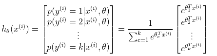

参考：
1. 深度学习 500 问：https://github.com/scutan90/DeepLearning-500-questions
2. [【机器学习】逻辑回归（非常详细）](https://zhuanlan.zhihu.com/p/74874291)
3. [L1 正则化与 L2 正则化](https://zhuanlan.zhihu.com/p/35356992)
4. [L1 相比于 L2 为什么容易获得稀疏解？](https://www.zhihu.com/question/37096933/answer/70426653)
5. [参数模型和非参数模型](https://link.zhihu.com/?target=https%3A//blog.csdn.net/sinat_27652257/article/details/80543604)
6. [SVM 和 Logistic 回归分别在什么情况下使用？](https://www.zhihu.com/question/21704547)
7. [Linear SVM 和 LR 有什么异同？](https://www.zhihu.com/question/26768865)
8. [Logistic Regression (LR) 详解](https://link.zhihu.com/?target=https%3A//blog.csdn.net/songbinxu/article/details/79633790%23%E5%9B%9Blr-%E6%AD%A3%E5%88%99%E5%8C%96)
9. [逻辑回归 LR 的特征为什么要先离散化](https://link.zhihu.com/?target=https%3A//blog.csdn.net/yang090510118/article/details/39478033)
10. [并行逻辑回归](https://link.zhihu.com/?target=http%3A//blog.sina.com.cn/s/blog_6cb8e53d0101oetv.html)
11. [连续特征的离散化](https://www.zhihu.com/question/31989952/answer/54184582)
12. [从后验概率到逻辑回归，从逻辑回归到神经网络](https://blog.csdn.net/olizxq/article/details/89919376)


# 逻辑回归

逻辑回归是一个分类模型，常用于二分类，因为其简单、可并行化以及可解释强，深受工业界喜爱。

逻辑规划的本质是：假设数据服从该分布，然后用极大似然估计做参数的估计。


## 1. 模型介绍

### 1.1 logistic 分布

logistic 分布是一种连续型的概率分布，其分布函数和密度函数分别是：
$$
F(x) = P(X\le x)=\frac{1}{1+e^{-(x-\mu)/\gamma}} \\
f(x) = F^{\prime}(X\le x)=\frac{e^{-(x-\mu)/\gamma}}{\gamma(1+e^{-(x-\mu)/\gamma})^2}
$$
其中，$\mu$ 表示位置参数，$\gamma \gt 0$ 是形状参数，如下图所示：


Logistic 分布是由其位置和尺度参数定义的连续分布。Logistic 分布的形状与正态分布的形状相似，但是 Logistic 分布的**尾部更长**，所以我们可以使用 Logistic 分布来建模比正态分布具有更长尾部和更高波峰的数据分布。在深度学习中常用到的 Sigmoid 函数就是 Logistic 的分布函数在 $\mu=0,\gamma=1$ 的特殊形式。


逻辑回归的**先验分布是伯努利分布**，即二项分布。


### 1.2 函数表达及导数

逻辑回归算法基于 Sigmoid 函数，或者说 Sigmoid 就是逻辑回归函数。Sigmoid 函数定义如下：
$\frac{1}{1+e^{-z}}$。函数值域范围(0,1)。

因此逻辑回归函数的表达式如下：
$$
h_\theta(x) =g(\theta^T X) = \frac{1}{1+e^{-\theta^TX}} \\
其中，g(z) = \frac{1}{1+e^{-z}}
$$
其导数形式为：
$$
g\prime (z)  =  \frac{d}{dz} \frac{1}{1+e^{-z}} \\
		 = \frac{1}{(1+e^{-z})^2} (e^{-z}) \\
		 =  \frac{1}{1+e^{-z}} (1-  \frac{1}{1+e^{-z}}) \\
		 = g(z)(1-g(z))
$$


### 1.3 代价函数

逻辑回归模型的数学形式确定后，剩下就是如何去求解模型中的参数。在统计学中，常常使用极大似然估计法来求解，即找到一组参数，使得在这组参数下，我们的数据的似然度（概率）最大。

设：
$$
P(Y=1|x)=p(x)\\
P(Y=0|x)=1-p(x)
$$
似然函数：
$$
L(w)=\prod[p(x_i)]^{y_i}[1-p(x_i)]^{1-y_i}
$$
为了更方便求解，对等式两边取对数，写成对数似然函数：
$$
L(w)=\sum[y_i lnp(x_i)+(1-y_i)ln(1-p(x_i))] \\
    =\sum[y_iln\frac{p(x_i)}{1-p(x_i)}+ln(1-p(x_i))]\\
    =\sum[y_i(w\cdot x_i)-ln(1+e^{w\cdot x_i})]
$$
在机器学习中我们有损失函数的概念，其衡量的是模型预测错误的程度。如果取整个数据集上的平均对数似然损失，我们可以得到:
$$
J(w)=-\frac{1}{N}lnL(w)
$$
即在逻辑回归模型中，我们**最大化似然函数**和**最小化损失函数**实际上是等价的。

求解逻辑回归的方法有不少，这里主要介绍梯度下降和牛顿法。**优化的主要目标是找到一个方向**，参数朝这个方向移动之后使得损失函数的值能够减小，**这个方向往往由一阶偏导或者二阶偏导各种组合求得**。逻辑回归的损失函数是：
$$
J(w)=-\frac{1}{n}(\sum_{i=1}^n(y_i lnp(x_i)+(1-y_i)ln(1-p(x_i))))
$$


#### 随机梯度下降

梯度下降是通过 J(w) 对 w 的一阶导数来找下降方向，并且以迭代的方式来更新参数，更新方式为 :
$$
g_i = \frac{\partial J(w)}{\partial w_i}=(p(x_i)-y_i)x_i\\
w_i^{k+1}=w_i^k-\alpha g_i
$$
其中 k 是迭代次数，每次更新参数后，可以通过比较 $||J(w^{k+1}) - J(w^k)||$ 小于阈值或者到达最大迭代次数来停止迭代；

#### 牛顿法

牛顿法的基本思路是，**在现有极小点估计值的附近对 f(x) 做二阶泰勒展开，进而找到极小点的下一个估计值**。假设 $w^k$ 为当前的极小值估计值，那么有：
$$
\psi(w)=J(w^k)+J^\prime (w^k)(w-w^k)+\frac{1}{2}J^{\prime \prime}(w^k)(w-w^k)^2
$$
然后令 $\psi ^ \prime (w) = 0$ ，可以得到：
$$
w^{k+1} = w^k-\frac{J^\prime(w^k)}{J^{\prime \prime}(w^k)}
$$
因此迭代的更新公式为：
$$
w^{k+1}=w^k-\frac{J^\prime(w^k)}{J^{\prime \prime}(w^k)}=w^k-H^{-1}_k\cdot g_k
$$
其中 $H^{-1}_k$ 是 Hessian 矩阵：
$$
H_{mn}=\frac{\partial^2J(w)}{\partial w_m \partial w_n}=h_w(x^i)(1-p_w(x^i))x_m^i x_n ^i
$$
此外，这个方法需要目标函数是二阶连续可微的，本文中的 J(w) 是符合要求的。


### 1.4 优缺点

#### 优点

1. 实现简单，广泛的应用于工业问题上；
2. 分类时计算量非常小，速度很快，存储资源低；
3. 便于观测样本概率分数
4. 对逻辑回归而言，多重共线性并不是问题，它可以结合L2正则化来解决该问题。

#### 缺点

1. 容易**欠拟合，一般准确度不太高**
2. 只能处理**两分类**问题（在此基础上衍生出来的softmax可以用于多分类），且必须**线性可分**；
3. **特征空间很大**时，逻辑回归的性能不是很好；
4. 不能很好地处理**大量多类特征或变量**
5. 对于非线性特征，需要进行转换。


### 1.5 回归划分

广义线性模型家族里，依据因变量不同，可以有如下划分：

（1）如果是连续的，就是多重线性回归。

（2）如果是二项分布，就是逻辑回归。

（3）如果是泊松（Poisson）分布，就是泊松回归。

（4）如果是负二项分布，就是负二项回归。

（5）逻辑回归的因变量可以是二分类的，也可以是多分类的，但是二分类的更为常用，也更加容易解释。所以实际中最常用的就是二分类的逻辑回归。


### 1.6 用途

逻辑回归可用于以下几个方面：

（1）**用于概率预测**。用于可能性预测时，得到的结果有可比性。比如根据模型进而预测在不同的自变量情况下，发生某病或某种情况的概率有多大。

（2）**用于分类**。实际上跟预测有些类似，也是根据模型，判断某人属于某病或属于某种情况的概率有多大，也就是看一下这个人有多大的可能性是属于某病。进行分类时，仅需要设定一个阈值即可，可能性高于阈值是一类，低于阈值是另一类。

（3）**寻找危险因素**。寻找某一疾病的危险因素等。

（4）**仅能用于线性问题**。只有当目标和特征是线性关系时，才能用逻辑回归。在应用逻辑回归时注意两点：一是当知道模型是非线性时，不适用逻辑回归；二是当使用逻辑回归时，应注意选择和目标为线性关系的特征。

（5）**各特征之间不需要满足条件独立假设，但各个特征的贡献独立计算**。


### 1.7 并行化

从逻辑回归的求解方法中我们可以看到，无论是随机梯度下降还是牛顿法，或者是没有提到的拟牛顿法，都是需要计算梯度的，因此逻辑回归的并行化最主要的就是**对目标函数梯度计算的并行化**。

我们看到目标函数的梯度向量计算中只需要进行向量间的点乘和相加，可以很容易将每个迭代过程拆分成相互独立的计算步骤，由不同的节点进行独立计算，然后归并计算结果。

下图是一个标签和样本矩阵，行为特征向量，列为特征维度。


**样本矩阵按行划分**，将样本特征向量分布到不同的计算节点，由各计算节点完成自己所负责样本的点乘与求和计算，然后将计算结果进行归并，则实现了按行并行的 LR。**按行并行的 LR 解决了样本数量的问题**，但是实际情况中会存在针对高维特征向量进行逻辑回归的场景，仅仅按行进行并行处理，无法满足这类场景的需求，**因此还需要按列将高维的特征向量拆分成若干小的向量进行求解**。


并行计算总共会被分为两个并行化计算步骤和两个结果归并步骤：

**步骤一：**各节点并行计算点乘，计算 $d_{(r,c),k,t}=W^T_{c,t}X_{(r,c),k}$ ，其中 $k=1,2,\ldots,M/m$ ， $d_{(r,c),k,t}$ 表示第 t 次迭代中节点 $(r,c)$ 上第 k 个特征向量与特征权重分量的点乘， $W_{c,t}$ 为第 t 次迭代中特征权重向量在第 c 列节点上的分量； 

**步骤二：**对行号相同的节点归并点乘结果：
$$
d_{r,k,t}=W^T_tX_{r,k}=\sum^n_{c=1}d_{(r,c),k,t}=\sum_{c=1}^nW^T_{c,t}X_{(r,c),k}
$$


**步骤三：**各节点独立算标量与特征向量相乘：
$$
G_{(r,c),t}=\sum_{i=1}^{M/m}[\sigma(y_{r,k}d_{r,k,t})-1]y_{r,k}X_{(r,c),k}
$$


$G_{(r,c),t}$ 可以理解为由第 r 行节点上部分样本计算出的目标函数梯度向量在第 c 列节点上的分量。

**步骤四：**对列号相同的节点进行归并：
$$
G_{c,t}=\sum_{r=1}^mG_{(r,c),t}
$$


$G_{c,t}$ 就是目标函数的梯度向量  $G_t$ 在第 c 列节点上的分量，对其进行归并得到目标函数的梯度向量：
$$
G_t=<G_{1,t},\ldots,G_{c,t},\ldots,G_{n,t}>
$$


这个过程如下图所示：


所以并行计算 LR 的流程如下所示。


所以并行 LR 实际上就是在求解损失函数最优解的过程中，针对寻找损失函数下降方向中的梯度方向计算作了并行化处理，而在利用梯度确定下降方向的过程中也可以采用并行化。


### 1.8 正则化

正则化是一个通用的算法和思想，所以会产生过拟合现象的算法都可以使用正则化来避免过拟合。

在经验风险最小化的基础上（也就是训练误差最小化），尽可能采用简单的模型，可以有效提高泛化预测精度。如果模型过于复杂，变量值稍微有点变动，就会引起预测精度问题。正则化之所以有效，就是因为其降低了特征的权重，使得模型更为简单。

正则化一般会采用 L1 范式或者 L2 范式，其形式分别为 $\phi (w)=||x||_1$ 和  $\phi (w)=||x||_2$。

#### L1 正则

LASSO 回归，相当于给模型添加了一个先验知识：w 服从零均值拉普拉斯分布。拉普拉斯分布如下所示：
$$
f(w|\mu, b) = \frac{1}{2b}exp(-\frac{|w-\mu|}{b})
$$
引入了先验知识，所以似然函数变为：
$$
L(w)=P(y|w,x)P(w)=\prod_{i-1}^Np(x_i)^{y_i}(1-p(x_i))^{1-y_i}\prod_{j=1}^d\frac{1}{2b}exp(-\frac{|w_j|}{b})
$$
取 log 再取负，得到目标函数：
$$
-lnL(w)=-\sum_i[y_ilnp(x_i)+(1-y_i)ln(1-p(x_i))]+\frac{1}{2b^2}\sum_j|w_j|
$$
等价于原始损失函数的后面加上了 L1 正则，因此 L1 正则的本质其实是为模型增加了“**模型参数服从零均值拉普拉斯分布**”这一先验知识。


#### L2 正则

Ridge 回归，相当于为模型添加了这样一个先验知识：w 服从零均值正态分布。

首先看看正态分布长什么样子：
$$
f(w|\mu,\sigma)=\frac{1}{\sqrt{2\pi}\sigma}exp(-\frac{(w-\mu)^2}{2\sigma^2})
$$
由于引入了先验知识，所以似然函数这样写
$$
L(w)=P(y|w,x)P(w)=\prod_{i-1}^Np(x_i)^{y_i}(1-p(x_i))^{1-y_i}\frac{1}{\sqrt{2\pi}\sigma}exp(-\frac{w_j^2}{2\sigma^2})\\
= \prod_{i-1}^Np(x_i)^{y_i}(1-p(x_i))^{1-y_i}\frac{1}{\sqrt{2\pi}\sigma}exp(-\frac{w^Tw}{2\sigma^2})
$$
取 log 再取负，得到目标函数：
$$
-lnL(w)=-\sum_i[y_ilnp(x_i)+(1-y_i)ln(1-p(x_i))]+\frac{1}{2\sigma^2}w^TW
$$
等价于原始的损失函数后面加上了 L2 正则，因此 L2 正则的本质其实是为模型增加了“**模型参数服从零均值正态分布**”这一先验知识。

#### L1和 L2区别

从上面的分析中我们可以看到，L1 正则化增加了所有权重 w 参数的绝对值之和，逼迫更多 w 为零，**也就是变稀疏**（ L2 因为其导数也趋 0, 奔向零的速度不如 L1 给力了）。我们对稀疏规则趋之若鹜的一个关键原因在于它能**实现特征的自动选择**。一般来说，大部分特征 x_i 都是和最终的输出 y_i 没有关系或者不提供任何信息的。在最小化目标函数的时候考虑 x_i 这些额外的特征，虽然可以获得更小的训练误差，但在预测新的样本时，这些没用的特征权重反而会被考虑，从而干扰了对正确 y_i 的预测。L1 **正则化的引入就是为了完成特征自动选择**，它会学习地去掉这些无用的特征，也就是把这些特征对应的权重置为 0。

L2 正则化中增加所有权重 w 参数的平方之和，**逼迫所有 w 尽可能趋向零但不为零（L2 的导数趋于零）**。因为在未加入 L2 正则化发生过拟合时，拟合函数需要顾忌每一个点，最终形成的拟合函数波动很大，在某些很小的区间里，函数值的变化很剧烈，也就是某些 w 值非常大。为此，**L2 正则化的加入就惩罚了权重变大的趋势**。


我们以二维样本为例，图解阐述加入 L1 正则化和 L2 正则化之后目标函数求解时发生的变化。

- 原函数曲线等高线（同颜色曲线上，每一组 ![[公式]](https://www.zhihu.com/equation?tex=w_1%2Cw_2) 带入后值都相同)


那现在我们看下加了 L1 正则化和 L2 正则化之后，目标函数求解的时候，最终解会有什么变化。


从上边两幅图中我们可以看出：

- 如果不加 L1 和 L2 正则化的时候，对于线性回归这种目标函数凸函数的话，我们最终的结果就是最里边的紫色的小圈圈等高线上的点。
- 当加入 L1 正则化的时候，我们先画出 $|w_1|+|w_2|=F$ 的图像，也就是一个菱形，代表这些曲线上的点算出来的  $L_1$ 范数 $|w_1|+|w_2|$ 都为 F。那我们现在的目标是不仅是**原曲线算的值要小（越来越接近中心的紫色圈圈），还要使得这个菱形越小越好（F 越小越好）**。那么还和原来一样的话，过中心紫色圈圈的那个菱形明显很大，因此我们要取到一个恰好的值。那么如何求值呢？


1. 以同一条原曲线目标等高线来说，现在以最外圈的红色等高线为例，我们看到，对于红色曲线上的每个点都可做一个菱形，根据上图可知，当这个菱形与某条等高线相切（仅有一个交点）的时候，这个菱形最小，上图相割对比较大的两个菱形对应的 L1 范数更大。用公式说这个时候能使得在相同的 $\frac{1}{N}\sum_{i=1}^N(y_i-w^Tx_i)^2$ ，由于相切的时候的  $C||w||_1$ 小，即 $|w_1|+|w_2|$ 所以能够使得 $\frac{1}{N}\sum_{i=1}^N (y_i-w^Tx_i)^2+C||w||_1$  更小；
2. 有了第一条的说明我们可以看出，最终加入 L1 范数得到的解一定是某个菱形和某条原函数等高线的切点。现在有个比较重要的结论来了，**我们经过观察可以看到，几乎对于很多原函数等高曲线，和某个菱形相交的时候及其容易相交在坐标轴（比如上图），也就是说最终的结果，解的某些维度及其容易是 0，比如上图最终解是** $w=(0,x)$**，这也就是我们所说的 L1 更容易得到稀疏解（解向量中 0 比较多）的原因；**
3. 当然光看着图说，L1 的菱形更容易和等高线相交在坐标轴一点都没说服力，只是个感性的认识，我们接下来从更严谨的方式来证明，简而言之就是假设现在我们是一维的情况下 $h(w)=f(w)+C|w| $ ，其中 h(w) 是目标函数， $f(w)$ 是没加 L1 正则化项前的目标函数， $C|w|$  是 L1 正则项，要使得 0 点成为最值可能的点，虽然在 0 点不可导，但是我们只需要让 0 点左右的导数异号，即 $h^\prime_l(0)h^\prime_r(0)=(f^\prime(0)+C)(f^\prime(0)-C)<0$  即可，也就是 $C \gt |f^\prime(0)|$  的情况下，0 点都是可能的最值点。

当加入 L2 正则化的时候，分析和 L1 正则化是类似的，也就是说我们仅仅是从菱形变成了圆形而已，同样还是求原曲线和圆形的切点作为最终解。当然与 L1 范数比，我们这样求的 L2 范数的**从图上来看，不容易交在坐标轴上，但是仍然比较靠近坐标轴。因此这也就是我们老说的，L2 范数能让解比较小（靠近 0），但是比较平滑（不等于 0）。**

综上所述，我们可以看见，加入正则化项，在最小化经验误差的情况下，可以让我们选择解更简单（趋向于 0）的解。

结构风险最小化：在经验风险最小化的基础上（也就是训练误差最小化），尽可能采用简单的模型，以此提高泛化预测精度。

**因此，加正则化项就是结构风险最小化的一种实现。**

**正则化之所以能够降低过拟合的原因在于，正则化是结构风险最小化的一种策略实现。**

**简单总结下**：

给 loss function 加上正则化项，能使新得到的优化目标函数 $h=f+||w||$ ，需要在 f 和 ||w|| 中做一个权衡，如果还像原来只优化 f 的情况下，那可能得到一组解比较复杂，使得正则项 ||w|| 比较大，那么 h 就不是最优的，因此可以看出加正则项能让解更加简单，符合奥卡姆剃刀理论，同时也比较符合在偏差和方差（方差表示模型的复杂度）分析中，通过降低模型复杂度，得到更小的泛化误差，降低过拟合程度。

L1 正则化就是在 loss function 后边所加正则项为 L1 范数，加上 L1 范数容易得到稀疏解（0 比较多）。L2 正则化就是 loss function 后边所加正则项为 L2 范数的平方，加上 L2 正则相比于 L1 正则来说，得到的解比较平滑（不是稀疏），但是同样能够保证解中接近于 0（但不是等于 0，所以相对平滑）的维度比较多，降低模型的复杂度。


------

## 2. 和其他模型的区别

### 2.1 和朴素贝叶斯的区别

逻辑回归与朴素贝叶斯区别有以下几个方面：

1. 逻辑回归是判别模型， 朴素贝叶斯是生成模型，所以生成和判别的所有区别它们都有。
2. 朴素贝叶斯属于贝叶斯，逻辑回归是最大似然，两种概率哲学间的区别。
3. 朴素贝叶斯需要条件独立假设。
4. 逻辑回归需要求特征参数间是线性的。


### 2.2 和线性回归的区别

线性回归与逻辑回归的区别如下描述：

（1）线性回归的样本的输出，都是连续值，$y\in (-\infty ,+\infty )$，而逻辑回归中 $y\in (0,1)$，只能取0和1。

（2）对于**拟合函数也有本质上的差别**： 

线性回归：$f(x)=\theta ^{T}x=\theta _{1}x _{1}+\theta _{2}x _{2}+...+\theta _{n}x _{n}$
	
逻辑回归：$f(x)=P(y=1|x;\theta )=g(\theta ^{T}x)$，其中，$g(z)=\frac{1}{1+e^{-z}}$

可以看出，线性回归的拟合函数，是对f(x)的输出变量y的拟合，而逻辑回归的拟合函数是对为1类样本的概率的拟合。
	
那么，为什么要以1类样本的概率进行拟合呢，为什么可以这样拟合呢？ 
	
$\theta ^{T}x=0$就相当于是1类和0类的决策边界： 
	
当$\theta ^{T}x>0$，则y>0.5；若$\theta ^{T}x\rightarrow +\infty$，则$y \rightarrow  1$，即y为1类; 


当$\theta ^{T}x<0$，则y<0.5；若$\theta ^{T}x\rightarrow -\infty$，则$y \rightarrow  0$，即y为0类; 

这个时候就能看出区别，在线性回归中$\theta ^{T}x$为预测值的拟合函数；而在逻辑回归中$\theta ^{T}x$为决策边界。下表为线性回归和逻辑回归的区别。


|              |  线性回归  |   逻辑回归   |
| :----------: | :--------: | :----------: |
|     目的     |    预测    |     分类     |
|  $y^{(i)}$   |    未知    |   （0,1）    |
|     函数     |  拟合函数  |   预测函数   |
| 参数计算方式 | 最小二乘法 | 极大似然估计 |


下面具体解释一下： 

1. 拟合函数和预测函数什么关系呢？

简单来说就是将拟合函数做了一个逻辑函数的转换，转换后使得$y^{(i)} \in (0,1)$;

2. 最小二乘和最大似然估计可以相互替代吗？

当然是不行了。我们来看看两者依仗的原理：**最大似然估计是计算使得数据出现的可能性最大的参数**，依仗的自然是Probability。而**最小二乘是计算误差损失**。


### 2.3 逻辑回归和 SVM 的区别

#### 相同点

1. 都是分类算法，如果不考虑核函数，都是线性分类算法
2. 都是监督学习算法
3. 都是判别模型
4. 都能通过核函数方法针对非线性情况分类
5. 目标都是找一个分类超平面
6. 都能减少离群点的影响


#### 不同点

##### 1.损失函数不同

逻辑回归是 cross entropy loss，svm 是 hinge loss

$$
LR\ Loss:\ L(\omega,b)=\sum_{i=1}^{m}ln(y_{i}p_{1}(x;\beta)+(1-y_{i})p_{0}(x;\beta)) = \sum_{i=1}^{m}(-y_{i}\beta^{T}x_{i}+ln(1+e^{\beta^{T}x_{i}}))
\\其中，\beta=(\omega;b), p_{1}=p(y=1|x;\beta), p_{0}=p(y=0|x;\beta)  \\
\\SVM\ Loss:\ L(\omega,b,\alpha)=\frac{1}{2}||w||^2+\sum_{i=1}^{m}\alpha_{i}(1-y_{i}(\omega^{T}x_{i}+b))
$$

LR： 基于概率理论，通过极大似然估计方法估计参数值

SVM：基于几何间隔最大化原理

> 补充：		Logistic Loss：			 $L_{log}(z)=log(1+e^{-z})$                   // 用于 LR
>
> ​					Hinge Loss：		  	 $L_{hinge}(z)=max(0,1-z)$             // SVM
>
> ​					Exponential Loss：	$L_{exp}(z)=e^{-z}$  								 // Adaboost


##### 2. 考虑的样本点不同

SVM只考虑边界线上局部的点（即support vector），而LR考虑了所有点

影响SVM决策分类面的只有少数的点，即边界线上的支持向量，其他样本对分类决策面没有任何影响，即SVM不依赖于数据分布；

而LR则考虑了全部的点（即依赖于数据分布），优化参数时所有样本点都参与了贡献，通过非线性映射，减少远离分类平面的点的权重，即对不平衡的数据要先做balance。这也是为什么逻辑回归不用核函数，它需要计算的样本太多。并且由于逻辑回归受所有样本的影响，当样本不均衡时需要平衡一下每一类的样本个数。


##### 3. 在解决非线性问题时，SVM采用核函数机制，而LR一般很少采用核函数的方法。

SVM使用的是hinge loss，可以方便地转化成对偶问题进行求解，在解决非线性问题时，引入核函数机制可以大大降低计算复杂度。


##### 4. SVM依赖于数据分布的距离测度，所以需对数据先做normalization，而LR不受影响。

normalization的好处：进行梯度下降时，数值更新的速度一致，少走弯路，可以更快地收敛。


##### 5. 逻辑回归是处理经验风险最小化，svm是结构风险最小化

所以SVM的损失函数中自带正则化项($\frac{1}{2}||w||^2$)，而LR需要另外添加。


##### 6. 逻辑回归对概率建模，svm对分类超平面建模

##### 7. 逻辑回归通过非线性变换减弱分离平面较远的点的影响，svm则只取支持向量从而消去较远点的影响

##### 8. 逻辑回归是统计方法，svm是几何方法


#### 2.4 和最大熵模型

逻辑回归和最大熵模型本质上没有区别，**最大熵在解决二分类问题时就是逻辑回归，在解决多分类问题时就是多项逻辑回归**。


## 3. 模型细节

### 3.1 LR和SVM什么时候用？

来自Andrew Ng的建议：

①若feature数远大于样本数量，使用LR算法或者Linear SVM

②若feature数较小，样本数量适中，使用kernel SVM

③若feature数较小，样本数很大，增加更多的feature然后使用LR算法或者Linear SVM


### 3.2 LR和SVM如何处理多分类问题？

#### SVM

方式一：组合多个二分类器来实现多分类器（两种方法OvO或OvR）

①OvO（one-versus-one）: 任意两个类别之间设计一个二分类器，N个类别一共$\frac{N(N-1)}{2}$个二分类器

②OvR（one-versus-rest）: 每次将一个类别作为正例，其余的作为反例，共N个分类器。

> 注：OvO和OvR先训练出多个二分类器，在测试时，新样本将同时提交给所有的分类器进行预测，投票产生		最终结果，将被预测的最多的类别作为最终的分类结果

方式二：直接修改目标函数，将多个分类面的参数合并到一个最优化问题中，一次性实现多分类。


#### LR

方式一： OvR：同上，组合多个logistic 二分类器

方式二： 修改目标函数，改进成softmax回归

对于选择softmax分类器还是 k 个logistic分类器，取决于所有类别之间是否互斥：

- **所有类别之间明显互斥**用 softmax分类器，
- 所有类别之间不互斥有交叉的情况下最好用 k 个logistic分类器。


#### softmax 回归

参考：[逻辑回归解决多分类和softmax](https://blog.csdn.net/u012879957/article/details/81197903)

对于有 k 个标记的分类问题，其分类函数如下所示：



这里将上式所有的$\theta_1, \theta_2,\cdots,\theta_k$ 组合起来，用矩阵 $\theta$ 来表示：


这时候，softmax 回归算法的代价函数如下所示，其中 $sign(expression is true)=1$


上述公式就是一个逻辑回归损失函数的推广


### 3.3 为什么适合离散特征

我们在使用逻辑回归的时候很少会把数据直接丢给 LR 来训练，我们一般会对特征进行离散化处理，这样做的优势大致有以下几点：

1. 离散后**稀疏向量内积乘法运算速度更快，计算结果也方便存储，容易扩展**；
2. 离散后的特征**对异常值更具鲁棒性**，如 age>30 为 1 否则为 0，对于年龄为 200 的也不会对模型造成很大的干扰；
3. LR 属于广义线性模型，表达能力有限，经过离散化后，每个变量有单独的权重，这相当于引入了非线性，能够提升模型的表达能力，加大拟合；
4. 离散后特征可以进行特征交叉，提升表达能力，由 M+N 个变量编程 M*N 个变量，进一步引入非线形，提升了表达能力；
5. **特征离散后模型更稳定**，如用户年龄区间，不会因为用户年龄长了一岁就变化；

总的来说，特征离散化以后起到了**加快计算，简化模型和增加泛化能力**的作用。


### 3.4 为什么不使用平方误差

假设目标函数是 MSE，即：
$$
L=\frac{(y-\hat y)^2}{2}\\
\frac{\partial L}{\partial w}=(\hat y-y)\sigma^{\prime}(w\cdot x)x
$$
这里 Sigmoid 的导数项为：
$$
\sigma^\prime(w\cdot x)=w\cdot x(1-w\cdot x)
$$
根据 w 的初始化，**导数值可能很小（想象一下 Sigmoid 函数在输入较大时的梯度）而导致收敛变慢，而训练途中也可能因为该值过小而提早终止训练（梯度消失）**。

另一方面，交叉熵的梯度如下，**当模型输出概率偏离于真实概率时，梯度较大，加快训练速度，当拟合值接近于真实概率时训练速度变缓慢**，没有 MSE 的问题。
$$
g^\prime = \sum_{i=1}^N x_i(y_i-p(x_i))
$$
可以从下图看出来，两者的区别


由上图可知：

- 使用交叉熵作为损失函数，距离目标点远的地方梯度较大，参数更新较快，距离目标点近的地方梯度较小，参数更新较慢，这是很合理的；
- 使用平方损失作为损失函数，距离目标点远的地方梯度也很小，导致参数更新很缓慢，无法收敛；


### 3.5 如何解决非线性问题？

（1）使用kernel trick；

（2）把特征离散化，然后做组合特征，可以实现一定程度的非线性；


------

## 4. 代码实现

首先是采用`sklearn`包中的逻辑回归算法代码：

```python
#Import Library
from sklearn.linear_model import LogisticRegression
#Assumed you have, X (predictor) and Y (target) for training data set and x_test(predictor) of test_dataset

# Create logistic regression object

model = LogisticRegression()

# Train the model using the training sets and check score
model.fit(X, y)
model.score(X, y)

#Equation coefficient and Intercept
print('Coefficient: \n', model.coef_)
print('Intercept: \n', model.intercept_)

#Predict Output
predicted= model.predict(x_test)
```


接下来则是应用例子，如下所示：

```python
#!/usr/bin/env python
# -*- coding: utf-8 -*-
"""
@Time    : 2016/10/19 21:35
@Author  : cai

实现多类的逻辑回归算法
"""
import os
import numpy as np
import pandas as pd
import matplotlib.pylab as plt
from scipy.optimize import minimize
from scipy.io import loadmat

# 定义Sigmoid函数
def sigmoid(z):
    return 1 / (1 + np.exp(-z))

# 定义 cost函数
def costReg(theta, X, y, lambdas):
    theta = np.matrix(theta)
    X = np.matrix(X)
    y = np.matrix(y)
    h = X * theta.T
    first = np.multiply(-y, np.log(sigmoid(h)))
    second = np.multiply((1-y), np.log(1 - sigmoid(h)))
    reg = (lambdas / 2 * len(X)) * np.sum(np.power(theta[:, 1:theta.shape[1]], 2))
    return np.sum(first - second) / (len(X)) + reg

# 梯度下降算法的实现, 输出梯度对权值的偏导数
def gradient(theta, X, y, lambdas):
    theta = np.matrix(theta)
    X = np.matrix(X)
    y = np.matrix(y)

    parameters = int(theta.ravel().shape[1])
    grad = np.zeros(parameters)
    # 计算误差
    error = sigmoid(X * theta.T) - y

    grad = ((X.T * error) / len(X)).T + ((lambdas / len(X)) * theta)

    grad[0, 0] = np.sum(np.multiply(error, X[:, 0])) / len(X)

    return np.array(grad).ravel()

# 实现一对多的分类方法
def one_vs_all(X, y, num_labels, lambdas):
    rows = X.shape[0]
    params = X.shape[1]

    # 每个分类器有一个 k * (n+1)大小的权值数组
    all_theta = np.zeros((num_labels, params + 1))

    # 增加一列，这是用于偏置值
    X = np.insert(X, 0, values=np.ones(rows), axis=1)

    # 标签的索引从1开始
    for i in range(1, num_labels + 1):
        theta = np.zeros(params + 1)
        y_i = np.array([1 if label == i else 0 for label in y])
        y_i = np.reshape(y_i, (rows, 1))

        # 最小化损失函数
        fmin = minimize(fun=costReg, x0=theta, args=(X, y_i, lambdas), method='TNC', jac=gradient)
        all_theta[i-1, :] = fmin.x

    return all_theta

def predict_all(X, all_theta):
    rows = X.shape[0]
    params = X.shape[1]
    num_labels = all_theta.shape[0]

    # 增加一列，这是用于偏置值
    X = np.insert(X, 0, values=np.ones(rows), axis=1)

    X = np.matrix(X)
    all_theta = np.matrix(all_theta)

    # 对每个训练样本计算其类的概率值
    h = sigmoid(X * all_theta.T)

    # 获取最大概率值的数组索引
    h_argmax = np.argmax(h, axis=1)
    # 数组是从0开始索引，而标签值是从1开始，所以需要加1
    h_argmax = h_argmax + 1

    return h_argmax

dataPath = os.path.join('data', 'ex3data1.mat')
# 载入数据
data = loadmat(dataPath)
print(data)
print(data['X'].shape, data['y'].shape)

# print(np.unique(data['y']))
# 测试
# rows = data['X'].shape[0]
# params = data['X'].shape[1]
#
# all_theta = np.zeros((10, params + 1))
#
# X = np.insert(data['X'], 0, values=np.ones(rows), axis=1)
#
# theta = np.zeros(params + 1)
#
# y_0 = np.array([1 if label == 0 else 0 for label in data['y']])
# y_0 = np.reshape(y_0, (rows, 1))
# print(X.shape, y_0.shape, theta.shape, all_theta.shape)

all_theta = one_vs_all(data['X'], data['y'], 10, 1)
print(all_theta)

# 计算分类准确率
y_pred = predict_all(data['X'], all_theta)
correct = [1 if a == b else 0 for (a, b) in zip(y_pred, data['y'])]
accuracy = (sum(map(int, correct)) / float(len(correct)))
print('accuracy = {0}%'.format(accuracy * 100))
```

实现代码来自[Part 4 - Multivariate Logistic Regression](http://www.johnwittenauer.net/machine-learning-exercises-in-python-part-4/)。具体可以查看[我的github](https://github.com/ccc013/CodingPractise/blob/master/Python/MachineLearning/mulLogisticRegressionPractise.py)。


# 线性回归

## 简述

在统计学中，**线性回归（Linear Regression）是利用称为线性回归方程的最小平方函数对一个或多个自变量和因变量之间关系进行建模的一种回归分析**。这种函数是一个或多个称为回归系数的模型参数的线性组合（自变量都是一次方）。**只有一个自变量的情况称为简单回归，大于一个自变量情况的叫做多元回归**。

优点：结果易于理解，计算上不复杂。
缺点：对非线性数据拟合不好。

适用数据类型：数值型和标称型数据。
算法类型：回归算法

线性回归的模型函数如下：
$$
h_\theta = \theta ^T x
$$

它的损失函数如下：
$$
J(\theta) = {1\over {2m}} \sum_{i=1}^m (h_\theta(x^{(i)}) - y^{(i)})^2
$$
通过训练数据集寻找参数的最优解，即求解可以得到 $minJ(\theta)$ 的参数向量 $\theta$ ,其中这里的参数向量也可以分为参数 $w和b$ , 分别表示权重和偏置值。

求解最优解的方法有**最小二乘法和梯度下降法**。


## 梯度下降法

梯度下降算法的思想如下(这里以一元线性回归为例)：

> 首先，我们有一个代价函数，假设是$J(\theta_0,\theta_1)$，我们的目标是$min_{\theta_0,\theta_1}J(\theta_0,\theta_1)$。
> 接下来的做法是：
>
> - 首先是随机选择一个参数的组合$(\theta_0,\theta_1)$,一般是设$\theta_0 = 0,\theta_1 = 0$;
> - 然后是不断改变$(\theta_0,\theta_1)$，并计算代价函数，直到一个**局部最小值**。之所以是**局部最小值**，是因为我们并没有尝试完所有的参数组合，所以不能确定我们得到的局部最小值是否便是**全局最小值**，选择不同的初始参数组合，可能会找到不同的局部最小值。
>   下面给出梯度下降算法的公式：

> repeat until convergence{
$$
\theta_j := \theta_j - \alpha \frac{\partial}{\partial \theta_j} J(\theta_0,\theta_1)\quad (for\quad j=0 \quad and\quad j=1)
$$
> } 

也就是在梯度下降中，不断重复上述公式直到收敛，也就是找到$\color{red}{局部最小值}$。其中符号`:=`是赋值符号的意思。

而应用梯度下降法到线性回归，则公式如下：
$$
\theta_0 := \theta_0 - \alpha \frac{1}{m}\sum_{i=1}^m (h_\theta(x^{(i)}) - y^{(i)})\ \\
 \theta_1 := \theta_1 - \alpha \frac{1}{m}\sum_{i=1}^m ((h_\theta(x^{(i)}) - y^{(i)}) \cdot x^{(i)})
$$

公式中的$\alpha$称为**学习率(learning rate)**，它决定了我们沿着能让代价函数下降程度最大的方向向下迈进的步子有多大。

在梯度下降中，还涉及到一个参数更新的问题，即更新$(\theta_0,\theta_1)$，一般我们的做法是**同步更新。**

最后，上述梯度下降算法公式实际上是一个叫**批量梯度下降(batch gradient descent)**，即它在每次梯度下降中都是使用整个训练集的数据，所以公式中是带有$\sum_{i=1}^m$。


## 岭回归（ridge regression）

岭回归是一种专用于共线性数据分析的有偏估计回归方法，实质上是一种改良的最小二乘估计法，通过放弃最小二乘法的无偏性，以损失部分信息、降低精度为代价，获得回归系数更为符合实际、更可靠的回归方法，对病态数据的耐受性远远强于最小二乘法。

岭回归分析法是从根本上消除复共线性影响的统计方法。岭回归模型通过在相关矩阵中引入一个很小的岭参数K（1>K>0），并将它加到主对角线元素上，从而降低参数的最小二乘估计中复共线特征向量的影响，减小复共线变量系数最小二乘估计的方法，以保证参数估计更接近真实情况。岭回归分析将所有的变量引入模型中，比逐步回归分析提供更多的信息。

其他回归还可以参考 [各种回归全解：传统回归、逻辑回归、加权回归/核回归、岭回归、广义线性模型/指数族](http://blog.csdn.net/ownfed/article/details/41181665)。


## 代码实现

Python实现的代码如下：

```python
#Import Library
#Import other necessary libraries like pandas, numpy...
from sklearn import linear_model
#Load Train and Test datasets
#Identify feature and response variable(s) and values must be numeric and numpy arrays

x_train=input_variables_values_training_datasets
y_train=target_variables_values_training_datasets
x_test=input_variables_values_test_datasets

# Create linear regression object
linear = linear_model.LinearRegression()

# Train the model using the training sets and check score
linear.fit(x_train, y_train)
linear.score(x_train, y_train)

#Equation coefficient and Intercept
print('Coefficient: \n', linear.coef_)
print('Intercept: \n', linear.intercept_)

#Predict Output
predicted= linear.predict(x_test)
```

上述是使用`sklearn`包中的线性回归算法的代码例子，下面是一个实现的具体例子。

```python
# -*- coding: utf-8 -*-
"""
Created on Mon Oct 17 10:36:06 2016

@author: cai
"""

import os
import numpy as np
import pandas as pd
import matplotlib.pylab as plt
from sklearn import linear_model

# 计算损失函数
def computeCost(X, y, theta):
    inner = np.power(((X * theta.T) - y), 2)
    return np.sum(inner) / (2 * len(X))

# 梯度下降算法
def gradientDescent(X, y, theta, alpha, iters):
    temp = np.matrix(np.zeros(theta.shape))
    parameters = int(theta.ravel().shape[1])
    cost = np.zeros(iters)

    for i in range(iters):
        error = (X * theta.T) - y

        for j in range(parameters):
            # 计算误差对权值的偏导数
            term = np.multiply(error, X[:, j])
            # 更新权值
            temp[0, j] = theta[0, j] - ((alpha / len(X)) * np.sum(term))

        theta = temp
        cost[i] = computeCost(X, y, theta)
    return theta, cost

dataPath = os.path.join('data', 'ex1data1.txt')
data = pd.read_csv(dataPath, header=None, names=['Population', 'Profit'])
# print(data.head())
# print(data.describe())
# data.plot(kind='scatter', x='Population', y='Profit', figsize=(12, 8))
# 在数据起始位置添加1列数值为1的数据
data.insert(0, 'Ones', 1)
print(data.shape)

cols = data.shape[1]
X = data.iloc[:, 0:cols-1]
y = data.iloc[:, cols-1:cols]

# 从数据帧转换成numpy的矩阵格式
X = np.matrix(X.values)
y = np.matrix(y.values)
# theta = np.matrix(np.array([0, 0]))
theta = np.matrix(np.zeros((1, cols-1)))
print(theta)
print(X.shape, theta.shape, y.shape)
cost = computeCost(X, y, theta)
print("cost = ", cost)

# 初始化学习率和迭代次数
alpha = 0.01
iters = 1000

# 执行梯度下降算法
g, cost = gradientDescent(X, y, theta, alpha, iters)
print(g)

# 可视化结果
x = np.linspace(data.Population.min(),data.Population.max(),100)
f = g[0, 0] + (g[0, 1] * x)

fig, ax = plt.subplots(figsize=(12, 8))
ax.plot(x, f, 'r', label='Prediction')
ax.scatter(data.Population, data.Profit, label='Training Data')
ax.legend(loc=2)
ax.set_xlabel('Population')
ax.set_ylabel('Profit')
ax.set_title('Predicted Profit vs. Population Size')

fig, ax = plt.subplots(figsize=(12, 8))
ax.plot(np.arange(iters), cost, 'r')
ax.set_xlabel('Iteration')
ax.set_ylabel('Cost')
ax.set_title('Error vs. Training Epoch')


# 使用sklearn 包里面实现的线性回归算法
model = linear_model.LinearRegression()
model.fit(X, y)

x = np.array(X[:, 1].A1)
# 预测结果
f = model.predict(X).flatten()
# 可视化
fig, ax = plt.subplots(figsize=(12, 8))
ax.plot(x, f, 'r', label='Prediction')
ax.scatter(data.Population, data.Profit, label='Training Data')
ax.legend(loc=2)
ax.set_xlabel('Population')
ax.set_ylabel('Profit')
ax.set_title('Predicted Profit vs. Population Size(using sklearn)')
plt.show()
```

上述代码参考自 [Part 1 - Simple Linear Regression](http://www.johnwittenauer.net/machine-learning-exercises-in-python-part-1/)。具体可以查看 [我的Github](https://github.com/ccc013/CodingPractise/blob/master/Python/MachineLearning/linearRegressionPractise.py)。


